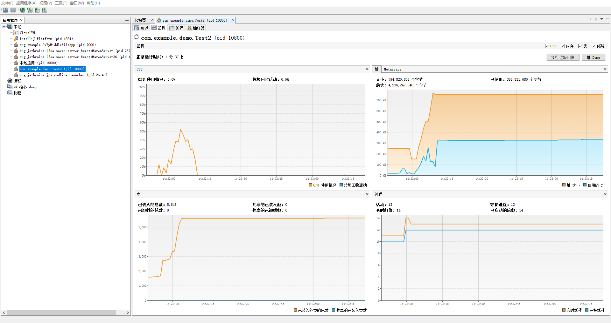
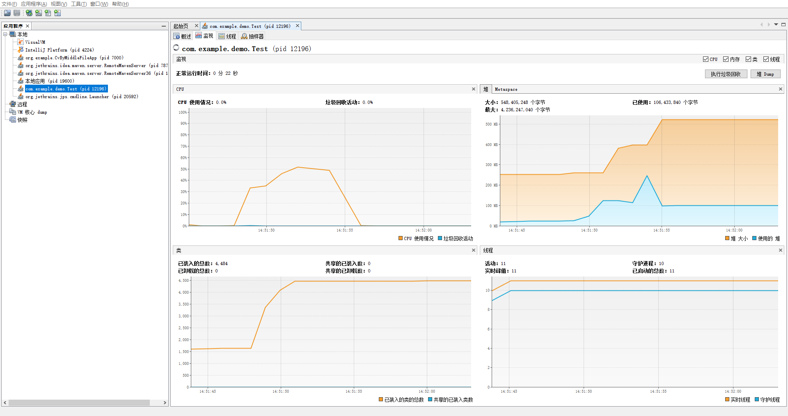
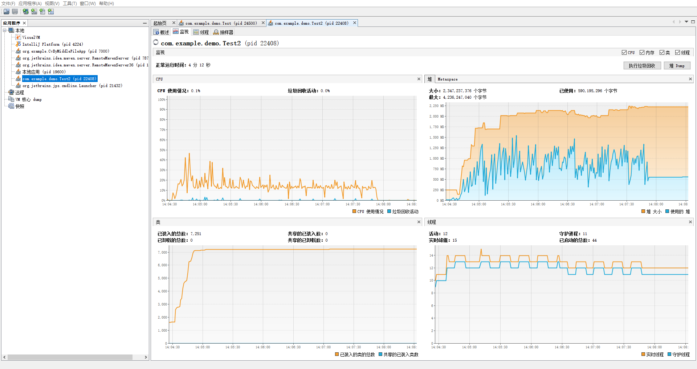
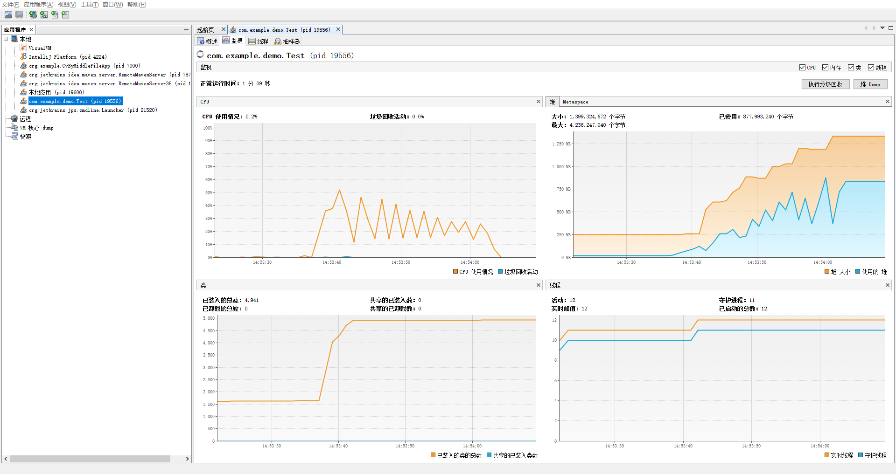
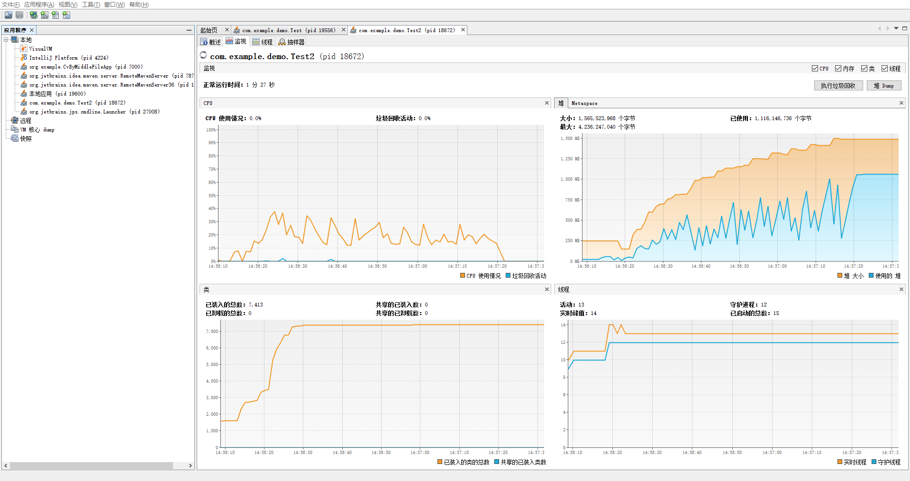

# Aspose-words和spire office对比

## 简介

目前只做Docx转PDF的对比。为了避免不同框架第一次的准备工作不同导致结果误差，这里测试不同框架时都会对文件做**10**次转换。通过记录开始和结束时间戳来计算耗时，并通过VisualVM查看内存、CPU等使用情况。

更多对比信息可参考早期文档：【文档转换框架对比.pdf】

## 40K的文件

乌拉盖现场文档.docx，7页。（封面标题使用文本框或艺术字）

|              | 耗时 | 内存峰值 | 还原度            | 备注                                     |
| ------------ | ---- | -------- | ----------------- | ---------------------------------------- |
| Spire Office | 15s  | 320M     | 90%（仅标题问题） | 大标题由红变黑且换行的“公司文件”无法显示 |
| Aspose-words | 6.1s | 240M     | 几乎100%          |                                          |

Spire Office运行监控

Aspose-words运行监控

## 10M的文件

京能集成说明.docx 33页

|              | 耗时   | 内存峰值 | 还原度 | 备注                                          |
| ------------ | ------ | -------- | ------ | --------------------------------------------- |
| Spire Office | 199.9s | 1500M    | 90%    | 有的图片被放大，被遮挡。排版改变，页面多了4页 |
| Aspose-words | 25.1s  | 850M     | 100%   |                                               |

Spire Office运行监控

Aspose-words运行监控

## 14M的文件

鼓风机检修汇总.docx，19页

|              | 耗时  | 内存峰值 | 还原度 | 备注                       |
| ------------ | ----- | -------- | ------ | -------------------------- |
| Spire Office | 66.5s | 1050M    | 99%    |                            |
| Aspose-words | 16.7s | 380M     | 95%    | 目录中有一个页码显示有问题 |

Spire Office运行监控

Aspose-words运行监控

## 总结

综合上面的对比数据，Aspose-words无论是速度，内存使用量，都比Spire Office有明显优势。还原度方面，Aspose-words整体也比Spire Office更好。

> PS：这些文档如此复杂，或许就不存在完美的解决方案，毕竟**WPS Office**和**Microsoft Office**都是有些许差别的，对于第三方排版引擎来说更是容易存在兼容问题。

