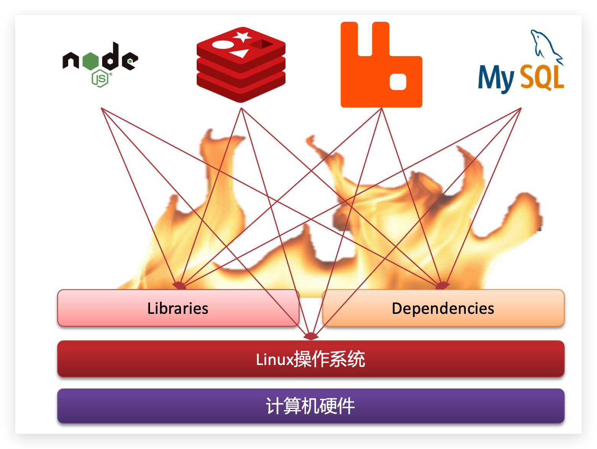
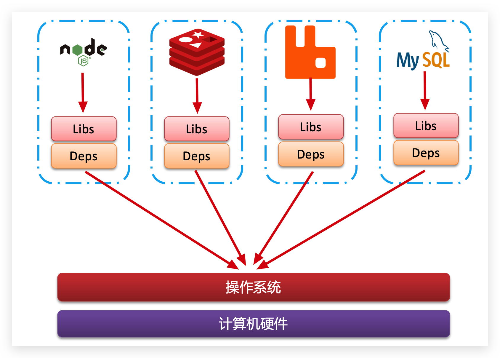
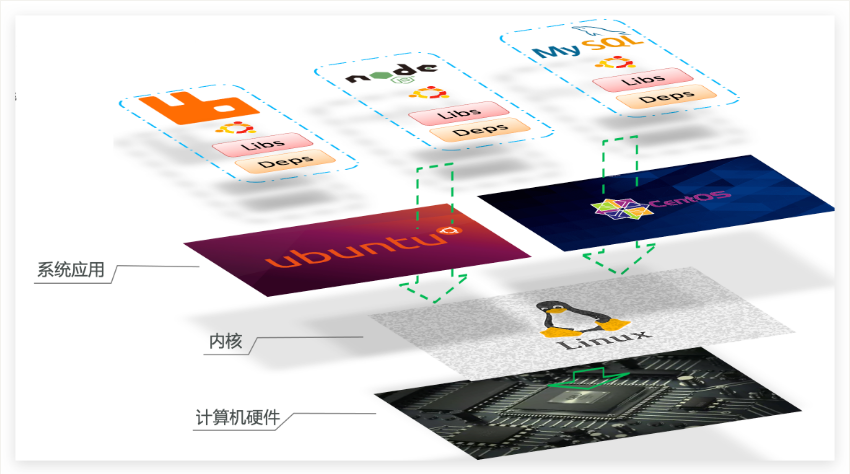
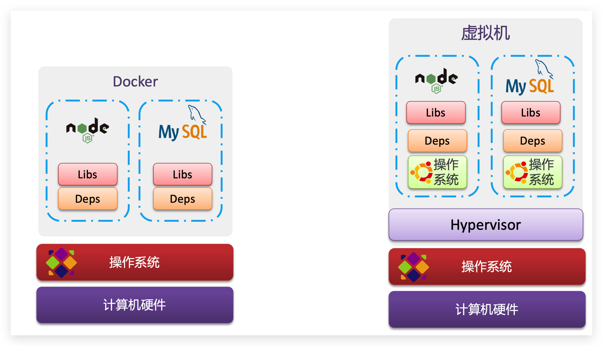
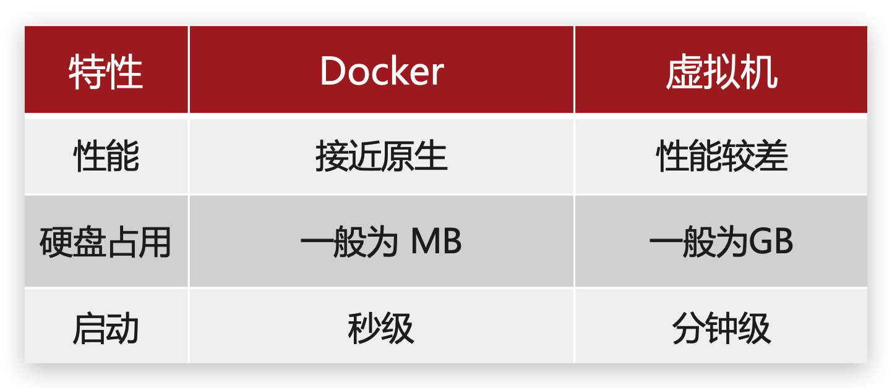
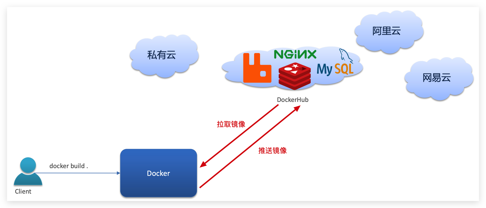
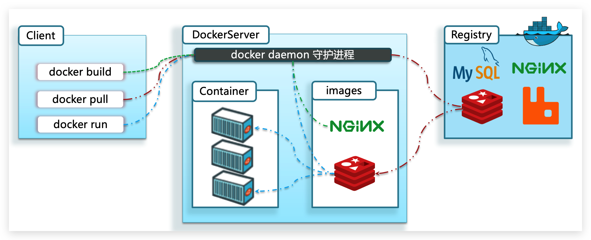
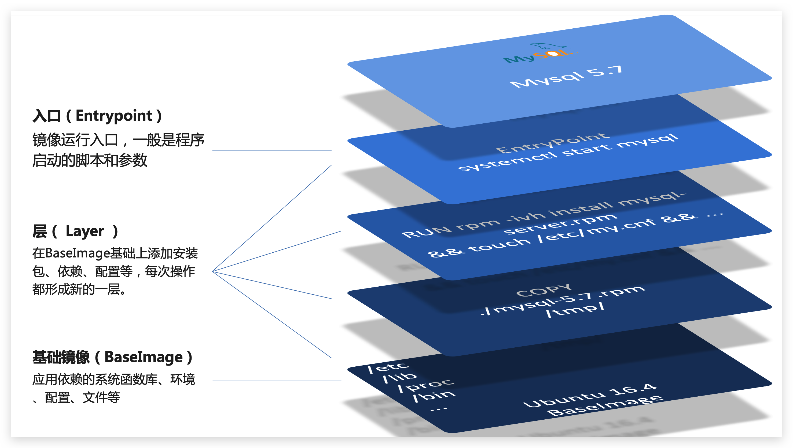
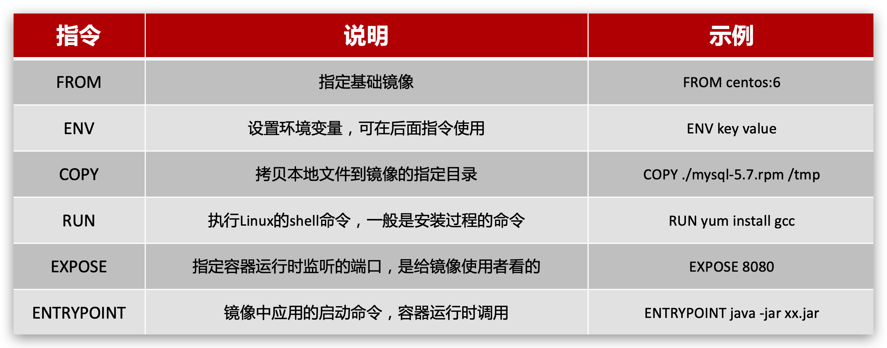

# Docker学习笔记

## 1.介绍与安装

### 1.1介绍

1. 没有Docker会有什么问题？

   大型项目组件较多，运行环境复杂，部署时会遇到依赖关系复杂版本不兼容、开发测试生产环境有差异等问题，导致项目部署失败。

   例如一个项目中，部署时需要依赖于node.js、Redis、RabbitMQ、MySQL等，这些服务部署时所需要的函数库、依赖项各不相同，甚至会有冲突。给部署带来了极大的困难。

   

   

2. Docker解决了依赖兼容问题

   Docker为了解决依赖的兼容问题的，采用了两个手段：

   - 将应用的Libs（函数库）、Deps（依赖）、配置与应用一起打包

   - 将每个应用放到一个隔离**容器**去运行，避免互相干扰

     

   这样打包好的应用包中，既包含应用本身，也保护应用所需要的Libs、Deps，无需再操作系统上安装这些，自然就不存在不同应用之间的兼容问题了。

   

   虽然解决了不同应用的兼容问题，但是开发、测试等环境会存在差异，操作系统版本也会有差异，怎么解决这些问题呢？

3. Docker解决操作系统环境差异

   操作系统可以分为一下三层结构：

   - 系统应用：操作系统本身提供的应用、函数库。这些函数库是对内核指令的封装，使用更加方便，Redis、Java等应用调用操作系统应用（函数库），实现各种功能。
   - 系统内核：所有Linux发行版的内核都是Linux，例如CentOS、Ubuntu、Fedora等。内核可以与计算机硬件交互，对外提供**内核指令**，用于操作计算机硬件。
   - 计算机硬件：例如CPU、内存、磁盘等

   Ubuntu和CentOS等发行版本都是基于Linux内核的，主要就系统应用这一层不同，提供的函数库有差异。因此如果将一个Ubuntu版本的MySQL应用安装到CentOS系统，MySQL在调用Ubuntu函数库时，会发现找不到或者不匹配，就会报错。

   Docker如何解决不同系统环境的问题？

   - Docker将用户程序与所需要调用的系统(比如Ubuntu)函数库一起打包
   - Docker运行到不同操作系统时，直接基于打包的函数库，借助于操作系统的Linux内核来运行

   

   总结：Docker允许开发中将应用、依赖、函数库、配置一起**打包**，形成可移植镜像，Docker应用运行在容器中，使用沙箱机制，相互**隔离**

4. Docker和虚拟机的区别

   **虚拟机**（virtual machine）是在操作系统中**模拟**硬件设备，然后运行另一个操作系统，比如在 Windows 系统里面运行 Ubuntu 系统，这样就可以运行任意的Ubuntu应用了。

   **Docker**仅仅是封装函数库，并没有模拟完整的操作系统，如图：

   

   对比来看：

   

5. Docker架构

   - 镜像和容器

     **镜像（Image）**：Docker将应用程序及其所需的依赖、函数库、环境、配置等文件打包在一起，称为镜像。这个镜像文件包是只读的。

     **容器（Container）**：镜像中的应用程序加载到内存运行后形成的进程就是**容器**，只是Docker会给容器进程做隔离，对外不可见。一个镜像可以启动多次，形成多个容器进程。（容器的停止状态可以理解为镜像文件+容器的配置信息）

   - DockerHub

     开源应用程序非常多，打包这些应用往往是重复的劳动。为了避免这些重复劳动，人们就会将自己打包的应用镜像，例如Redis、MySQL镜像放到网络上，共享使用，就像GitHub和Maven等仓库一样，原理类似。

     DockerHub是一个官方的Docker镜像的托管平台。这样的平台称为Docker Registry。国内也有类似于DockerHub 的公开服务，比如 [网易云镜像服务](https://c.163yun.com/hub)、[阿里云镜像库](https://cr.console.aliyun.com/)等。

     

   - Docker架构

     Docker是一个CS架构的程序，由两部分组成：

     - 服务端(server)：Docker守护进程，负责处理Docker指令，管理镜像、容器等。通过systemctl命令启动。

     - 客户端(client)：通过命令或RestAPI向Docker服务端发送指令。可以在本地或远程向服务端发送指令。我们常用的docker命令就是客户端。


     

   - 

### 1.2安装

1. 卸载旧版本Docker相关组件

   ```bash
    sudo yum remove docker \
                     docker-client \
                     docker-client-latest \
                     docker-common \
                     docker-latest \
                     docker-latest-logrotate \
                     docker-logrotate \
                     docker-engine
   ```

2. 安装yum相关组件，并添加仓库地址

   ```bash
    sudo yum install -y yum-utils
    sudo yum-config-manager \
       --add-repo \
       https://download.docker.com/linux/centos/docker-ce.repo
   ```

3. 安装Docker（CentOS）

   安装最新版

   ````bash
   sudo yum install docker-ce docker-ce-cli containerd.io docker-compose-plugin
   ````

   安装指定版本

   ```bash
   # 列出可安装的版本
   yum list docker-ce --showduplicates | sort -r
   # 指定版本号进行安装
   sudo yum install docker-ce-<VERSION_STRING> docker-ce-cli-<VERSION_STRING> containerd.io docker-compose-plugin
   ```

4. 启动Docker

   ```bash
   sudo systemctl start docker
   # 还可以通过 systemctl 命令进行stop enable status等操作
   ```

5. 验证Docker是否安装成功

   ```bash
   # 拉取 hello-world 镜像并运行
   sudo docker run hello-world
   ```

   完整安装步骤可见官网 `https://docs.docker.com/engine/install/centos/`

### 1.3 卸载

1. 停掉docker服务

2. 删除docker所在目录

   ```bash
   rm -rf /etc/docker
   rm -rf /run/docker
   rm -rf /var/lib/dockershim
   rm -rf /var/lib/docker
   ```

3. 查询docker已安装的包

   ```bash
   yum list installed | grep docker
   ```

4. 删除安装包

   ```bash
   yum remove docker-ce.x86_64 ddocker-ce-cli.x86_64 -y
   ```

   

## 2.基本操作

可以使用 docker command --help 命令查看具体命令的用法。

### 2.1镜像操作

镜名称一般分两部分组成：[repository]:[tag]，如 mysql:5.7 ，如果没有指定tag，则默认使latest

```bash
docker build # 构建镜像 docker build  -t imageName:tagName dir
docker pull # 从仓库拉取镜像，可以在镜像前面写上仓库地址，指定镜像仓库
docker iamges # 查看所有的本地镜像
docker search # 在远程仓库搜索相关镜像
docker push # 将本地镜像推送到仓库
docker save # 保存镜像为一个压缩包
docker load # 加载压缩包为镜像
docker create # 通过镜像创建容器
docker run # 创建容器并运行，相当于create和start两条命令,docker run --name nginx -p 80:80 -d nginx 参数：-p配置主机端口和容器端口的映射，第一个是-d后台运行。也可以使用 ---network=host 配置项设置容器的网络模式，设置为host时，容器将会直接使用主机的端口，避免了配置端口映射的麻烦，默认的网络模式是bridge。
```

### 2.2容器操作

对容器的操作可以指定容器名或者容器id

```bash
docker cp # 在容器和本地文件系统之间复制文件或者目录，容器的路径前面加上容器名和冒号，如 docker cp /home/conf.txt nginx:/home/conf.txt
docker pause # 让一个运行的容器暂停
docker unpause #  让一个容器从暂停状态恢复运行
docker stop # 停止一个运行的容器
docker start # 让一个停止的容器运行
docker rm # 删除一个容器
docker ps # 查看运行的容器，加 -a 参数查看所有容器
docker kill # 强制关闭容器
docker rename # 容器重命名 docker rename oldName newName
docker exec # 在运行的容器执行命令，如进入容器：docker exec -it container bash（-i 保持STDIN打开，-t 分配一个伪终端。bash/sh 是进入容器后第一个执行的命令）
docker logs -f container # 查看容器的运行日志
docker inspect container # 查看容器的详细信息
```

`docker inspect` 命令显示信息（json格式）：

1. Created属性显示容器创建日期。
2. State显示容器状态
3. Mounts属性显示主机和容器的文件映射以及读写信息。
4. Config属性显示核心的配置项，其中Env显示容器的环境变量（和容器内部的env命令类似）。Cmd显示启动配置命令（数组的第一条是配置项，第二条是配置值）。ExposedPorts显示容器暴露的端口号。Image显示创建容器的镜像。Volumes显示容器数据卷。Labels显示镜像的详细信息，如镜像地址、作者、版本号等。
5. NetworkSettings显示网络设置，包括端口映射、网络模式等等。

### 2.3数据卷

**数据卷（volume）**是一个虚拟目录，指向宿主机文件系统中的某个目录。一旦完成数据卷挂载，对容器的一切操作都会作用在数据卷对应的宿主机目录了。这样避免了进入容器中操作数据的麻烦。

```bash
docker volume [COMMAND] # 数据卷的操作
# create 创建一个volume，如创建数据卷html：docker volume create html
# inspect 显示一个或多个数据卷的信息
# ls 列出所有的volume
# prune 删除未使用的volume
# rm 删除一个或多个指定的volume

docker run --name mn -v html:/root/html -p 8080:80 nginx # 在创建容器时，可以通过 -v 参数来挂载一个数据数据卷到某个容器的内的目录，这里将html数据卷挂载到nginx容器中的/root/html目录
# -v volume名称:容器内目录
# -v 宿主机文件:容器内文文件
# -v 宿主机目录:容器内目录
```

- 数据卷挂载耦合度低，由docker来管理目录，但是目录较深，不好找
- 目录挂载耦合度高，需要我们自己管理目录，不过目录容易寻找查看

### 2.4其他命令

```bash
docker info # 查看docker相关信息
docker version # 查看docker版本
```


## 3.Dockerfile自定义镜像

### 3.1镜像结构

镜像是将应用程序及其需要的系统函数库、环境、配置、依赖打包而成。我们以MySQL为例，来看看镜像的组成结构：



简单来说，镜像就是在系统函数库、运行环境基础上，添加应用程序文件、配置文件、依赖文件等组合，然后编写好启动脚本打包在一起形成的文件。

我们要构建镜像，其实就是实现上述打包的过程。

### 3.2Dockerfile语法

**Dockerfile**就是一个文本文件，其中包含一个个的**指令(Instruction)**，用指令来说明要执行什么操作来构建镜像。每一个指令都会形成一层Layer。



### 3.3构建Java项目

基于java8镜像，自定义一个简单Springboot项目的镜像。

1. 首先创建一个文件夹，并将相关文件放入文件夹中，这里是一个SpringBoot项目的 jar 包。

2. 在文件夹中创建名为 Dockerfile 的文件，并在文件中写入一以下内容

   ```bash
   FROM openjdk:8 # 基于openjdk8的镜像
   COPY ./simple-service-1.0.jar /tmp/simple-service-1.0.jar # 拷贝jar包到镜像的指定目录
   EXPOSE 8080 # 暴露8080端口
   ENTRYPOINT java -jar -Dserver.port=8080 /tmp/simple-service-1.0.jar # 容器启动时执行的命令
   ```

3. 通过以下命令构建镜像（指定名称和版本号，以及Dockerfile所在的目录）：

   ```bash
   docker build -t demo:1.0 dirPath
   ```

构建好镜像之后，通过run命令就可以创建容器并执行了。

## 4.Docker-Compose

Docker Compose可以基于Compose文件帮我们快速的部署分布式应用，而无需手动一个个创建和运行容器！

### 4.1DockerCompose的安装

1. 执行如下命令下载docker-compse并放到指定目录

   ```bash
   curl -L https://github.com/docker/compose/releases/download/v2.17.0/docker-compose-`uname -s`-`uname -m` > /usr/local/bin/docker-compose
   # 其中 -L表示遇到重定向时自动跟随。`uname -a` 和 `uname -m`是两个命令，用于获取操作系统名和处理器架构名
   ```

2. 添加执行权限

   ```bash
   chmod +x /usr/local/bin/docker-compose
   ```

### 4.2部署微服务

这里部署nacos + mysql + 2个微服务 app.jar

1. 创建一个文件夹并把各个微服务的自定义镜像文件夹（包含jar包和Dockerfile等）放入其其中

2. 在文件夹中创建docker-compose.yml文件并写入如下内容：

   ```yaml
   version: "3.2"
   
   services:
     nacos:
       image: nacos/nacos-server # 使用nacos镜像
       environment:
         MODE: standalone
       ports:
         - "8848:8848"
     mysql:
       image: mysql:5.7.25 # 使用mysql镜像
       environment:
         MYSQL_ROOT_PASSWORD: 123
       volumes:
         - "$PWD/mysql/data:/var/lib/mysql"
         - "$PWD/mysql/conf:/etc/mysql/conf.d/"
     app-1:
       build: ./app1
       ports:
         - "8082:8082"
     app-2:
       build: ./app2
       ports:
         - "8080:8080"

3. 在当前文件夹中执行如下命令，DockerCompose会对yaml文件中声明的service下拉和创建镜像，并创建容器然后运行。

   ```bash
   docker-compose up -d # 后台运行service
   docker-compose down # 关闭service
   ```

DockerCompose的详细语法参考官网：https://docs.docker.com/compose/compose-file/

其实DockerCompose文件可以看做是将多个docker run命令写到一个文件，只是语法稍有差异。

## 5.Docker镜像仓库

### 5.1.搭建私有镜像仓库

参考课前资料《CentOS7安装Docker.md》

搭建镜像仓库可以基于Docker官方提供的DockerRegistry来实现。

官网地址：https://hub.docker.com/_/registry

1. 简化版镜像仓库

   Docker官方的Docker Registry是一个基础版本的Docker镜像仓库，具备仓库管理的完整功能，但是没有图形化界面。搭建方式比较简单，命令如下：

   ```bash
   docker run -d \
       --restart=always \
       --name registry	\
       -p 5000:5000 \
       -v registry-data:/var/lib/registry \
       registry
   ```

   命令中挂载了一个数据卷registry-data到容器内的/var/lib/registry 目录，这是私有镜像库存放数据的目录。

   访问http://YourIp:5000/v2/_catalog 可以查看当前私有镜像服务中包含的镜像

2. 带有图形化界面版本

   使用DockerCompose部署带有图象界面的DockerRegistry，命令如下：

   ```bash
   version: '3.0'
   services:
     registry:
       image: registry
       volumes:
         - ./registry-data:/var/lib/registry
     ui:
       image: joxit/docker-registry-ui:static
       ports:
         - 8080:80
       environment:
         - REGISTRY_TITLE=传智教育私有仓库
         - REGISTRY_URL=http://registry:5000
       depends_on:
         - registry
   ```

3. 配置Docker信任地址

   我们的私服采用的是http协议，默认不被Docker信任，所以需要做一个配置：

   ```bash
   # 打开要修改的文件
   vi /etc/docker/daemon.json
   # 添加json内容：
   "insecure-registries":["http://192.168.150.101:8080"]
   # 重加载
   systemctl daemon-reload
   # 重启docker
   systemctl restart docker
   ```

### 5.2.推送、拉取镜像

推送镜像到私有镜像服务必须先tag，步骤如下：

1. 重新tag本地镜像，名称前缀为私有仓库的地址：192.168.150.101:8080/

   ```bash
   docker tag nginx:latest 192.168.150.101:8080/nginx:1.0 
   ```

2. 推送镜像

   ```bash
   docker push 192.168.150.101:8080/nginx:1.0 
   ```

3. 拉取镜像

   ```bash
   docker pull 192.168.150.101:8080/nginx:1.0 
   ```

   

