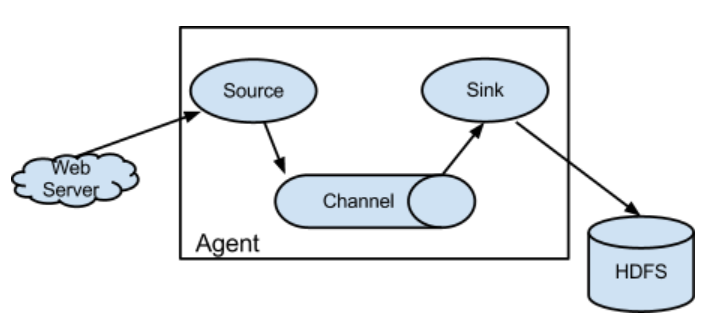

# Flume学习笔记

## 1、简介

Flume最早是Cloudera提供的一个高可用的，高可靠的，分布式的海量日志采集、聚合和传输的系统(其中Logstash也是日志采集的一大解决方案，具体内容详见)，是Apache下的一个孵化项目。它支持在日志系统中定制各类数据发送方，用于收集数据；同时，提供对数据进行简单处理，并写到各种数据接受方（可定制）的能力。开箱即用。开源之后更名为Apache flume。

Flume有以下特性：

- 提供上下文路由特征
2. Flume的管道是基于事务，保证了数据在传送和接收时的一致性
3. Flume是可靠的，容错性高的，可升级的，易管理的,并且可定制的。
4. Flume可以将应用产生的数据存储到任何集中存储器中，比如HDFS,HBase
- 当收集数据的速度超过将写入数据的时候，也就是当收集信息遇到峰值时，这时候收集的信息非常大，甚至超过了系统的写入数据能力，这时候，Flume会在数据生产者和数据收容器间做出调整，保证其能够在两者之间提供平稳的数据


## 2、运行流程

一般Flume程序的运行流程如下图所示：




- agent：Flume 系统中核心的角色是 agent，agent 本身是一个 Java 进程，一般运行在数据收集节点。每一个 agent 相当于一个数据传递员，内部包含有source、channel、sink三个组件。
- Source：采集源，用于跟数据源对接，以获取数据；
- Sink：下沉地，采集数据的传送目的，用于往下一级 agent 传递数据或者往最终存储系统传递数据
- Channel：agent 内部的数据传输通道，用于从 source 将数据传递到 sink；

在整个数据的传输的过程中，流动的是 event，它是 Flume 内部数据传输的最基本单元。event 将传输的数据进行封装。如果是文本文件，通常是一行记录，event 也是事务的基本单位。event 从 source，流向 channel，再到 sink。

event 封装的对象主要有两部分：Headers和Body;

Headers是一个集合Map<String,String>类型，用于存储元数据(如标志、描述等)
Body就是一个字节数组，装载具体的数据内容


## 3、安装部署

解压安装包：`tar -zxvf apache-flume-x.x.x-bin.tar.gz`

修改 conf 下的 flume-env.sh，在里面配置 JAVA_HOME (如export JAVA_HOME=/xxx/xxx)

在conf下编写一个flume程序运行配置demo.conf，通过命令 bin/flume-ng agent -c conf -f conf/netcat-logger.conf -n a1 -Dflume.root.logger=INFO,console 启动

-c conf 指定 flume 自身的配置文件所在目录
-f conf/netcat-logger.con 指定我们所描述的采集方案
-n a1 指定我们这个 agent 的名字

简单的配置文件demo.conf示例如下:

```shell
# 定义这个 agent 中各组件的名字
a1.sources = r1
a1.sinks = k1
a1.channels = c1

# 描述和配置 source 组件：r1,这里通过netcat监听网络端口的数据
a1.sources.r1.type = netcat
a1.sources.r1.bind = localhost
a1.sources.r1.port = 44444

# 描述和配置 sink 组件：k1，这里为打印日志
a1.sinks.k1.type = logger

# 描述和配置 channel 组件，此处使用是内存缓存的方式
a1.channels.c1.type = memory
a1.channels.c1.capacity = 1000
a1.channels.c1.transactionCapacity = 100

# 描述和配置 source channel sink 之间的连接关系
a1.sources.r1.channels = c1
a1.sinks.k1.channel = c1
```

## 4、Source

Source是数据来源

Flume自身支持Kafka Source，Exec Source，Spooling Directory Source等数据采集方式，如果不满足业务需求，用户可以自定义。自定义的Source，Sink，Interceptor等只需要将jar包放入flume下的lib目录，并在配置文件中通过全限定类名指定即可。

实例代码如下：

```java
// 自定义产生数字的Source，需继承AbstractSource类并实现PollableSource, Configurable两个接口
public class NumberGen extends AbstractSource implements PollableSource, Configurable {
    public Status process() throws EventDeliveryException {
        // 死循环，不断产生随机数字
        while (true) {
            try {
                // 创建一个Event对象，并且装入header和body
                SimpleEvent event = new SimpleEvent();
                Map<String, String> header = new HashMap<String, String>();
                header.put("type", "user-defined");
                Random random = new Random();
                String num = random.nextInt(100) + "";
                event.setHeaders(header);
                event.setBody(num.getBytes());
                getChannelProcessor().processEvent(event);
                Thread.sleep(1000);
                return Status.READY; // 返回就绪状态
            } catch (Exception e) {
                e.printStackTrace();
                return Status.BACKOFF;
            }
        }
    }

    /**
     * 开始，可以用于初始化
     */
    @Override
    public synchronized void start() {
        super.start();
    }

    /**
     * 关闭，可以用于关闭资源
     */
    @Override
    public synchronized void stop() {
        super.stop();
    }

    public long getBackOffSleepIncrement() {
        return 0;
    }

    public long getMaxBackOffSleepInterval() {
        return 0;
    }
    /**
     * 配置
     * @param context 上下文对象，可以获取到配置文件中的字段
     */
    public void configure(Context context) {
        context.getString("name", "sunny"); // 获取配置文件中配置的name字段的值，如果获取不到则使用默认值sunny
    }
}
```


## 5、Channel

channel是一种短暂的存储容器，它从source处接收到event格式数据后进行缓存，直到被消费掉。它在source和sink之间起到了桥梁作用，channel是一个完整的事务，这一点保障了数据在收发时的一致性，并且可以和任意数量的source和sink连接。

几种内置的channel：

- MemoryChannel：event存储在内存中，且可以配置最大值。对于需要高吞吐而且可以容忍数据丢
    失的情况下，可以选择该channel

- JDBC Channel：event被持久到数据库中，目前支持derby.适用于可恢复的场景

- KafkaChannel：agent利用kafka作为channel数据缓存；kafka channel要跟 kafka source、kafka sink区别开来；kafka channel在应用时，可以没有source

- FileChannel：event被缓存在本地磁盘文件中；可靠性高，不会丢失；但在极端情况下可能会重复数据

- Spillable Memory Channel：event存储在内存和磁盘上。内存充当主存储，磁盘充当溢出。

如果内置channel不满足需求，可以自定义，但是没有必要，因为内置channel已经够用且很优秀了。


## 6、Sink

sink将数据存储到集中存储器比如Kafka、Hbase和HDFS等，它从channels消费数据(events)并将其传递给目标地，目标地可能是另一个sink，也可能HDFS，HBase

自定义Sink示例代码如下：

```java
// 自定义Sink，将数字打印输出，继承AbstractSink类和实现Configurable接口
public class PrintNum extends AbstractSink implements Configurable {
    private static Logger logger = LoggerFactory.getLogger(HandleNum.class);
    /**
     * 业务处理
     * @return 状态
     */
    @Override
    public Status process() throws EventDeliveryException {
        Event event = null;
        // 获取channel
        Channel channel = this.getChannel();
        // 获取并开启事务
        Transaction transaction = channel.getTransaction();
        transaction.begin();
        while(true){
            event = channel.take();
            if(null != event){
                break;
            }
        }
        byte[] body = event.getBody();
        int num = Integer.parseInt(new String(body));
        try {
            logger.info("receive a num, it is {}", num);
            transaction.commit();
        } catch (Exception e) {
            transaction.rollback(); // 异常回滚事务，保证数据未被消费
            e.printStackTrace();
            return Status.BACKOFF;
        }finally {
            transaction.close(); // 结束关闭事务
        }
        return Status.READY;
    }

    /**
     * 配置
     * @param context 上下文环境
     */
    @Override
    public void configure(Context context) {}

    @Override
    public synchronized void start() {
        super.start();
    }
    @Override
    public synchronized void stop() {
        super.stop();
    }
}
```


## 7、拦截器 intercepotr

拦截器，拦截工作在source组件之后，source产生的event会被传入的拦截器根据需要进行拦截处理。可以根据业务逻辑修改拦截到的event（比如数据脱敏等），然后返回新的event。多个拦截器可以组成拦截器链。

几个的内置拦截器：

- host：往event的header中插入主机名信息
- timestamp：向event中，写入一个kv到header里，key的名称可以随意配置，value就是当前时间戳
- static：往event中添加一个自定义的header，key-value形式的，这个kv在配置文件中是写死的
- search_replace：该拦截器基于Java正则表达式提供简单的基于字符串的搜索和替换功能；类似于Java中的Matcher.replaceAll方法

内置拦截器无法满足业务需求时，可以使用自定义拦截器。自定义拦截器的运行机制如下：

1. Flume先调用自定义拦截器中的一个内部Builder类的config方法配置参数
2. 然后再调用Builder类的build方法获取实例对象
3. 最后调用intercept方法来处理event

代码实例如下：

```java
// 简单处理数字的自定义拦截器，需要实现Interceptor接口
public class HandleNum implements Interceptor {
    private static Logger logger = LoggerFactory.getLogger(HandleNum.class);
    /**
     * 初始化操作，可以用于打开资源
     */
    public void initialize() {}

    /**
     * 拦截单个event
     */
    public Event intercept(Event event) {
        //输出20-60之间的数，大于60，则×100
        int num = Integer.parseInt(new String(event.getBody()));
        if (num < 20) {
            logger.warn("num {} is too small, abandon!", num);
            return null;
        } else if (num > 60){
            num = num * 100;
        }
        event.setBody(Integer.toString(num).getBytes());
        return event;
    }

    /**
     * 拦截多个event（可以直接调用单个 event 的拦截器）
     */
    public List<Event> intercept(List<Event> list) {
        return list.stream()
                .map(this::intercept)
                .filter(Objects::nonNull)
                .collect(Collectors.toList());
    }

    /**
     * 拦截器关闭，可以用于关闭资源
     */
    public void close() {}

    /**
     * 通过内部类继承Builder类，并实现build方法，建立拦截器
     */
    public static class Builder implements Interceptor.Builder {
        public Interceptor build() {
            return new HandleNum(); // 创建拦截器实例
        }

        public void configure(Context context) {
            // 上下文环境，可以获取配置信息
        }
    }
}
```