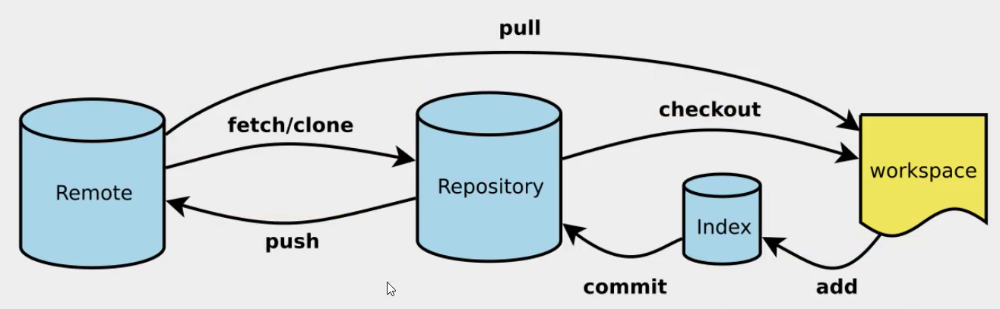

# Git安装与使用

## 1. 安装Git

- 进入官网 https://git-scm.com/ 下载并安装git（全部next即可）
- Git可以使用Git GUI和Git Bash，可以结合一起使用提高效率

## 2. 基础配置（git bash）

- 通过以下命令配置Git账户的用户名和邮箱，提交时别人会看到。

  ```shell
  git config --global user.name 'yourName'
  git config --global user.email 'yourEmail'
  ```

- 查看已有配置

  ```shell
  git config --list
  ```

第一次提交的时候，需要输入仓库的用户名密码，以后不用输入了。也可以把本机公钥加入到远程仓库中。

## 3. Git常用命令

- 常用命令

  ```shell
  git init 项目初始化 
  git clone 远程克隆项目到本地 
  git add file 添加到暂存区 
  git commit -m "" 添加commit信息 
  git push origin 将本地分支推送到服务器上去 
  git pull origin master 本地与服务器端同步
  
  git log 查看日志 
  git status 查看当前状态 
  git tag 查看版本号 
  git diff 查看尚未提交的更新
  
  git remote -v 查看远程仓库信息
  git remote set-url origin url 修改远程仓库地址
  ```

- fetch与pull

  pull是拉取当前服务器上最新的内容，并合并到当前本地仓库。

  fetch是拉取最新的内容，但是并不会自动合并到本地仓库，fetch到的信息保存在FETCH_FIRST文件中

  可以通过git log -p master..origin/master比较本地仓库与远程仓库的区别，也可以通过

  git merger origin/master命令合并fetch到的当前的本地仓库。

## 4. Git工作示意图



## 5. 解决 Failed to connect to github.com port 443:connection timed out超时
```shell
# 设置代理
git config --global http.proxy http://127.0.0.1:1080
git config --global https.proxy http://127.0.0.1:1080
# 取消代理
git config --global --unset http.proxy
git config --global --unset https.proxy
```
