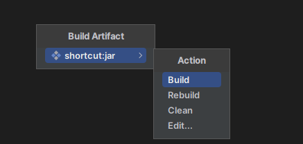

## 常用设置

### java doc代码头注释

settings - Editor - File And Code Templates - includes，找到（或者新建）java 扩展名的，然后输入模板，应用即可。

代码头模板如下（方法注释可以直接使用 idea 自带的）：

```java
/**
 * @Author: 
 * @Date: ${DATE} ${HOUR}:${MINUTE}
 * @Description: 
 */
```

### 设置多行文件tab

settings - Editor - General - Editor Tabs 勾选 Multiple rows

## 常用插件

### Code Glance

### Alibaba Java Coding GuideLines

### Lombok

### SonarLint


## Git使用

### 配置

### 常用方法

## Java打包

### IDEA Build

进入`Project Structure`，然后按照如下操作：


保存后结果如下


在 `IDEA` 导航栏中找到 `Build` -> `build Artifacts`，然后选中需要打包的模块，进行`build`。



成功之后，就会在out目录下生成jar包了。
