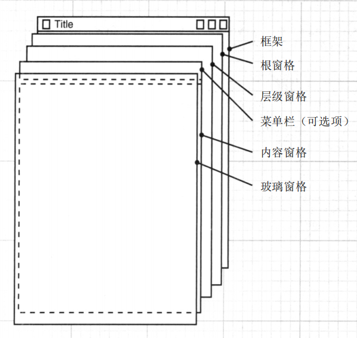

# Java核心技术 卷一

## 第2章 Java程序设计环境

### 使用命令行工具

编写代码文件Demo.java

```java
public class Demo {
    public static void main(String[] args) {
        System.out.println("Hello Java!");
    }
}
```

使用javac编译器进行，输出Demo.class字节码文件

```bash
javac Demo.java
```

通过java命令启动java虚拟机，运行字节码程序

```bash
java Demo # 不用加class
```

因为Demo.java中没有指定包名，所以直接在当前目录下即可运行，否则需要以运行路径作为基础查找包中的类，找不到会报错“找不到或无法加载主类”。

### Jshell


## 第3章 Java的基本程序设计结构

> 在java中，不区分变量的声明和定义。


## 第4章 类与对象


### 创建对象

#### 构造器

构造器是创建对象的方法，构造器可以有多个。

创建对象通过使用new 加构造方法的方式实现。构造方法支持创建对象，没有返回值。

```java
Student student = new Student();
```

以上代码在堆内存中创建了一个Student对象，并将对象的引用赋值给student变量。

null表示变量不引用任何对象。null和未初始化不是用一个含义。

#### 字段和局部变量初始化的区别

对象初始化时，如果构造没有对字段初始化，则它们会使用默认值：数值为0，布尔值为false，对象引用为null。但是局部变量不会被设置默认值。

### var声明局部变量

JAVA10支持在可以自动推断类型的情况下使用var声明局部变量，参数和字段的类型还是必须声明的。如下代码的局部变量就避免了重复写类型名Student。

```java
var student = new Student();
```

### final关键字

#### final字段

将实例字段定义为final。这样的字段必须在构造对象时初始化（可以在声明处初始化或者在构造函数中初始化）。初始化之后不能再给字段赋值。

final关键字只是表示变量中的对象引用不会再指向其他对象。但是已指向的对象可以更改。

#### final类和方法

final类和方法表示不可修改，不可继承。

#### final变量

在局部变量中使用，初始化之后变量中的对象引用不会改变。

### static关键字

static关键字用来修饰静态代码块、静态字段和静态方法。静态字段和静态方法只和类有关，不用实例化对象，通过类就可以调用。

在类第一次加载时，将会对静态字段初始化和执行静态代码块。所有静态字段初始化方法以及静态初始化块都是依照类声明中的顺序执行的。

> 术语"静态"只是沿用了C++的叫法，没有实际意义。

#### 静态代码块

在类加载时执行业务逻辑，可以用于做类的一些初始化操作。如JDBC中的驱动类，在被Class.forName()方法中加载之后，都会调用自身的静态代码块将自己注册到DriverManager中。

#### 静态字段

用在与对象无关的字段。即不是某个对象特有的状态或属性。

#### 静态方法

一般用在工具类中使用静态方法，无需实例化直接调用。或者使用做工厂方法以创建对象。

### this关键字

this表示当前对象，在对象每一个方法中，this都作为隐式参数放在第一个参数的位置（这是编译期体现的，对我们来是是透明的）。因此我们可以在方法中使用对象的字段。如果我们方法中使用字段时在前面加上this会提高代码的可读性。

```java
public void raiseSalary() {
    double raise = this.salary * byPercent / 100;
    this.salary += raise;
}
```

以上这种代码风格可以将实例字段和局部变量明显区分开来。

### 包

Java允许使用包（package）将类组织在一个集合中。使用包的主要原因是确保类的唯一性。事实上为了保证包名的绝对唯一性，要使用一个因特网域名以逆序的形式作为包名，然对于不同的工程使用不同的子包（所以java工程一般都嵌套好几层空包）。

> 编译器处理文件（带有文件分隔符和扩展名.java的文件），而java解释器加载类（使用 . 做为分隔符）
>
> 在包中定位类是编译器的工作。类文件的字节码总是使用完成的包应用其他的类。如果包与目录不匹配，虚拟机就找不到类。

#### 在包中增加类

将一个类加入一个包中，需要在类的代码使用package关键字声明。

```java
package com.demo.test;
public class Test{}
```

#### 类的导入

我们可以采用两种方式访问另外一个包中的公共类。

1. 使用权限定类名

   ```java
   java.util.Date date = new java.util.Date();
   ```

2. 使用import

   ```java
   package com.demo.test;
   import java.util.*
   public class Test{
       Date date = new Date();
   }
   ```

   import java.util.*导入了util整个包中的所有类，java一条import语句最多只能导入一个包。

   如果上面的代码中还有另外一条import java.sql.* 语句，使用Date时会报错，因为两个包都有Date类，因而不能保证类的唯一性。

#### 静态导入

有一种import语句允许导入静态方法和静态字段，而不只是类。

### jar文件

Java的归档（JAR）文件可以将java文件其他文件打包成一个压缩文件。这样既便于存储，也便于交付。JAR文件可以通过使用jar工具（位于 jdk/bin 目录下）生成。

除了类文件、图像和其他资源外，每个JAR文件还包含一个清单文佳（menifest），用于扫描归档文件的特殊性。该清单文件被命名为 MANIFEST.MF ，它位于JAR文件的特殊目录META-INF目录中。

可以通过 jar 命令 在MANIFEST.MF中指定程序入口点。

将Demo.class打成JAR包（使用java -jar package命令执行）；

```bash
jar cvf demo.jar Demo.class
```

这时 demo.jar 包是无法执行的，运行会提示 demo.jar 中没有主清单属性，也就是没有指定 jar 包运行入口。这时候需要使用使用 jar 命令中 e 选项指定入口类。

```bash
jar cvfe demo.jar Demo Demo.class
```

或者直接手动在 jar 包的 MANIFEST.MF 中添加程序入口类。Main-Class: Demo。

### 文档注释

JDk包含一个很有用的工具，叫做javadoc，它可以由源文件生成HTML文档。使用javadoc可以使得java代码和文档处在一个文件中，更加有利于学习和使用。文档注释都是以  `/**`开头。

```bash
# -encoding UTF-8 避免乱码 -d指定目录  最后面可以跟java文件或者包名
javadoc -encoding UTF-8 -d C:\Users\temp xxx*.java
javadoc -encoding UTF-8 -d C:\Users\temp xxxpackage
```

### 类设计技巧

1. 一定要保证数据私有

   这非常重要，绝对不要破坏封装性。这有利于代码的修改和Bug的排查。

2. 一定要对数据进行初始化

   虽然对象字段会在没有显式初始化时使用默认值，但是还是应该显示提供默认值。减少Bug出现的可能性和提高可读性。

3. 不要在类中使用过多的基本类型

   如果一个类中的有很多基本数据类型，应该考虑把相关的字段封装成一个独立的类，这样更加便于管理和使用。

4. 不是所有字段都需要setter和getter

   比如一个Student类，出生日期在构造方法中确定了，以后就不会再修改了。

5. 分解职责过多的类

   究竟多少才算多？这是因人而异的。但是如果一个类可以拆分成两个更简单的类，就应该拆分。

6. 类和方法名要体现它们的职责

   提高代码可读性

7. 优先使用不可变类

   类似String类，调用改变方法后会返回一个新的对象

## 第5章 继承

### 类的继承

一个类可以通过 extends 关键字实现扩展另外一个类。因为扩展的类拥有被扩展类的非私有方法和属性，所有扩展也叫继承。扩展的类称为子类、派生类或者孩子类。被扩展的类被称为超类、基类或者父类。Java中每个类都直接或者间接地继承了Object类。

> 超类和子类中的“超”和“子”来源于集合中的术语，超集和子集。明显超类代表的范围要比子类广。

子类可以重写父类方法，如果还需要调用父类方法需要通过 super 关键字，也可以通过 super 调用父类的构造器做一些初始化工作（初始化私有字段）。

> super 和 this的含义不一样，this是对象的引用，super只是java提供访问父类的一种方式。

子类在初始化时，子类构造器内必须调用父类构造器，如果没有显示的调用，则会调用父类的无参构造器。调用构造器的语句只能作为另外一个构造器的第一条语句出现。

如 super() 和 this() 等语句必须放在构造器的第一行。

### 访问权限

1. private：仅对本类可见
2. 默认：对本包可见
3. protected：对本包和子类可见
4. public：所有类可见

### 多态

有一个简单规则可以用来判断是否应该将数据设计为继承关系，这就是 “is a” 规则，它指出子类的每个对象也是父类的对象。

如 Student 类集成了 Person 类，因为 Student 是一个 Person。

#### 类型转换

Student 对象可以当做 Person 对象来使用。类型是自动转换的。

```java
Person p = new Student();
p.work(); // JVM动态分派决定调用重写的方法
```

如果上面的 Person 需要转化为 Student 对象（转换之后才能调用Student中的特有方法），则需要进行强制类型转换。为了确保转换成功，可以先使用 instanceof 关键字判断是否是该类型。

```java
if (p instanceof Student) {
    Student s = (Student)p;
}
```

#### 对象包装器的自动拆装箱

基本数据类型和其对应的包装类之间的类型转换是编译器自动（添加额外指令）完成。

自动装箱

```java
List<Integer> list = new ArrayList();
list.add(3); // 将3进行装箱成Integer对象
```

先自动拆箱，计算完成后再将结果装箱。

```java
Integer nun = 3;
num++;
```

### 反射

反射库提供了一个丰富且精巧的工具集，可以用来编写能够动态操作 Java 代码程序。不过反射一般在开发工具的时候使用比较多，一般应用程序使用比较少。使用反射编辑器无法帮助查找编程错误，而且运行效率不高，因此不要滥用反射。

反射中常用的几个类包括：Class、Filed、Method、Constructor四个类，分别用来描述类、类的字段、类的方法、类的构造器。这四个类都可以调用getModifiers()方法获取描述信息（使用数值表示），如访问权限、返回值类型等等。将描述信息数据传入Modifier.toString()方法可以进行分析得出字符内容的结果。

Class 可以获取字段、方法和构造器。Field 对象可以使用get和set方法获取和设置内部的值。Method 对象可以调用invoke方法进行调用。Constructor对象可以调用newInstance方法创建新对象。

使用反射创建数组并复制，Arrays.copyOf()也是同样原理。

```java
Object strs = new String[]{"1", "2", "3"};
// 这里将数组声明为Obejct，需要时可以直接强转
Object newArray = Array.newInstance(String.class, strs.length);
System.arraycopy(strs, 0, newArray, 0, strs.length); // 调用本地方法实现
```


## 第6章 接口、lambda表达式与内部类

### 接口

在 java 中接口不是类，而是对希望符合这个接口的类的一组需求。接口中的所有方法都自动是 public 方法。接口中的字段总是自动被设置为 public static final。

#### 为什么需要接口

抽象类和接口同样不能被实例化。而且使用抽象类也可以表示类的通用行为和属性。那么为什么还需要接口呢？

这是因为 Java 中每个类只能继承一个其他类。Java 的设计者觉得多重继承会让语言变得非常复杂或者效率变低。

接口可以提供多重继承的大多数好处、同时还能避免多重继承的复杂性和低效性能。

#### 接口新特性

在 Java 8中，允许在接口中增加静态方法和默认方法。

到目前为止，通常的做法都是将静态方法放在伴随类中。标准库中，我们会看到成对出现的接口和使用工具类。如 Collection/Conllections 或 Path/Paths。

默认方法需要使用 default 关键修饰。在默认方法做一些实现。如果一个类实现了接口并且继承了一个类，被继承的类和接口的默认方法都包含了同名的方法，那么冲突的方法会以 “类优先” 的方式解决，即优先使用类的方法，其次才考虑接口的方法。

#### 对象克隆

一个对象如果需要调用 clone 方法，必须要实现 Cloneable 接口。clone() 方法继承自 Object 类，该方法是一个本地方法，实现对象的浅拷贝。浅拷贝即只是拷贝对象中的基本数据类型的属性，引用类型将会和原对象使用同一个引用（当然如果引用的对象是一个不可变对象如 String ，这样是内没有问题的，因为它不会被改变）。

Cloneable 是 Java 提供的少数标记接口之一。标记接口不包含任何方法，它唯一的作用就是允许在类型查询中使用 instanceof 。

### lambda表达式

在 Java 中，传递一个代码片段并不容易，我们不能直接传递代码段。Java 是面向对象语言，因此必须构造一个对象，这个对象的类需要有一个方法包含所需要的代码。

#### 基本语法

lambda的基本语法如下（返回值类型可以根据上下文推导出）：

```java
(Type parameter...) -> {
    // do something
}
```

如果可以推导出参数类型，则可以省略其类型。

如果只有一个参数而且可以推导出其类型，则可以省略小括号。

如果方法体只有一句话，则可以省略大括号。

被省略后最简单的 lambda 表达式与如下代码类似：

```java
x -> x * 2; // 计算一个 参数*2 的结果
```

#### 函数式接口

对于只有一个抽象方法的接口，需要这种接口的对象时，就可以提供一个 lambda 表达式。这种接口称为函数式接口。定义函数式接口代码如下：

```java
// 注解只是为了便于编译检查，可以不使用
@FunctionalInterface
interface Calculate{
    int cal(int a, int b);
}
```

在需要 Calculate 实现类的对象参数中使用 lambda 表达式即可

```java
call((x, y) -> x * y); // 方法体可以方便的写入具体实现
```

lambda 表达式能做的也只是转化为函数式接口。在上面代码中，完全可以先写一个实现了 函数式 接口的类，然后创建一个对象传入方法中，只是 lambda 表达式显得更加简洁。

> 不能把 lambda 表达式赋值给类型为 Object 的变量，因为 Object 不是函数式接口

#### 闭包

lambda 表达式包含3个部分：

1. 一个代码块
2. 参数
3. 自由变量的值，即非参数也不在代码中定义的变量

所谓闭包就是代码块以及自由变量的值。

lambda 表达式可以捕获外围作用域中变量的值。但是有两条规则：

1. 在lambda 表达式中只能引用值不会改变的变量（不能重新赋值）。
2. 也不能在表达式中改变外围作用域中的值。

如下代码是不合法的：

```java
// 错误一：使用了外围作用域中值会改变的变量num
int num = 99;
show((x, y) -> {
    System.out.println(num);
    return x * y;
});
num ++;

// 错误二：在表达式中改变了外围作用域的变量num
int num = 99;
show((x, y) -> {
    System.out.println(++num);
    return x * y;
});
```

如果还是需要使用如上代码，应该按照下面方式进行调整：

```java
// 方案一：在表达式外面让变量 num 复制到变量 n 中，然后使用变量 n 即可
int num = 99;
int n = num;
show((x, y) -> {
    System.out.println(n);
    return x * y;
});
num ++;

//方案二：在表达式里面让变量 num 复制到变量 n 中，然后使用变量 n 即可
int num = 99;
show((x, y) -> {
	int n = num;
    System.out.println(++n);
    return x * y;
});
```

#### 方法引用

方法引用指示编译器生成一个函数式接口的实例，覆盖这个接口的抽象方法来调用给定的方法。使用示例：

```java
List<String> list = new ArrayList<>();
list.forEach(System.out::println); 
```

forEach()方法中的函数式接口是Consumer，这里使用 System.out 的 println() 覆盖了接口的抽象方法。

使用方法引用主要包括以下3中情况：

1. object::instanceMethod

   方法引用等价于向方法传递参数的 lambda 表达式。对于System.out::println，对象是System.out，表达式等价于 x -> System.out.println(x)。

2. Object::instanceMethod ：

   第一个参数会成为方法的隐式参数（即this，方法所属的对象）。如String::compareIgnoreCase等价于 (x, y) -> x.compareIgnoreCase(y)。

3. Object::staticMethod ：

   所有参数都传递到静态方法，如Math::pow等价于(x, y) -> Math.pow(x, y)。

> 类似于 lambda 表达式，方法引用不能独立存在，总是会转换为函数式接口的实例。

### 内部类

#### 一般内部类

内部类是定义在一个类内部的类。

1. 内部类可以对同一个包中的其他类隐藏。
2. 内部类可以访问定义这个类的作用域的数据，包括私有数据。

内部类总有一个隐式引用，指向创建它的外部类对象。编译器在编译的时候修改内部类的构造器，添加一个对应外部类引用的参数，然后从外部类中把引用传进来。

内部类是一个编译器现象，与虚拟机无关。编译器会把内部类转换为常规文件，用 $ 分隔外部类与内部类名，而虚拟机对此并不知道。

#### 局部内部类

定义在方法内部的类叫做局部内部类。不过一般不使用这种方式，因为容易导致代码很混乱。

#### 匿名内部类

如果只想创建这个类的对象，甚至不需要为类指定名字。这样的类称为匿名内部类，特点是声明后立即初始化，且只能使用一次。

匿名内部类与局部内部类有一点类似，但是比局部内部类简洁很多。匿名内部类的语法如下：

```java
new SuperType(){
    // inner class and data
}
```

SuperType 既可以是接口也可以是类。因为内部类是匿名的，所以不能包含构造器，不过可以包含初始化代码块。

#### 静态内部类

有时候使用内部类只是为了把一个类隐藏在另外一个类的内部，并不需要内部类有外围类对象的引用。就可以将内部类声明为 static，这样编译器就不会生成外围类对象的引用了。

如我们就是想定义一个简单的数据结构，但是担心与其他类重名，就可以使用静态内部类。

> 只要内部类不需要访问外围类对象，就应该使用静态内部类。

## 第7章 异常、断言和日志

### 异常

#### 异常介绍

所有的异常都是由 Throwable 继承而来的，但在下一层立即分解为两个分支：Error和Exception。

Error类层次描述了Java运行时系统内部错误和资源耗尽错误。我们的程序不应该抛出这种异常，如果出现这样的错误，除了通知用户并且尽力妥善终止程序，我们几乎无能为力。这种情况比较少见。


在设计Java 程序时，我们应该重点关注Exception层次结构。Exception又有两个分支：一个分支派生于RuntimeException代表运行时异常；另外一个分支派生于IOException代表其他异常。

派生于Error类或者RuntimeException类的所有异常称为非检查型（unchecked）异常，所有其他的异常称为检查型（checked）异常。

检查型异常包括：数组下标越界异常、空指针异常等。“如果出现RuntimeException，那么就一定是你的问题“，这句话很有道理。

一个方法必须声明所有可能抛出的检查型异常（可以预料到的IOException），而非检查型异常要么在你的控制之外（Error），要么是由从一开始就应该避免的情况所导致的（RuntimeException）。如果方法没有声明所有可能抛出的检查型异常，编译器会报错。

#### 抛出异常

抛出异常代码如下所示：

```java
public void show(boolean flag) throws RuntimeException, IOException{
    if (flag) {
        throw new RuntimeException();
    } else {
        throw new IOException();
    }
}
```

如果标准异常类无法描述你遇到的问题，则可以创建一个新的异常。继承Exception或者其子类如IOException等。习惯的做法是自定义异常类包含两个构造器，一个是默认构造器，一个是包含详细信息字符串参数的构造器。

#### 捕获异常

如果某个方法抛出了异常，异常后面代码不会被执行，而且方法没有返回值。这时候虚拟机会向外界查找对应异常捕获代码，找到这运行异常捕获代码，如果一直找不到就会把异常丢给虚拟机，程序就会终止。

捕获异常的代码模板：

```java
try{
    code;
    more code;
}catch(NullPointerException e){
    // ...
}catch(IndexOutOfBoundsException e){
    // ...
}
```

一般经验：捕获你知道如何处理的异常，继续传播你不知道如何处理的异常。

JDK7以后，如果两种异常处理方式一样，可以合并异常

```java
try{
    code;
    more code;
}catch(NullPointerException | IndexOutOfBoundsException e){
    // ...
}
```

在 catch 子句中可以继续抛出异常，如只是想打个日志而不处理异常的情况。也可以对异常进行包装，使它成为其他异常。如下代码所示：

```java
// 将SQL异常转化为Servlet异常，因为不关心具体细节，之关系Servlet初始化是否成功
try{
    // access database
} catch(SQLException e) {
    ServletException newE = new ServletException();
    newE.initCause(e); // 将原始异常装进新异常
    throw newE; // 抛出新异常
}
// 取出原始异常
Throwable original = caughtException.getCause();
```

强烈建议使用异常包装技术。这样可以在子系统抛出高层异常，而不丢失原始异常的细节。

#### 善后处理

在捕获异常之后可以加finally子句（也可以只有try和finally而没有catch），用于资源回收等善后操作。不管catch是否执行，finally子句一定会执行。

> 在finally中包含return语句时，有可能产生意想不到的结果。
>
> 在方法返回前，会执行finally子句。如果finally中也有一个return语句，这个值会屏蔽之前的返回值。
>
> finally子句主要用于资源清理。不要把控制流的语句（return，throw，break，continue）放在里面。

在JDK7以后，可以使用 try-with-resource 语句进行资源资源的处理。代码如下

```java
try(Resource res) {
    // do something
}
```

try 块退出时，会自动调用 res 资源对象的 close() 方法。

> try-with-resource 也可以有catch 和 finally 子句，它们会在资源关闭后执行

### 断言

断言机制允许在测试期间向代码中插入一下检查，而在生产代码中自动删除这些检查。断言的基本语法：

```java
assert condition;
// or
assert condition: expression
```

断言默认是关闭的，可以通过启动参数开启。

因为断言只是在开发和测试阶段打开，因此有人把断言戏称为”在靠近海岸的时候穿上救生衣，但是在海里的时候把救生衣抛掉“。

### 日志

为什么不使用 System.out.println() 来记录日志？因为它不能控制日志等级、不能将日志输出到文件等。

标准Java日志框架在 java.util.logging 包中。虽然标准Java日志框架不如 Log4J2 和 Logback 日志框架性能高，但是学习了解Java标准日志框架对学习其他日志框架是有帮助的。

> SLF4J 和 Commons Logging 等日志门面提供了一个统一的API，利用这个API，我们无需重写日志代码就可以替换日志框架。

标准日志框架的使用

```java
// 获取一个日志记录器
private static final Logger logger = Logger.getLogger("className");
logger.setLevel(Level.ALL); // 设置所有等级的日志都代印
logger.info("some message"); // 打印消息
```

> 日志记录器一般都声明为static final
>
> static：因为每个类只需要一个记录器即可，单例模式可以不用static
>
> final：编程习惯，而且使用 final 可以提高日志的可信度


## 第8章 泛型程序设计

## 第9章 集合

### Java 集合框架

在正常实现方法或者非常关注性能时，选择不同的数据结构会带来很大差异。与现代数据结构类库的常见做法一样，Java集合类库也将接口与实现分离。

这样的好处是一旦构造了集合，就不需要知道究竟是用了那种实现了（数组列表？还是链表列表）。只有在构造集合时才会使用具体类，之后使用接口类型存放集合引用。使用这种方式，当你想换集合实现时，只需要改动一个地方即可。

在Java类库中，集合类的基本接口是Collection接口。（映射扩展了Map接口）Collection接口又扩展了Iterable接口，所以标准类库中的任何集合都可以使用“for each循环”。编译器简单地将“for each”循环转换为带有迭代器的循环。

```java
for(String e: list) {
    // do something
}
```

我们可以认为集合的迭代器位于两个元素之间，当调用next时，迭代器就越过下一个元素并返回刚刚越过的那个元素的引用。可以将Iterator.next和InputStream.read看成等效的。迭代器的next方法和remove方法是相互关联的，没有调用next方法就调用remove方法时不合法的。

### 具体集合

Java库中的常见集合

| 集合类型        | 描述                                                     |
| --------------- | -------------------------------------------------------- |
| ArrayList       | 高效随机访问的序列                                       |
| LinkedList      | 高效插入和删除的序列                                     |
| ArrayDequeue    | 实现为循环数组的双端队列                                 |
| HashSet         | 没有重复元素的无序集合                                   |
| TreeSet         | 相对HashSet是有序的                                      |
| EnumSet         | 一个包含枚举类型值的集                                   |
| LinkedHashSet   | 可以记住插入次序的集合                                   |
| PriorityQueue   | 允许高效删除最小元素的集合，可以用于任务调度             |
| HashMap         | 映射                                                     |
| TreeMap         | 键有序的映射                                             |
| EnumMap         | 键属于枚举类型的映射                                     |
| LinkedHashMap   | 记住键值加入顺序的映射                                   |
| WeakHashMap     | 值不会再别处使用的时候就可以被垃圾回收                   |
| IdentityHashMap | 用==而不是equals比较键的一个映射                         |
| BitSet          | 位集，存储布尔类型的集合，效率比ArrayList<Boolean>高的多 |

### 视图与包装器

可以使用视图获取其他实现了Collection接口或Map接口的对象。

如下代码

```java
Set<String> set = map.keySet();
```

keySet 方法并不是创建了一个新集，然后填入映射中的所有键。keySet方法返回一个实现了set接口的类对象，由这个类的方法操纵原映射。这种集合称为视图。

#### 小集合

Java9中引入了许多静态方法，可以生成给定元素的集或列表，以及给定键值对的映射。

```java 
List<String> names = List.Of("sunny", "angeya");
Set<Integer> numbers = Set.of(2, 3, 5);
Map<String, Integer> scores = Map.of("sunny", 98, "angeya", 99);
```

#### 子范围

可以为很多集合建立子范围视图。对范围视图的操作就直接影响到原视图。

```java
// 删除前3个元素
List<Integer> subList = list.subList(0, 3);
subList.clear();
list.forEach(System.out::println);
```

对于有序集（实现SortedSet接口）和映射（实现SortedMap接口），可以使用排序顺序而不是元素位置建立范围。方法名如下

subSet、headSet、tailSet。subMap、headMap、tailMap。

#### 同步视图

Collections类的静态方法synchronizedMap可以将任何一个映射转换成有同步访问方法的Map。

```java
Map<String, String> sychronizedMap = Collections.synchronizedMap(map);
```

### 属性映射

属性映射是一个特殊类型的映射结构。有如下三个特性：

1. 键值都是字符串
2. 这个映射可以很容易地保存到文件以及从文件中加载
3. 有一个二级表存放默认值

使用示例：

```java
// 设置属性
Properties properties = new Properties();
properties.setProperty("name", "sunny");
properties.setProperty("age", "25");
// 存储到文件，第二个参数是描述信息，存放在文件头
properties.store(new FileOutputStream(""), "properties demo");
// 创建新属性映射对象
Properties properties1 = new Properties();
// 从文件中加载属性映射到对象
properties1.load(new FileInputStream(""));
String name = properties1.getProperty("name");
```

### 算法

#### 排序

```java
Collections.sort(list); // 这个方法假定元素实现了Comparable接口。升序排序
list.sort((o1, o2) -> o2 - o1); // 传入一个Comparator对象，进行自定排序
```

链表的随机访问效率很低，这种情况可以使用归并排序对链表进行高效排序。不过Java 的实现是将链表中的元素转入一个数组进行排序，然后再将排序后的序列赋值回链表。

集合类库中使用的排序算法比快速排序要慢一些，快速排序是通用排序算法的传统选择，不过快速排序是不稳定的。

#### 混洗

与排序相反的操作时混排。

```java
Collections.shuffle(list);
```

#### 二分查找

二分查找需要集合是有序的，方法返回负值表示没有查找到，如果是非负值则表示找到元素的下标。集合必须支持随机访问，二分查找才有意义，否则二分查找就是去了意义。

```java
Collections.binarySerch(list, element);
```

### List的一些使用使用场景

#### 遍历List删除元素的几种方法

普通遍历删除存在的问题：

```java
// 基础数据
List<String> list = new ArrayList<>();
list.add("北京市");
list.add("上海市");
list.add("江苏省");

// fori循环，删除北京市，这种情况下看似没问题
// 其实北京市被删除之后，上海的下标变为了0，第二次循环就直接跳过上海市了，直接到江苏省
// 当删除的元素的更多时，问题更加容易显现出来
for (int i = 0; i < list.size(); i++) {
    if (list.get(i).contains("市")) {
        list.remove(i);
    }
}

// 使用高级for循环（基于迭代器），会抛出 ConcurrentModificationException 异常
for (String s : list) {
    if (s.contains("市") {
        list.remove(s);
    }
}
```

1. for循环手动修改下标

   ```java
   for (int i = 0; i < list.size(); i++) {
       if (list.get(i).contains("市")) {
           list.remove(i);
           // 因为元素向前移动了一位，所以下标要向前移动，避免跳过元素
           i--;
       }
   }
   ```

   

2. for循环倒序遍历

   ```java
   // 倒序使被删除的元素不影响剩余的元素
   for (int i = list.size() - 1; i >= 0; i--) {
       if (list.get(i).contains("市")) {
           list.remove(i);
       }
   }
   ```

   

3. 使用迭代器删除

   ```java
   Iterator<String> iterator = list.iterator();
   while(iterator.hasNext()) {
       if (iterator.next().contains("市")) {
           iterator.remove();
       }
   }
   ```

4. removeIf方法

   ```java
   list.removeIf(s -> s.contains("市"));
   ```

5. 使用Stream中的filter筛选

   ```java
   // 筛序不包含"市"的字符串
   list = list.stream().filter(s -> !s.contains("市")).collect(Collectors.toList());
   ```

   

## 第12章 并发

### 什么是线程

线程是控制线程的简称。如果一个程序可以运行多个线程，则称这个程序是多线程的。

在有些操作系统中，与进程相比，线程更“轻量级”，创建、销毁一个线程比启动新进程的开销小的多。

创建线程可以通过实现Runnable接口，然后通过Runnable对象创建一个Thread对象，调用Thread对象的start方法即可启动线程。

当然，也可以通过继承Thread类来创建线程，不过现在不推荐这种方式。应当把要并行运行的任务与运行机制解耦合。

### 线程状态

线程可以有如下6种状态：

1. New（新建）
2. Runnable（可运行）
3. Blocking（阻塞）
4. Waiting（等待）
5. Timed waiting（计时等待）
6. Terminated（终止）


### 线程属性

#### 线程中断

除了已经废弃的stop方法，没有办法可以强制线程终止。不过，interrput方法可以用来请求终止一个线程。

当对一个线程调用interrupt方法时，就会将线程的中断状态就被设置为true，程序员可以在合适的位置检测中断状态是否为true，为true是安全退出，即跳出线程循环，使其自然结束。代码如下：

```java
while (Thread.currentThread().isInterrupted() && more work to do) {
    // do more work
}
```

但是如果线程被阻塞，就无法检查中断状态。当在一个被sleep或wait调用阻塞的线程上调用interrupt方法时，那个阻塞调用将会被一个InterruptedException异常中断掉。这时候代码的形式一般如下：

```java
try {
    while (Thread.currentThread().isInterrupted() && more work to do) {
    	// do more work
        // 当sleep或者wait阻塞时设置线程中断、这时会抛出InterruptedException异常
        // 这个时候不会清除中断状态
	}
} catch (InterruptedException e) {
    // thread was interrupted during sleep or wait
}
```

如果每次工作迭代之后都调用sleep方法（或者其他可中断方法），isInterrupted检查既没有必要也没有用。如果线程设置了中断状态，再调用sleep方法，它不会休眠。实际上它会清除中断状态并抛出InterruptException异常，因此isInterrupted检查是无用的（除非在捕获异常代码中重新把线程置为中断状态，不过没必要如此处理）。这时候应当捕获InterruptException，代码示例如下：

```java
try {
    while (more work to do) {
    	// do more work
        // 当线程中断了再调用sleep或wait方法，不会休眠，而是抛出InterruptedException异常
        // 并且清除中断状态！！！
        Thread.sleep(200);
	}
} catch (InterruptedException e) {
    // thread was interrupted during sleep or wait
}
```

#### 守护线程

可以调用如下方法将线程设置为守护线程。不过这样一个线程并没有什么魔力。不过当只剩下守护线程时，虚拟机就会退出。因为守护线程是为其他线程服务的。

```java
thread.setDaemon(true);
```

#### 线程名

通过设置为线程设置通俗易懂的名字，这会在线程转储或者日志中很有用。

```java
thread.setName("a thread");
```

### 线程同步

#### ReentrantLock锁

##### 锁

```java
Lock lock = new ReentrantLock(); // lock是全局变量，不是局部变量
try {
    lock.lock();
    // do something
} finally {
    lock.unlock(); // 要确保锁释放掉
}
```

使用锁时，就不能用try-with-resource语句了。

ReentrantLock称为重入锁，因为线程可以反复获得已经拥有的锁。比如在获得锁之后需要递归调用，或者调用另外一个需要同一个锁的方法。锁有一个持有计数来跟踪对lock方法的调用，当计数为0时失去锁。

ReentrantLock默认是非公平锁，也可以在构造函数中设置为公平锁，不过公平锁严重影响性能，所以除非特殊业务，否则不建议使用公平锁。

##### 条件对象

我们可以使用一个条件对象来管理那些已经获得了一个锁却不能做有用工作的线程。代码如下：

```java
private Lock lock = new ReentrantLock(); // lock是全局变量，不是局部变量
private Condition condition = lock.newCondition(); // 使用锁创建一个条件对象
try {
    lock.lock();
    if (need other condition){
        // 当条件不满足时调用await方法，放弃锁，等待其他线程运行来满足条件
        // 当重新竞争到锁之后，代码会从当前位置继续执行
        condition.await();
    }
    // do something
    // 通知所有在await的线程，可以竞争锁了
    condition.signalAll();
} finally {
    lock.unlock(); // 要确保锁释放掉
}
```

实际上，正确使用条件很有挑战性。在使用条件对象之前，优先考虑使用线程安全集合。

#### sychronized锁

如果一个方法声明为sychronized，那么对象的锁将会保护整个方法，要调用这个方法，线程必须获得内部对象锁。

```java
public sychronized void method() {
    // do something
}
// 等价于
public void method() {
    // 同步代码块
    sychronized(this) {
        // do something
    }
}
// 等价于
public void method() {
    this.intrinsicLock.lock();
    try {
        // do something
    } finally {
        this.intrinsicLock.unlock();
    }
}
```

内部对象锁只有一个关联条件，wait方法会将一个线程增加到等待集合中，notifyAll/notify方法可以解除等待线程的阻塞。换句话说，调用wait或notifyAll等价于：

```java
intrinsicCondition.await();
intrinsicCondition.signalAll();
```

建议：优先使用线程安全集合 > sychronized > lock

#### volatile字段

多处理器计算机能够在寄存器或者本地缓存（工作内存）中保存内存（主内存）值，导致运行在不同处理器上的线程可能看到同一个内存位置的值不一致。

同时，编译器有时户通过改变指令顺序以使吞吐量最大化（指令重排）。指令重排序在单线程下是可以保证结果的正确性的，但是多线程环境下内存值可能被另外一个线程修改。

解决的办法是字段使用volatile关键字修饰，这可以使各个线程修改了字段值之后可以立马写会主内存，其他线程需要该字段值时也从主内存中去获取。这就保证了内存可见性。

但是volatile并不保证原子性，可能两个线程读到的值都是正确的，但是写回去的时候被覆盖了。所以volatile适合用在一写多读的情况。

#### 原子性

java.util.concurrent.atomic包中有很多类使用了很高级的机器级指令来保证其他操作的原子性。如AtomicInteger、AtomicBoolean等。

#### 线程局部变量


#### 废弃方法stop和suspend

stop是不安全的，因为线程立马被终止，同时释放所有的对象锁。这会使对象处于不一致的状态。如转账业务中钱出去之后终止，但是钱还没有进入目标账户。而中断可以在安全的位置终止线程。

suspend不会破坏对象。但是，如果用suspend挂起一个持有锁的线程，那么，在线程恢复运行之前这个锁是不可用的，而挂起线程等待resume方法恢复，这样容易导致死锁。

### 线程安全的集合

可以通过提供锁来保护共享的数据，但是选择线程安全的数据结构实现可能更为容易。

虽然线程安全的集合可以保证内部数据结构不会因为多线程修改而被破坏，但是并不能保证在多线程业务使用就是正确的，这需要保证业务操作的原子性。

#### 阻塞队列

在协调多个线程之间的合作时，阻塞队列是一个有用的工具。常用的阻塞队列（它们都实现了BlockingQueue接口）有：

| 阻塞队列               | 描述                                                         |
| ---------------------- | ------------------------------------------------------------ |
| ArrayBlockingQueue     | 循环数组实现                                                 |
| LinkedBlockingQueue    | 链表实现，默认容量为Integer.MAX_VALUE，最好限制              |
| PriorityBolockingQueue | 阻塞优先队列                                                 |
| DelayQueue             | 延时队列，只有过期的元素可以被取出                           |
| SynchronousQueue       | 一个不存储元素的阻塞队列。每一个put操作必须等待一个take操作。吞吐量高于LinkBlockingQueue和ArrayBlockingQueue |

阻塞队列的方法：

| 方法    | 正常操作           | 特殊情况操作       |
| ------- | ------------------ | ------------------ |
| add     | 添加元素           | 队列满则抛异常     |
| element | 返回队头元素       | 队列为空则抛异常   |
| remove  | 移除并返回队头元素 | 队列为空则抛异常   |
| offer   | 添加元素并返回true | 队列满则返回false  |
| peek    | 返回队头元素       | 队列为空则返回null |
| poll    | 移除并返回队头元素 | 队列为空则返回null |
| put     | 添加元素           | 队列满则阻塞       |
| take    | 移除并返回队头元素 | 队列空则阻塞       |

#### 高效的映射、集和队列

java.util.concurrent包提供了映射、有序集和队列的高效实现：ConcurrentHashMap、ConcurrentSkipListMap、ConcurrentSkipListSet、ConcurrentLinkedQueue。

#### 写数组的拷贝

CopyOnWriteArrayList和CopyOnWriteArraySet是线程安全的集合，其中所有更改器会建立底层数组的一个副本。即便有线程修改了数组，之前通过数组获取的迭代器依然可以正常使用（但是数据可能过时了），而且不存在任何同步开销。

#### 较早的线程安全集合

从Java的初始版本开始，Vector和HashTable类就提供了动态数组和散列表的线程安全的实现。现在这些类被认为已经过时了（里面都是同步方法，效率低），而被ArrayList和HashMap所取代（不过他们并不是线程安全的）。

集合库中还提供了一种不同的机制：任何集合类都可以通过使用包装器变成线程安全的。

```java
List<String> syncList = Collections.synchronizedList(new ArrayList<>());
Map<String, String> syncMap = Collections.synchronizedMap(new HashMap<>());
```

通常最好使用JUC包中定义的集合，而不是使用包装器。

#### 同步计数器

##### CountDownLatch

同步辅助类，可以用于在若干个任务完成后再继续后面的操作。例如：主线程需要等待三个子线程完成工作后，做一个汇总，则通过构造函数初始化倒计时的数，每个线程完成时调用CountDownLatch对象的countDown方法表示一个任务完成。主线程会阻塞在CountDownLatch对象的await()方法中，直到countDown将倒计数减为0；

##### Semaphore

计数信号量。应用场景为，允许同时有n个线程工作（获取许可），通过构造方法初始化并发个数，每个线程调用Semaphore对象的acquire方法获取许可，在获取许可前一直阻塞。线程工作完成后调用release方法释放一个许可，这时其他线程可以获取许可。资源有限的场景可用，如线程池、连接池、排队等。

##### CyclicBarrier

直译过来是循环屏障，同步辅助类，通过构造函数确定有几个线程进行协同作业，用于确保若干个线程都到达(缺一不可)某一步时（即每个在线程中都调用了CyclicBarrier对象的await方法），所有线程才能继续往下执行。CyclicBarrier重点是多个线程互相等待，CountDownLatch重点是一个线程等待其他多个线程完成。

### 线程池

如果频繁地创建线程，而且这些线程做的工作又很少。那么创建线程的开销相对业务来说就很大。这种情况应该使用线程池，池中的线程会不断复用（原理：创建多个线程，然后调用Runnable对象的run方法）。

线程池相关类：

Executor：执行器，线程池的顶级接口，严格来说不算线程池，而是一个执行线程的工具。

Executors：线程池辅助类，有许多实用的静态方法。

ExecutorService：执行器服务，真正地线程池接口。继承Executor接口，并声明了submit、invokeAll、shutdown等方法。

ThreadPoolExecutor：ExecutorService的默认实现，继承了类AbstractExecutorService。可以用来创建自定义线程池。

#### JDK内置线程池

以下为JDK内置的几种常见线程池：

```java
// 固定大小的线程池，可能队列中任务过多导致OOM
ExecutorService executorService = Executors.newFixedThreadPool(10);
// 动态伸缩的线程池，可能会创建大量的线程降低系统性能
ExecutorService executorService = Executors.newCachedThreadPool();
// 创建单线程线程池，保证任务执行顺序，也可以用于测试单线程与多线程的性能差异
ExecutorService executorService = Executors.newSingleThreadExecutor();
```

#### 自定义线程池

内置线程池不满足需求的时候，需要我们创建自己的线程池。ThreadPoolExecutor是创建线程池的核心类，有多个构造方法，但是最终都会调用下面这个方法。

```java
ExecutorService service = new ThreadPoolExecutor(10, 15, 60,
                TimeUnit.SECONDS, new ArrayBlockingQueue<>(10),
                Executors.defaultThreadFactory(), 
                new ThreadPoolExecutor.AbortPolicy());
```

线程工厂ThreadFactory是用来创建线程的（返回一个Thread对象），可以自定义实现，不过一般使用默认提供的就够了。

拒绝策略，默认是AbortPolicy

#### ExecutorService常用方法

```java
Future<T> submit(Callable<T> task); // 提交callable任务
Future<T> submit(Runnable task, T result); // 
Future<?> submit(Runnable task); //
void execute(Runnable task); // 执行任务，没有返回值
shutdown(); // 不再接收新任务，等所有提交的任务执行完后关闭线程池
shutdownNow(); // 等正在执行任务完成就关闭线程池
```

### Callable和Future

Runnable封装一个异步运行的任务，可以把它想象成一个没有参数和返回值的异步方法。Callable与Runnable类似，但是有返回值。Callable接口是一个参数化的类型，只有一个方法call。

Future保存异步计算结果，Future<V>接口有如下方法：

```java
V get(); // 获取任务结果，会阻塞到任务执行完成为止
V get(long timeout, TimeUnit unit); // 也会阻塞，但是超时没有结果会抛出TimeoutException异常
void cancel(boolean mayInterrupt); // 取消任务。如果任务还没有开始会被取消。如果正在执行，mayInterrupt为true则任务被中断
boolean isCaneled(); // 任务是否已经被取消
boolean isDone(); // 任务是否执行完成
```

Callable一般都是配合Futrue一起使用的，使用方法由以下两种：

```java
// 创建一个任务
Callable<String> stringCallable = new Callable<String>() {
    @Override
    public String call() throws Exception {
        Thread.sleep(3000);
        return "This is callable";
    }
};
// 方法一：通过FutureTask，它实现了Future和Runnable接口
FutureTask<String> task = new FutureTask<>(stringCallable);
Thread thread = new Thread(task);
thread.start();
System.out.println(task.get()); // 打印执行结果
// 方法二：通过执行器执行
ExecutorService service = Executors.newSingleThreadExecutor();
Future<String> result = service.submit(stringCallable);
service.shutdown();
System.out.println(result.get()); // 打印执行结果
// 也可以批量在线程池中执行任务
List<Callable<Integer>> callableList = ...
List<Future<Integer>> resultList = executorService.invokeAll(callableList);
```

### 异步计算

等待添加...

### 进程

有时需要执行一个另一个程序。可以使用ProcessBuilder和ProcessL类。Process类在一个单独的操作系统中进程中执行一个命令，允许我们与标准输入、输出、错误流交互。ProcessBuilder类则允许我们配置Process对象。

ProcessBuilder类可以取代RunTime.exec调用，而且更为灵活。

#### 创建进程

运行ipconfig命令

```java
// 一般都需要“/c”参数
ProcessBuilder builder = new ProcessBuilder("cmd.exe", "/C", "ipconfig");
Process p = builder.start();
// 获取输入流（进程的输出）并打印信息
Scanner scanner = new Scanner(p.getInputStream(), StandardCharsets.US_ASCII);
while (scanner.hasNextLine()) {
    System.out.println(scanner.nextLine());
}
```

#### 进程句柄

获取进程句柄可以使用ProcessHandle接口，以下4种方式都可以获取到ProcessHandle。

1. 通过一个Process对象获取：process.toHandle()
2. 通过进程Id获取：ProcessHandle.of(pid)
3. 获取当前虚拟机进程：Process.current()
4. 获取所有的进程：ProcessHandle.allProcesses()，返回值为Stream<ProcessHandle>

````java
// 获取所有进程句柄作为一个流
ProcessHandle.allProcesses().forEach(processHandle -> {
    ProcessHandle.Info info = processHandle.info();
    // 因为有进程可能结束，所以是Optional对象
    Optional<String> cmd = info.command();
    cmd.ifPresent(System.out::println);
});
````

### 并发的应用案例

多个线程往同一个普通List中插入数据，会有什么问题？会存在数据覆盖的问题，比如线程和A和线程B同时从内存中读取List到自己的线程空间中，A加入一个元素，然后写入到内存，B也加入一个元素并写入到内存，这样线程B的操作就覆盖了线程A的操作。

#### 多线程写入问题：

启用5个线程，每个线程往List中筛入100条数据，结束后主线程对List中的数据进行统计，如果不做额外的并发操作，会运行报错或者List中的数据会部分丢失。

代码如下：

```java
public class Demo {
    /**
     * 一个普通列表
     */
    private static final List<String> LIST = new ArrayList<>();
    /**
     * 程序计数器
     */
    private static final CountDownLatch COUNT_DOWN_LATCH = new CountDownLatch(5);

    public static void main(String[] args) throws Exception {
        Runnable runnable = () -> {
            for (int i = 0; i < 100; i++) {
                String name = Thread.currentThread().getName();
                LIST.add(name + "---" + i);
            }
            COUNT_DOWN_LATCH.countDown();
        };
        // 启用5个线程
        for (int i = 0; i < 5; i++) {
            new Thread(runnable).start();
        }
        // 主线程等待其他线程执行结束
        COUNT_DOWN_LATCH.await();
        LIST.forEach(System.out::println);
        System.out.println("size is " + LIST.size());

    }
}
```

代码运行之后，很可能会报如下错，因为可能AB两个线程同时读取到了List，A线程加入了数据x，写入内存，然后又读取加入数据y，写入内存；B线程加入了数据z，还没有写入内存，线程C读取到了List，准备加入数据时候，B把List写入了内存，这时候就覆盖了A的操作，导致List数据变短了，C进行写入数据时候就会出现下标越界异常。

```bash
Exception in thread "Thread-0" java.lang.ArrayIndexOutOfBoundsException: 366
	at java.util.ArrayList.add(ArrayList.java:463)
	at com.springsciyon.business.spm.Demo.lambda$main$0(Demo.java:28)
	at java.lang.Thread.run(Thread.java:748)
```

即便没有下标越界异常，最后的结果也很可能是不正确的。

#### 解决方法:

1. 使用线程安全的集合CopyOnWriteArrayList，或者使用包装器

   ```java
   // 只需修改List类型即可
   private static final List<String> LIST = new CopyOnWriteArrayList<>();
   // 使用同步包装器
   private static final List<String> LIST = Collections.synchronizedList(new ArrayList<>());
   ```

2. synchronized 自动锁

   ```java
   public class Demo {
   
       /**
        * 一个普通列表
        */
       private static final List<String> LIST = new ArrayList<>();
       /**
        * 自动锁
        */
       private static final Object AUTOMATIC_LOCK = new Object();
       /**
        * 程序计数器
        */
       private static final CountDownLatch COUNT_DOWN_LATCH = new CountDownLatch(5);
   
       public static void main(String[] args) throws Exception {
           Runnable runnable = () -> {
               for (int i = 0; i < 100; i++) {
                   String name = Thread.currentThread().getName();
                   // 上锁并会在结束时自动释放
                   synchronized (AUTOMATIC_LOCK) {
                       LIST.add(name + "---" + i);
                   }
               }
               COUNT_DOWN_LATCH.countDown();
           };
           // 启用5个线程
           for (int i = 0; i < 5; i++) {
               new Thread(runnable).start();
           }
           // 主线程等待其他线程执行结束
           COUNT_DOWN_LATCH.await();
           LIST.forEach(System.out::println);
           System.out.println("size is " + LIST.size());
   
       }
   }
   ```

3. 手动锁Lock接口，ReentrantLock是一个常用的锁实现。

   ```java
   public class Demo {
       /**
        * 一个普通列表
        */
       private static final List<String> LIST = new ArrayList<>();
       /**
        * 手动锁
        */
       private static final Lock MANUAL_LOCK = new ReentrantLock();
       /**
        * 程序计数器
        */
       private static final CountDownLatch COUNT_DOWN_LATCH = new CountDownLatch(5);
   
       public static void main(String[] args) throws Exception {
           Runnable runnable = () -> {
               for (int i = 0; i < 100; i++) {
                   String name = Thread.currentThread().getName();
                   // 上锁
                   MANUAL_LOCK.lock();
                   LIST.add(name + "---" + i);
                   // 手动释放，如果不释放，其他线程获取不到锁，对于本程序而言，代码不会运行结束，因为主线程在等待计数器为0
                   MANUAL_LOCK.unlock();
               }
               COUNT_DOWN_LATCH.countDown();
           };
           // 启用5个线程
           for (int i = 0; i < 5; i++) {
               new Thread(runnable).start();
           }
           // 主线程等待其他线程执行结束
           COUNT_DOWN_LATCH.await();
           LIST.forEach(System.out::println);
           System.out.println("size is " + LIST.size());
       }
   }
   ```

   也可以使用`ReentrantReadWriteLock`实现更精细的读写锁控制。

# Java核心技术 卷二

## 第1章 Java 8 的流库

### Stream 的一些应用场景

通用类Person

```java
public static class Person{
    private String name;
    private Integer age;
    private Boolean isFemale;
}
```

#### 使用partitioningBy进行分类

```java
// 按照是否大于30岁进行分类
Map<Boolean, List<Person>> personMap = persons.stream().collect(partitioningBy(person -> person.getAge() > 30));
System.out.println("> 30");
personMap.get(true).forEach(p -> System.out.println(p.getAge()));
System.out.println("<= 30");
personMap.get(false).forEach(p -> System.out.println(p.getAge()));
```

#### 找到最xxx的人

```java
// 查找名字最长的人
Stream<String> nameStream = Stream.of("Sunnyangeya", "Lily", "Tom", "Snake");
System.out.println(nameStream.reduce((x, y) -> x.length() > y.length() ? x : y).get());
```

#### 对流中的某个字段进行排序

```java
// 年幼优先
persons.stream().sorted(Comparator.comparing(Person::getAge)).forEach(p -> System.out.println(p.getAge()));
// 女士优先(可以根据需要加上reversed进行倒序）
persons.stream().sorted(Comparator.comparing(Person::getFemale).reversed()).forEach(p -> System.out.println(p.getName()));
```

#### 收集结果时指定特定容器

```java
Set<String> nameSet = topMenuList.stream()
				.map(PfUserMenuOrder::getMenuId).collect(Collectors.toCollection(LinkedHashSet::new));
```

#### 转化为Map并指定键值的来源字段

```java
Map<String, Person> namePersonMap = persons.stream()
				.collect(Collectors.toMap(Person::getName, person -> person));
```

#### 多字段排序

```java
personList.sort(Comparator.comparing(Person::getAge).thenComparing(Person::getName).thenComparing(Person::getIsFemale));
```

#### 使用groupingBy分类进行分类

```java
// 根据年龄进行分类
Map<Integer, List<Person>> ageMap = personList.stream().collect(Collectors.groupingBy(Person::getAge, TreeMap::new, Collectors.toList()));
// 根据年龄进行分类并统计数量
Map<Integer, Long> ageMap = personList.stream().collect(Collectors.groupingBy(Person::getAge, TreeMap::new, Collectors.counting()));
```


## 第2章输入与输出

### 输入/输出流

与C语言只有单一类型FIle*包打天下不同，Java拥有一整个流家族。InputStream和OutputStream构成了输出类层次结构的基础。

但是因为面向字节的流不便与处理以unicode形式存储的信息。所有从抽象类Reader和Writer中继承出来了一个专门用于处理Unicode字符的单独的类层次结构。

各种流之间可以嵌套组合、更加高效地实现业务功能。

对于可移植程序来说，应该使用如下常量获取文件分隔符。

```java
java.io.File.separator
```

在处理文本相关操作时，可以通过StandardCharsets类的静态变量来指定字符编码。

### 读写二进制数据

文本格式对于测试和调试而言显得很方便，因为它是人类可阅读的。但是它并不像以二进制格式传递数据那样高效。

#### DataInput和DataOutput接口

这两个接口提供了以字节读/写Byte、Int、Double、Long等基础数据的方法。使用其实现类DataInputStream和DataOutputStream来输入和输出数据比解析文本的方式要更快。

#### 随机访问文件

RandomAccessFile类可以在文件中的任何位置查找或写入数据。随机访问文件有一个表示下一个即将被读入或写出的字节所处位置的文件指针，seek 方法可以用来将这个文件指针设置到文件中任意位置。使用RandomAccessFile类可以实现文件断点续传等功能。

RandomAccessFile同时实现了DataInput和DataOutput接口，可以调用readInt/writeInt等方法。

#### zip 文档

ZIP文档通常以压缩格式存储一个或多个文件，每个ZIP文档都有一个头，包含诸如每个文件名字和所使用的压缩方法等信息。

ZIp文档的读入示例代码如下：

```java
var zin = new ZipInputStream(new FileInputStream(file));
ZipEntry entry;
while ((entry = zin.getNextEntry()) != null) {
    System.out.println(entry.getName() + "-->" +  entry.getSize() + "B");
    entry.clone();
}
zin.close();
```

JAR文件只是带有一个特殊项的ZIP文件，这个项称作清单。可以通过JarInputStream和JarOutputStream类来读写清单项。

### 对象输出输出流与序列化

我们可以使用ObjectInputputStream和ObjectOutputStream来加载和保存序列化对象（从文件或网络中）。

如果被序列化的两个对象共同包含了同一个对象，那么反序列化的时候，被共同拥有的对象还是同一个吗？

我们不能去保存对象的地址，因为会改变。但是每个对象都有一个序列号，这就是这种机制之所以被成为序列化的原因。序列化时如果一个对象已经被序列化过了，那么就会被标记为“与之前保存过的序列号为x的对象相同”即可。

因为序列化使用序列号代替了内存地址，所以它可以允许对象集合从一台机器传送到另一台机器。

如果旧文件对象比程序中的对象具有更多或者更少的数据域，或者数据域的类型有所不同，那么对象输入流将尽力把流对象转换为当前类的版本。

将对象序列化再反序列化，即可简单的实现对象深拷贝。不过这种方式效率较低，没有显式地构建新对象并复制数据域的克隆方式快。

### 操作文件

Path接口和Files类时在Java7中新添加进来的，它们封装了在用户机器上处理文件系统所需要的所有功能。而且使用起来比 JDK1.0 就提供的 File 类要方便得多。

使用代码示例：

```java
Path path = Paths.get("/home", "demo.txt"); // 获取路径
String content = Files.readString(path, charset); // 读取字符串
List<String> lines = Files.readAllLines(path, charset); // 读取所有行到集合中
Files.writeString(path, content, charset); // 写入字符串
Files.write(path, lines, charset);// 写入字符串集合
Files.createDirectory(path);// 创建目录
Files.createDirectories(path); // 递归创建目录
Files.createFile(path);// 创建文件 一般配合 write 方法一起使用
Files.write(path, fileData.getBytes()); // 将字节数组写入文件，实现文件的写入
Files.getLastModifiedTime(path); // 获取文件修改时间，返回FileTime对象
Files.copy(srcPath, destPath); // 复制
Files.copy(srcPath, destPath, StandardCopyOptions.REPLACE_EXIST); // 复制，如果存在则覆盖
Files.move(srcPath, destPath); // 移动（复制之后删除,不保证原子性）
Files.move(srcPath, destPath, StandardCopyOptions.ATOMIC_MOVE); // 移动，原子操作）
Files.delete(path); // 删除文件，文件不存在则抛出异常
Files.deleteIfExist(path); // 如果文件存在则删除.不抛出异常
Files.exists(path); // 文件是否存在
Files.isDirectory(path); // 文件是否是目录
Files.isRegularFile(path); // 是否是常规文件
Files.size(path); // 获取文件大小，单位字节
Stream<Path> files = Files.list(dirPath);// 获取目录中的文件（只获取一级）
Stream<Path> files = Files.walk(dirPath);// 递归获取目录中的文件(可以指定深度),不方便做删除操作
```

### 内存映射文件

大多数操作系统都可以利用虚拟内存实现来将一个文件或者文件的一部分 “映射” 到内存中。然后，这个文件就可以被当做内存数组一样地访问，这比传统文件操作要快得多。

java.nio包使内存映射变得十分简单：

1. 首先从文件中获取一个通道（FileChannel），通道是用于磁盘文件的一种抽象，它使我们可以访问诸如内存映射、文件加锁以及文件间快速数据传递等操作系统特性。
2. 然后通过Filechannel类的map方法从这个通道中获取一个ByteBuffer。可以指定映射的区域和映射模式。
3. 有了缓冲区之后，就可以调用ByteBuffer及其超类Buffer的方法读写数据了。

```java
FileChannel channel = FileChannel.open(path, options);
```

除了ByteBuffer还有IntBuffer、DoubleBuffer等，他们底层都是对基本数据类型数组的封装。

### 文件加锁机制

如果多个同时执行的程序需要修改同一个文件，这些程序需要以某种方式进行通信，不然这个文件很容易被损坏。

要锁定一个文件，可以调用FileChannel类的lock或tryLock方法。

```java
FileChannel channel = FileChannel.open(path);
FileLock lock = channel.lock(); // 获取不到锁会阻塞
FileLock lock = channel.lock(); // 获取不到锁直接返回null
// do something with file
lock.close(); // 释放锁
```

文件锁是整个java虚拟机级别的。如果两个应用都由一个虚拟机启动，这两个应用无法同时获取一个文件的锁。不能在锁定一个文件的同时将其映射到内存中。


## 第3章 XML

### XML文档结构

XML文档应当以一个文档头开始（非必须，但是强烈推荐），例如

```xml
<?xml version="1.0"?>
```

文档头之后通常是文档类型定义，文档类型定义是确保文档正确的一个重要机制（比如包含哪些元素、元素和元素之间的顺序、元素中包含哪些属性等等），但是它不是必需的。例如

```xml
<!DOCTYPE mapper PUBLIC "-//mybatis.org//DTD Mapper 3.0//EN" "http://mybatis.org/dtd/mybatis-3-mapper.dtd">
```

再接下来应该就是XML文档的跟节点了。

### 解析XML文档

Java提供了两种XML解析器：

1. 像文档对象模型（DOM）解析器这样的树形解析器，它们将读入的XML文档转成成树结构。容易理解，但是文档大时消耗内存。
2. 像XML简单API（SAX）解析器这样的流机制解析器，它们在读入XML文档时生成相应的事件。不容易理解，但是节省内存。

#### DOM解析器

简单读取XML文件，和javascript中的DOM类似。

```java
DocumentBuilderFactory factory = DocumentBuilderFactory.newInstance();
DocumentBuilder builder = factory.newDocumentBuilder();
Document document = builder.parse(new File(filePath));
Element rootElement = document.getDocumentElement();
NodeList children = rootElement.getChildNodes();
for (int i = 0; i < children.getLength(); i++) {
    Node child = children.item(i);
    if (child instanceof Element) {
        System.out.println(child.getNodeName() + "--" + child.getFirstChild().getNodeValue());
    }
}
```

#### 流解析器

DOM解析器完整地读入XML文档，然后将其转换成一个树形的数据结构。对于大多数应用，DOM都运行得很好。但是，如果文档很大，并且处理算法又非常简单，可以在运行时解析节点，而不必看到完整的树形结构，那么DOM可能就会显得效率低下了。在这种情况下，我们应该使用流机制解析器。

SAX解析器在解析XML输入的组成部分时会报告事件，但不会以任何方式存储文档，而是由事件处理器建立相应的数据结构。实际上，DOM解析器是在SAX解析器的基础上建立起来的，它在接收到解析器事件时建立DOM树。

StAX解析器是一种“拉解析器（pull parser）”，与安装事件处理器不同，你只需使用基本循环来迭代所有的事件。

### 使用XPath定位信息

如果要定位某个XML文档中的一段特定信息，那么，通过遍历DOM树的众多节点来进行查找显得有些麻烦。XPath语言使得访问树节点变得很容易。因为Xpath需要定位文档，所以只能和DOM解析器一起使用。

```java
Document document = builder.parse(new File(filePath));
XPathFactory xPathFactory = XPathFactory.newInstance();
XPath path = xPathFactory.newXPath();
String s = path.evaluate("/signal/sampling/freq_bgn", document);
```

### 生成XML文档

生成XML文档一个比较好的方法是用文档的内容构建一棵DOM树，然后再写出该树的所有内容。

当然了，如果构建了一课没有什么用途的DOM树，那么这种方式就显得不是很高效。使用StAX API使我们可以直接将XML文档输出。


## 第4章 网络

### Ping一下？

有时候我们需要检查网络是否连接，可以使用`InetAddress`类及其相关的方法来实现。

```java
InetAddress inetAddress = InetAddress.getByName("10.3.27.49");
// 判断是否能连通，并指定超时时间
boolean is = inetAddress.isReachable(1500);
// 获取主机名称
inetAddress.getHostName()
```

### 连接到服务器

传统IO方式，在获取到socket对象之后，就可以使用套接字的输入输出流。这和普通的IO差不多。

```java
Socket socket = new Socket("127.0.0.1", 8088))
PrintWriter printWriter = new PrintWriter(socket.getOutputStream(),  true);// 自动刷新缓冲区
printWriter.println("服务端在吗？");
Scanner scanner = new Scanner(socket.getInputStream(), StandardCharsets.UTF_8);
while (scanner.hasNextLine()) {
    System.out.println(scanner.nextLine());
}
```

这种方式创建 Socket 对象会连接到服务端，即使长时间连不上也会一直阻塞。通过下面的方式设置超时时间，如果超时连不上服务端，则抛出超时异常。

```java
Socket socket = new Socket();
socket.connect(new InetSocketAddress(ipAddress, port), 3000); // 3000毫秒超时时间
```

### 实现服务器

使用传统的IO方式实现服务器，这和连接到服务器的代码差不多。

```java
ServerSocket serverSocket = new ServerSocket(8088));
Socket socket = serverSocket.accept(); // 等待客户端连接，如果没有收到连接就会阻塞
Scanner scanner = new Scanner(socket.getInputStream());
PrintWriter printWriter = new PrintWriter(socket.getOutputStream(), true);
```

以上这种方式只能实现接收一个客户端连接，想要多客户端连接，可以像如下代码为每一个客户端连接创建一个处理线程。

```java
ServerSocket serverSocket = new ServerSocket(8088);
Socket socket;
while(true){ //循环监听等待客户端的连接
    socket = serverSocket.accept(); // 监听客户端
    // 开启线程处理每个socket，方便主线程继续去处理accept()方法
    WebTask webTask = new WebTask(socket); // WebTask 需要实现Runnable接口，处理连接
    new Thread(webTask).start();
    InetAddress address=socket.getInetAddress();
    System.out.println("当前客户端的IP："+address.getHostAddress());
}
```

虽然以上这种多线程的方法有了改进，但是当客户端很多的时候，需要开启大量的线程，会消耗很多系统资源。可以使用nio包中提供的API实现高性能服务端。

```java
public static void main(String[] args) throws IOException{
    int port = 8084;
    Selector selector = Selector.open();
    ServerSocketChannel serverChannel = ServerSocketChannel.open();
    serverChannel.configureBlocking(false); // 配置为非阻塞
    serverChannel.socket().bind(new InetSocketAddress(port), 1024);// 绑定端口、设置最大连接队列
    // 注册选择器
    serverChannel.register(selector, SelectionKey.OP_ACCEPT);
    System.out.println("服务端开启，端口是: " + port);
    while (true) {
        selector.select(1000);
        Set<SelectionKey> selectedKeys = selector.selectedKeys(); // 查找所有就绪的通道的key
        Iterator<SelectionKey> it = selectedKeys.iterator();
        SelectionKey key = null;
        while (it.hasNext()) { //遍历就序的ServerSocketChannel对应的key
            key = it.next();
            it.remove(); // 将该key移除，然后对该key的通道进行处理
            handle(key, selector);
        }
    }
    // 多路复用器关闭后，所有注册在上面的Channel和Pipe等资源都会被自动去注册并关闭，所以不需要重复释放资源
    // selector.close();
}
private static void handle(SelectionKey key, Selector selector) throws IOException {
    if (key.isValid()) {
        // 处理新接入的请求消息
        if (key.isAcceptable()) {
            // 根据key获取ServerSocketChannel
            ServerSocketChannel ssc = (ServerSocketChannel) key.channel();
            //通过ServerSocketChannel获取SocketChannel
            SocketChannel sc = ssc.accept();
            sc.configureBlocking(false);
            //注册客户端通道，到selector
            sc.register(selector, SelectionKey.OP_READ);
        }
        if (key.isReadable()) {
            // 读取数据
            SocketChannel channel = (SocketChannel) key.channel();
            ByteBuffer readBuffer = ByteBuffer.allocate(1024);
            int readBytes = channel.read(readBuffer);
            if (readBytes > 0) {
                //读取数据
                byte[] bytes = new byte[readBuffer.remaining()];
                readBuffer.get(bytes);
                String content = new String(bytes, StandardCharsets.UTF_8);
                System.out.println("客户端发送的消息为: " + content);
                //写回客户端数据
                String response = "服务端收到，over!";
                byte[] resultBytes = response.getBytes();
                ByteBuffer writeBuffer = ByteBuffer.wrap(resultBytes);
                channel.write(writeBuffer);
            } else if (readBytes < 0) {
                // 对端链路关闭
                key.cancel();
                channel.close();
            }
            // 读到0字节，忽略
        }
    }
}
```

### 获取Web数据

为了在Java程序中访问Web服务器，你可能希望在更高的级别上进行处理，而不只是创建套接字连接和发送HTTP请求。

URL和URLConnection类封装了大量复杂的实现细节，这些细节涉及如何从远程站点获取信息。如果只是想获得该资源的内容，可以使用URL类中的openStream方法。该方法将产生一个InputStream对象，然后就可以按照一般的用法来使用这个对象了，比如用它构建一个Scanner对象：

```java
URL url = new URL("http://127.0.0.1:8080/");
Scanner scanner = new Scanner(url.openStream());
while (scanner.hasNextLine()) {
    System.out.println(scanner.nextLine());
}
```

同时URL还支持解析字符串内容中的协议，ip地址等等。URI是个纯粹的语法结构，包含用来指定Web资源的字符串的各种组成部分。URL是URI的一个特例，它包含了用于定位Web资源的足够信息

如果想从某个Web资源获取更多信息，那么应该使用URLConnection类，通过它能够得到比基本的URL类更多的控制功能。具体API可以参考原书。

### HTTP客户端

在Java11中增加了HttpClient相关类，比URLConnection更好用。简单使用方法如下：

```java
HttpClient client = HttpClient.newBuilder()
    .followRedirects(HttpClient.Redirect.ALWAYS)
    .build();
HttpRequest httpRequest = HttpRequest.newBuilder()
    .uri(new URI("http://127.0.0.1:8080/"))
    .GET()
    .build();
// 发送请求，设置结果处理方式（字符串）
HttpResponse<String> response = client.send(httpRequest, HttpResponse.BodyHandlers.ofString());
System.out.println(response.body());
```

## 第6章 日期和时间API

Java 1.0 有一个Date类，当Java1.1引入Calendar类之后，Date类中的大部分方法就被弃用了。但是Calendar的API还不够给力，而且它的实例是可修改的。

新的日期和时间API中，所有的时间对象都是不可修改的。

### 时间线

Instant表示时间线上的某个点。被称为“新纪元”的时间线原点被设置为穿过伦敦格林尼治皇家天文台的本初子午线所处时区的1970年1月1日的午夜。

```java
Instant now = Instant.now(); // 调用静态方法给出当前时刻
now.toEpochMilli(); // 获取时刻距离原点的毫秒数
fileSecondsAgo = now.minusSecods(5); // 向前减5秒
```

Duration是两个时刻之间的时间量。可以通过toMillis、getSeconds、toMinutes等方法来获取

```java
Duration fileSeconds = Duration.ofSecods(5); // 创建5秒的时间间隔
Duration duration = Duration.between(startInclusive, endExclusive); // 创建两个时刻的间隔
Duration newDuration = Duration.plusSeconds(5); // 增加5秒
```

### 本地日期和时间

时间线表示的是绝对时间，Java API中有两种人类时间：本地日期/时间和时区时间。

有许多计算下并不需要时区，在某些情况下，时区甚至是一种障碍。所以API的设计者们推荐程序员不要使用时区时间，除非确实想要表示绝对的实例。生日、假日、计划时间等通常最好都表示成本地日期和时间。

```java
LocalDate today = LocalDate.now();
LocalDate birthday = LocalDate.of(1997, 07, 12);
today.getDayOfMonth(); // 获取当前月的第几天
today.getDayOfYear(); // 获取一年中的第几天
today.isLeapYear(); // 是否是闰年
```

两个Instant之间的时长是Duration，而日期时长则是Period，它表示的是流逝的年月日的数量。

```java
Period period = Period.between(now, nextYear);
Period period = Period.of(1, 6, 7); // 1年6个月7天
Period period = Period.withDay(365); // 365天
```

本地时间LocalTime用于表示一天的时间。

### 日期调整期

对于日常安排来说，经常需要计算诸如 “每个月的第一个星期二” 这样的日期。TemporaAdjusters类提供了大量用于常见调整的静态方法。只需要将调整方法的结果传递给with方法即可。如某个月的第一个星期二可以像下面这样这样计算：

```java
LocalDate firstTuesday = LocalDate.of(year, month, 1).with(
	TemporaAdjusters.nextOrSame(DayOfWeek.TUESDAY));
```

还可以通过实现TemporalAdjuster接口来创建自己的调整器。如下代码获取下一个星期天。

```java
LocalDate myNextdSunday = now.with(w -> { // 参数w为当前日期
    final int num = 2;
    int times = 0;
    LocalDate result = (LocalDate)w;
    // 日期不断加1天，如果等于周天则返回
    while (times < num) {
        do{
            result = result.plusDays(1L);
        } while(result.getDayOfWeek() != DayOfWeek.SUNDAY);
        times++;
    }
    return result;
});
```

### 时区时间

LocalDateTime用于存储固定时区的时间点。如果你的计算需要跨越夏令时、或者需要处理不同时区的用户，那么应该使用接下来要讨论的ZonedDateTime。

```java
ZonedDateTime shanghai = ZonedDateTime.now(); // 不指定时区则使用系统时区
ZonedDateTime zeroDateTime = ZonedDateTime.ofInstant(shanghai.toInstant(), ZoneId.of("UTC"));// 0时区
ZonedDateTime zeroDateTime = ZonedDateTime.ofInstant(shanghai.toInstant(), ZoneId.of("America/New_York")); // 相对于上海时间，获取美国的时间
now.getOffset(); // 获取时区，+8 则为东八区，-04则为西四区
// 查看所有可用的时区
ZoneId.getAvailableZoneIds().forEach(System.out::println);
```

### 格式化和解析

DateTimeFormatter类提供了三种用于打印日期/时间值的格式器。

- 预定义的格式器
- locale相关的格式器
- 带有定制模式的格式器

```java
// 1，预定义的格式器 主要为了机器可读的时间戳而定义
String isoDateTime = DateTimeFormatter.ISO_LOCAL_DATE_TIME.format(now);
// 2，locale 相关的格式器
String localeDateTime = DateTimeFormatter.ofLocalizedDateTime(FormatStyle.FULL).format(now);
// 3，自定义模式的格式器
// 普通定制格式
String commonDateTime = DateTimeFormatter.ofPattern("yyyy-MM-dd HH:mm:ss").format(now);
// 带上下午的格式
String specialDateTime = DateTimeFormatter.ofPattern("yyyy-MM-dd a KK mm ss").format(now);
// 解析字符串时间
ZonedDateTime.parse(isoDateTime, DateTimeFormatter.ISO_LOCAL_DATE_TIME));
ZonedDateTime.parse(localeDateTime,
                    DateTimeFormatter.ofLocalizedDateTime(FormatStyle.FULL));
ZonedDateTime.parse(commonDateTime, DateTimeFormatter.ofPattern("yyyy-MM-dd HH:mm:ss"));
```

## 第7章 国际化

### Locale

Locale类可以用来标识不同的国家与地区，对于国际化程序实现本地化有很大帮助。获取Locale对象最简单的方式就是使用该类的静态变量，如Locale.CHINA，或者是系统默认的Locale.getDefault()。

locale由多达5个部分构成，包括语言、国家码等。如果语言zh代表中文（ZhongWen），en代表应为（English）。CN代表中国，US代表美国。

### 数字格式化

不同国家数字和货币的显示格式很可能是不一样的，Java提供了NumberFormat类来实现不同国家地区的数字显示。使用代码如下：

```java
// 数字格式化
NumberFormat formatter = NumberFormat.getNumberInstance(Locale.CHINA);
String res = formatter.format(123456.78);
float num = formatter.parse("3.1415").floatValue();
//货币格式化
NumberFormat currencyFormatter = NumberFormat.getCurrencyInstance(china);
String res = currencyFormatter.format(123456.789); // 会在数值前面加上￥，美元则加$
```

### 消息格式化

Java类库中有一个用来对包含变量部分的文本进行格式化的MessageFormat类，它的格式化方法与用printf方法进行格式化很类似，但是它支持locale。


## 第8章 Java平台模块系统

多个现有的Java模块系统都依赖类加载器来实现类之间的隔离。但是，Java9引入了一个由Java编译器和虚拟机支持的新系统，称为Java平台模块系统。

为什么在我们自己的程序中要考虑使用Java平台模块系统而不是传统的使用类路径上的 JAR 文件呢？因为这样做有以下两个有点：

1. 强封装性：我们可以控制哪些包是可访问的，并且无需操心去维护那些我们不想开放给公众去访问的代码。
2. 可靠的配置：我们可以避免诸如雷重复或者丢失这类常见的类路径问题。

### 对模块的命名

模块是包的集合。模块中的包无须彼此相关。

当创建供他人使用的模块时，重要的是确保它的名字是全局唯一的。我们期望大多数的模块名都遵循“反向域名” 惯例，就像包名一样。

命名模块最简单的方式就是按照模块提供的顶级包名来命名。

### 模块的简单示例

在 IDEA 新建一个名为 hello 的 module ，在 src 下右键新建一个 module-info.java，src 下新建两个public 类，com.sinovatio.haha.Hello 和 com.sinovatio.haha.Laugh，module-info.java的内容为

```java
module hello {
    exports com.sinovatio.hello;
}
```

即模块 hello 将 com.sinovatio.hello 包导出，供其他模块使用，com.sinovatio.haha则不能被其他模块使用。

要使用 hello 模块，我们可以新建一个 useHello 模块，module-info.java 的内容为

```java
module useHello {
    requires hello;
}
```

在 useHello 模块中，我们会发现 com.sinovatio.haha.Hello 类可以使用，但是 com.sinovatio.haha.Laugh 类不可以使用。

### 模块和反射式访问

在过去，总是可以通过使用反射来克服令人讨厌的访问权限问题。过去我们都是使用如下方式访问私有域的

```java
Field f = obj.getClass().getDeclaredField("salary");
f.setAccessible(true);
double value = f.getDouble(obj);
```

f.setAccessible(true); 会调用成功，但是在模块化的世界中，这种方式行不通了。如果一个类在模块中，那么对非共有成员的反射式访问将失败。

不过，通过 opens 关键字，模块就可以打开包，从而启动对给定包中的类的所有实例进行反射式访问。代码如下：

```javascript
module useHello {
    requires hello;
    opens hi;
}
```

### 限定导出和开放

opexports 和 opens 有一种变体，将他们的作用域窄化到指定的模块集。

如 hello模块的 com.sinovatio.hello 包只对 useHello 模块开放

```java
module hello {
    exports com.sinovatio.hello to useHello;
    exports com.sinovatio.haha;
}
```

如 hi 模块只对 hello 模块开放

```java
module useHello {
    requires hello;
    opens hi to hello;
}
```


## 图形用户界面程序设计

### 显示简单窗体

在Java中，顶层窗口（就是没有包含在其他窗口中的窗口）被称为框架（frame）。在AWT库中有一个称为Frame的类，用于描述顶层窗口。这个类的Swing版本名为JFrame，它扩展于Frame类。JFrame是极少数几个不绘制在画布上的Swing组件之一。因此，它的修饰部件（按钮、标题栏、图标等）由用户的窗口系统绘制，而不是由Swing绘制。

```java
public class HelloWorld {
    public static void main(String[] args) {
        EventQueue.invokeLater(() -> {
            var frame = new HelloWorldFrame();
            frame.setTitle("helloworld");
            frame.setDefaultCloseOperation(JFrame.EXIT_ON_CLOSE);
            frame.setVisible(true);
        });
    }
}
// 自己实现JFrame
class HelloWorldFrame extends JFrame {
    public HelloWorldFrame() throws HeadlessException {
        var com = new HelloWorldComponent();
        this.add(com);
        this.pack();
    }
}
// 很多组件都实现了JComponent，只需重写paintComponent方法，并绘制内容即可
class HelloWorldComponent extends JComponent {
    private static final int MESSAGE_X = 75;
    private static final int MESSAGE_Y = 100;
    private static final int MESSAGE_W = 500;
    private static final int MESSAGE_H = 400;
    
    @Override
    protected void paintComponent(Graphics g) {
        g.setFont(new Font("SansSerif", Font.BOLD, 20));
        g.drawString("Hello World", MESSAGE_X, MESSAGE_Y);
    }
    @Override
    public Dimension getPreferredSize() {
        return new Dimension(MESSAGE_W, MESSAGE_H);
    }
}

```

### 在窗体中显示信息

可以将消息字符串直接绘制在框架中，但这并不是一种好的编程习惯。在Java中，框架被设计为放置组件的容器，可以将菜单栏和其他的用户界面元素放置在其中。在通常情况下，应该在另一组件上绘制信息，并将这个组件添加到框架中。

JFrame的结构相当复杂。在下图中给出了JFrame的结构。可以看到，在JFrame中有四层面板。其中的根面板、层级面板和玻璃面板人们并不太关心；它们是用来组织菜单栏和内容窗格以及实现观感的。Swing程序员最关心的是内容窗格（content pane）。



在设计框架的时候，要使用下列代码将所有的组件添加到内容窗格中。

```java
Component com = ...;
frame.add(com);
```

绘制一个组件，需要定义一个扩展JComponent的类，并覆盖其中的paintComponent方法。paintComponent方法有一个Graphics类型的参数，这个参数保存着用于绘制图像和文本的设置，例如，设置的字体或当前的颜色。在Java中，所有的绘制都必须使用Graphics对象，其中包含了绘制图案、图像和文本的方法。

无论何种原因，只要窗口需要重新绘图，事件处理器就会通告组件，从而引发执行所有组

件的painComponent方法。一定不要自己调用paintComponent方法。在应用程序需要重新绘图的时候，这个方法将被自动地调用，不要人为地干预这个自动的处理过程。

### 事件处理

任何支持GUI的操作环境都要不断地监视敲击键盘或点击鼠标这样的事件。操作环境将这些事件报告给正在运行的应用程序。如果有事件产生，每个应用程序将决定如何对它们做出响应。

像Java这样的面向对象语言，都将事件的相关信息封装在一个事件对象（event object）中。在Java中，所有的事件对象都最终派生于java.util.EventObject类。不同的事件源可以产生不同类别的事件。例如，按钮可以发送一个ActionEvent对象，而窗口可以发送WindowEvent对象。

为了实现ActionListener接口，监听器类必须有一个被称为actionPerformed的方法，该方法接收一个ActionEvent对象参数。可以的使用Lambda表达式。

```java
var actionBtn = new JButton("一个按钮");
button.addActionListener(e -> {
    // 处理事件
});
```

### LayoutManger布局管理器

Component中有一个方法setBounds()可以设置当前容器的位置和大小，但是为我们手动设置位置大小，会造成程序的不通用性，不同操作系统要达到一样效果需要更改像素。

为了解决这个问题，java提供了LayoutManger布局管理器，可以根据运行平台自动调整组件的大小，程序员不用在手动设置组件的大小和位置，只需要选择合适的布局管理器即可。

布局管理器提供以下几种布局方式：网格、流式、卡片、网格包、边框布局。


