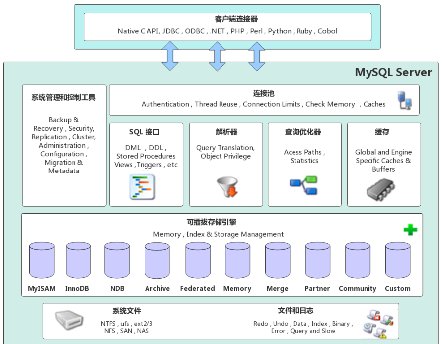

# MySQL笔记

## 体系结构



### 连接层

负责存储和管理客户端与数据库的连接，并完成授权认证等。采用连接池的方式，一个线程负责管理一个连接。

### 服务层

系统管理和控制工具（Management Services & Utilities）：例如备份恢复、安全管理、集群管理等。
SQL接口（SQL Interface）：用于接受客户端发送的各种SQL命令，并且返回用户需要查询的结果。比如DML、DDL、存储过程、视图、触发器等。
解析器（Parser）：负责将请求的SQL解析生成一个"解析树"。然后根据一些MySQL规则进一步检查解析树是否合法。
查询优化器（Optimizer）：当“解析树”通过解析器语法检查后，将交由优化器将其转化成执行计划，然后与存储引擎交互。

### 存储引擎层

存储引擎负责MySQL中数据的存储与提取，与底层系统文件进行交互。MySQL存储引擎是插件式的，服务器中的查询执行引擎通过接口与存储引擎进行通信，接口屏蔽了不同存储引擎之间的差异 。现在有很多种存储引擎，各有各的特点，最常见的是MyISAM和InnoDB。

### 存储层

该层负责将数据库的数据和日志存储在文件系统之上，并完成与存储引擎的交互，是文件的物理存储层。主要包含日志文件，数据文件，配置文件，pid 文件，socket 文件等。

## 存储引擎

常用的存储引擎主要有MyISAM和InnoDB两种，Mysql默认使用InnoDB存储引擎。

### 存储引擎对比

| 存储引擎 | 外键   | 事务   | 行表锁                                           | 存储                           | 表空间 | 关注点 | 默认安装 |
| -------- | ------ | ------ | ------------------------------------------------ | ------------------------------ | ------ | ------ | -------- |
| MyISAM   | 不支持 | 不支持 | 表锁，操作一条记录会锁住整个表，不适合高并发操作 | 只缓存索引                     | 小     | 读性能 | 是       |
| InnoDB   | 支持   | 支持   | 行锁，操作只锁某一行，适合高并发操作             | 缓存索引和真实数据，需要内存多 | 大     | 事务   | 是       |

### 数据文件

InnoDB存储引擎：

- frm文件 -  存放表结构

- idb文件 - 存放表数据和索引

MyISAM存储引擎：

- frm文件 - 存放表结构
- myd文件 - 存放表数据
- myi文件 - 存放表索引

## 配置文件

mysql 的配置文件在Windows操作系统系统下叫`my.ini`，在Linux下是`/etc/my.cnf`

## 7种Join理论

mysql支持内连接（inner可以省略），左外连接和右外连接（outer可以省略），不支持全连接（Oracle支持）。

1. AB的交集（内连接）：

   ```sql
   select * from a join b on a.b_id = b.id;
   ```

2. 包含A的所有（A左连接B）：

   ```sql
   select * from a left join b on b.id = a.b_id;
   ```

3. 包含B的所有（A右连接B）：

   ```sql
   select * from a right join b on b.id = a.b_id;
   ```

4. AB中A独有的：

   ```sql
   select * from a left join b on a.b_id = b.id where b.id is null;
   ```

5. AB中B独有的：

   ```sql
   select * from a right join b on a.b_id = b.id where a.id is null;
   ```

6. 包含AB全部：

   ```sql
   select * from a left join b on b.id = a.b_id
   union
   select * from a right join b on b.id = a.b_id;
   -- union 联合查询会去掉重复的数据，union all则不会
   ```

7. 包含A独有和B独有：

   ```sql
   select * from a left join b on a.b_id = b.id where b.id is null
   union
   select * from a right join b on a.b_id = b.id where a.id is null;
   ```

## 索引

### 索引简介

索引是为了更快地查找数据而组织起来的数据结构。索引的节点指向真实的数据地址，便于数据的查找。

索引也是需要空间的，一张表最好不超过5个索引。索引的创建和维护也是需要系统资源的。当对表中的数据进行增加、删除和修改的时候，索引也要动态维护。

### 索引的增删查

查询索引：

```sql
show index from tableName;
```

删除索引：

```sql
drop index indexName on tableName;
```

索引的建立分为以下好几种类型：

- 唯一索引：

  使用unique参数可以设置索引为唯一索引，在创建唯一索引时，限制该索引的值必须是唯一的，但允许有空值。通过唯一索引，可以更快地确定某条记录。

  ```sql
  -- 为user表email字段添加唯一索引
  alter table user add unique index(email);
  -- 为User表的school和class列添加唯一的联合索引
  alter table user add constraint uk_school_class unique (school, class);
  ```

  

- 主键索引：
  主键索引是一种特殊的唯一性索引，在唯一索引的基础上增加了不为空的约束，一张表中最多只有一个唯一索引。这是由主键索引的物理实现方式决定的，因为数据存储在文件中只能按照一种顺序进行存储。

  ```sql
  -- 为user表id字段添加主键索引
  alter table user add primary key (id);
  ```

- 普通索引：

  在创建普通索引时，不附加任何限制条件，只是用于提高查询效率，这类索引可以创建在任何数据类型中，其值是否唯一和非空，要由字段本身的完整性约束条件决定。

  ```sql
  -- 为user表name字段添加索引
  alter table user add index idx_name (name);
  ```

- 组合（联合）索引：

  多列索引时在表的多个字段上创建一种索引。该索引指向创建时对应的多个字段，可以通过这几个字段进行查询，但是只有查询条件中使用了这些字段中的第一个字段时才会被使用。

  ```sql
  -- 为user表name和city字段添加索引，查询时包含name字段时才会走索引
  alter table user add index idx_name_city(name, city_id);
  ```

- 全文索引：

  全文索引(也称全文检索)它能够利用分词技术等多种算法智能分析出文本文字中关键词的频率和重要性，然后按照一定的短发规则智能地筛选出我们想要是搜索结果，前文索引非常适合大型数据集，对于小的数据集，他的用处比较小。全文索引只能创建在char、varchar、text类型上，查询数据量较大的字符串类型的字段时，使用全文索引可以提高查询效率。

  ```sql
  -- 为user表的intro字段添加全文索引
  alter table user add fulltext index (intro);
  ```

判断索引是否存在，如果不存在则创建索引

```sql
DELIMITER //
-- 创建存储过程
CREATE PROCEDURE addIndexes()
BEGIN
    -- 为 pf_oss 表的 attach_id 列增加 IDX_ATTACH_ID 索引
    IF NOT EXISTS (SELECT 1
                   FROM information_schema.statistics
                   -- 可以根据表名 索引名 列名等进行过滤
                   WHERE table_name = 'table_name'
                     AND index_name = 'idx_other_id'
                     and column_name = 'other_id') 
    THEN
        select version();
        ALTER TABLE table_name
            ADD INDEX idx_other_id (other_id);
    END IF;
END //

DELIMITER ;
-- 调用存储过程
CALL addIndexes();
```


### 索引统计信息表

`INFORMATION_SCHEMA.STATISTICS` 是 MySQL 数据库中的一个系统表，用于存储每个表的索引统计信息。它包含了每个索引的详细信息，如索引名称、索引类型、索引包含的列、索引的基数（不同值的数量）等。

使用 `INFORMATION_SCHEMA.STATISTICS` 可以获取表的索引信息，比如哪些列上有索引，索引类型是什么，索引的基数等等，这对于优化查询语句和调整数据库性能非常有帮助。例如，可以使用该表来查找哪些索引没有被使用，或者哪些索引的基数过低，需要重新设计或重建索引。

下面是一些常用的 `INFORMATION_SCHEMA.STATISTICS` 查询示例：

1. 查看某个表的所有索引信息：

   ```sql
   SELECT * FROM INFORMATION_SCHEMA.STATISTICS WHERE table_schema='database_name' AND table_name='table_name';
   ```

2. 查看某个表的某个列上的索引信息：

   ```sql
   SELECT * FROM INFORMATION_SCHEMA.STATISTICS WHERE table_schema='database_name' AND table_name='table_name' AND column_name='column_name';
   ```

3. 查看某个表的索引是否被使用：

   ```sql
   SELECT * FROM INFORMATION_SCHEMA.STATISTICS WHERE table_schema='database_name' AND table_name='table_name' AND index_name='index_name' AND seq_in_index=1 AND cardinality>0;
   ```

需要注意的是，`INFORMATION_SCHEMA.STATISTICS` 表中的数据是从表的统计信息中获取的，因此需要定期更新统计信息，以保证这些查询结果的准确性。可以使用如下语句来更新表的统计信息。

```sql
ANALYZE TABLE table_name;
```

### 回表

主键索引的B+树的叶子节点会存放一行数据的所有字段。如果通过id查找数据，可以将所有的字段返回出去。

非主键索引的叶子节点只会存放主键信息，所以当通过非主键索引查找到数据后，还需要根据主键信息去主键索引中查找完整的数据，这个过程就是回表，回表会增加性能损耗。

### 判断与增加索引

```sql
-- mysql
-- 创建存储过程，调用之后再删除掉
DELIMITER // -- 将 SQL 语句的结束符从默认的 ; 改为 //，遇到 // 则表示结束。
CREATE PROCEDURE AddIndexIfNotExists()
BEGIN -- BEGIN 标识代码块的开始，END 表示结束。用于将存储过程中的多条语句组合在一起。
    IF NOT EXISTS(
        SELECT 1
        FROM INFORMATION_SCHEMA.STATISTICS
        WHERE table_name = 'user' AND index_name = 'idx_phone'
    ) THEN
        ALTER TABLE `user` ADD INDEX `idx_phone`(`phone`);
    END IF;
END //
DELIMITER ; -- 将语句结束符还原为 ;，以便后续 SQL 语句使用默认的 ; 作为结束标志。
CALL AddIndexIfNotExists();
DROP PROCEDURE IF EXISTS AddIndexIfNotExists;

-- pgsql
-- DO 语句表示执行一个匿名代码块，$$ 用作定界符，标识代码块的开始和结束。所有的 SQL 逻辑和控制流语句写在 BEGIN 和 END 之间
DO
$$
BEGIN
    IF NOT EXISTS (SELECT 1 FROM pg_indexes WHERE indexname = 'idx_phone' AND tablename = 'user') THEN
        CREATE INDEX idx_phone ON public.user (phone);
    END IF;
END
$$;

-- 达梦
DECLARE
   idx_exs INT;
BEGIN
 	SELECT COUNT(1) INTO idx_exs FROM all_indexes WHERE table_name = 'USER' AND index_name = 'IDX_PHONE';
  	IF idx_exs = 0 THEN
        EXECUTE IMMEDIATE 'CREATE INDEX IDX_PHONE ON USER (PHONE)';
  	END IF;
END;

-- 金仓
DO
$$
BEGIN
    IF NOT EXISTS (SELECT 1 FROM sys_indexes WHERE indexname = 'IDX_PHONE' AND tablename = 'USER') THEN
        CREATE INDEX IDX_PHONE ON public.USER(PHONE);
    END IF;
END
$$;
```


## 外键

级联删除 (一般不使用)

## 事务

### 事务特性

事务的四大特性分别是：原子性、一致性、隔离性、持久性。

1. 原子性：指事务是一个不可分割的工作单位，事务中的操作要么全部成功，要么全部失败。

2. 一致性：事务必须使数据库从一个一致性状态变换到另外一个一致性状态。如张三给李四转账100，张三要减少100，李四就要加上100。

3. 隔离性：多个事务并发操作数据时，一个事务不能被其他事务操作数据所干扰，多个并发事务之间要相互隔离。

4. 持久性：一个事务一旦被提交，它对数据库中数据的改变就是永久性的。

### 事务并发可能出现的问题

- 脏读（Dirty Read）：A事务读到了B事务未提交修改的数据。因为B有可能会回滚。
- 不可重复读（Non-Repeatable Read）：A事务两次读取同一个数据，得到的结果不一样。因为有可能被B事务修改并提交了。
- 幻读（Phantom）：A事务按照条件查询数据，这时候B事务插入了一条新数据，A事务再查数据时把B事务新插入的数据也查了出来。

### 事务隔离级别

MySQL的事务隔离级别一共有四个，分别是读未提交、读已提交、可重复读以及可串行化。

1. 读未提交（Read Uncommitted）：允许在事务中读到其他事务未提交的数据，可能导致脏读。当然还有不可重复读和幻读。一般很少使用此隔离级别。

2. 读已提交（Read Committed）：允许在事务中读到其他事务已经提交的数据，解决了脏读，但是可能导致不可重复读，当然还有幻读。一般很少使用此隔离级别。
3. 可重复度（Repeatable Read）- 默认：事务A只能在事务B修改过数据并提交后，自己也提交事务后，才能读取到事务A修改的数据；但是未提交时可以读到B新增的数据。解决了不可重复读，但是可能会有幻读的问题（不过InnoDB引擎的MVCC已经解决了幻读的问题）。

4. 可串行化（Serializable）：事务串行执行，通过锁实现，效率低。一般不会使用

4种事务隔离级别的对比：

|          | 脏读 | 不可重复读读 | 幻读 |
| :------: | :--: | :----------: | :--: |
| 读未提交 | 可能 |     可能     | 可能 |
| 读已提交 | 不会 |     可能     | 可能 |
| 可重复读 | 不会 |     不会     | 可能 |
| 可串行化 | 不会 |     不会     | 不会 |

### 事务隔离级别查询与设置

查看当前数据库事务隔离级别。

```sql
SELECT @@transaction_isolation
```

设置事务隔离级别

```sql
-- 全局设置 只对执行完该语句之后产生的会话起作用
SET GLOBAL TRANSACTION ISOLATION LEVEL level;
-- 当前会话 对当前会话的所有后续的事务有效，不影响正在执行的事务
SET SESSION TRANSACTION ISOLATION LEVEL level;
-- 当前会话的下一个事务
SET TRANSACTION ISOLATION LEVEL level;
```

## 死锁

不同的数据库引擎对数据表锁的支持是不一样的。

### InnoDB下发生死锁的例子：

1. where条件字段没有索引

   ```sql
   -- 开启一个窗口（连接）
   begin;
   update user set name = '张三' where name = '张三三';
   -- commit; -- 暂时不提交
   
   -- 开启另外一个窗口（连接）
   begin;
   update user set name = '老六六' where name = '老六';
   commit;
   -- 这里会死锁，事务无法提交
   ```

   

   

## Binlog日志

### 清理Mysql的binlog日志文件

步骤如下

1. 查看当前正在使用的binlog日志文件名称，SQL语句如下：

   ```sql
   show master status;
   ```

   该SQL用于查看MySQL主服务器的二进制日志（binary log）状态信息。

   在MySQL复制（replication）中，主服务器（master）将其操作记录在二进制日志中，并将这些日志传输给从服务器（slave）进行数据复制。该语句可以提供关于主服务器当前的二进制日志文件名和位置的详细信息，通常是以下几个字段：

   File：当前正在写入的二进制日志文件名。
   Position：当前二进制日志文件中的偏移量（position），表示已写入的字节数。
   Binlog_Do_DB：指定了要复制的数据库名，如果为空，则表示复制所有数据库。
   Binlog_Ignore_DB：指定了要忽略复制的数据库名，如果为空，则表示不忽略任何数据库。

2. 清理所有的binlog日志文件，除了当前正在使用的，SQL语句如下：

   ```sql
   purge binary logs to 'binlog.xxx';
   ```

   该SQL语句的作用是删除二进制日志中指定位置之前的所有日志文件。被删除的二进制日志将无法再用于数据库的复制或恢复操作。因此，在执行该语句之前，应该确保不再需要这些日志文件，并且已经进行了适当的备份。

## 案例

### 递归查询父子结构数据

在 MySQL 8.0 版本及以上，可以使用 `WITH RECURSIVE` 关键字来实现递归查询。这个功能允许你在查询中定义一个递归公共表表达式（CTE），从而实现对层次数据结构（如树形结构）的递归查询。

下面是一个简单的示例，演示如何在 MySQL 中使用 `WITH RECURSIVE` 来查询树形结构的数据：

假设有一个名为 `employees` 的表，结构如下：

```sql
CREATE TABLE employee (
    id varcar(32),
    name varcar(32),
    pid varcar(32) # 父级节点id
);
```

现在我们要查询员工及其直接下属的信息，可以使用 `WITH RECURSIVE` 关键字如下：

```sql
WITH RECURSIVE employee_hierarchy AS (
    # 这里是起始条件
    SELECT id, name, pid
    FROM employee parent
    WHERE name = 'CEO'
    
    UNION ALL
    
    # 下面这里的是通用的递归条件
    SELECT e.id, e.name, e.pid
    FROM employees e
    JOIN employee_hierarchy eh ON e.pid = eh.id
)
SELECT * FROM employee_hierarchy;
```

在上面的示例中，首先选择 CEO 这个员工作为起始节点，然后通过递归查询找出其直接下属，然后不断向下递归查询，直到所有子孙节点都被找出。

需要注意的是，使用 `WITH RECURSIVE` 进行递归查询时，必须遵循一些规则，比如递归查询语句中必须包含一个初始查询（非递归查询部分）和一个递归部分，并且递归部分必须引用递归公共表表达式本身。另外，递归查询语句中应该存在终止条件，以避免无限递归。
