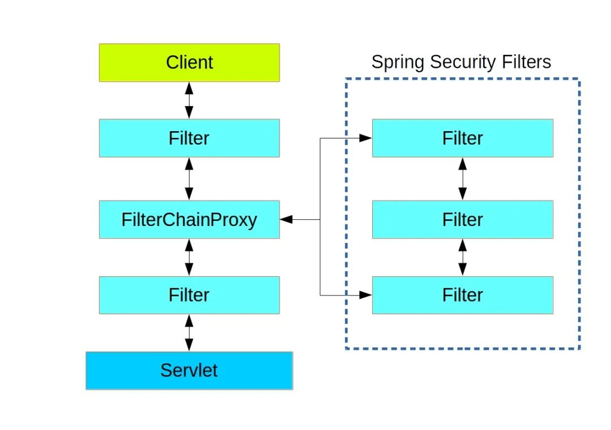
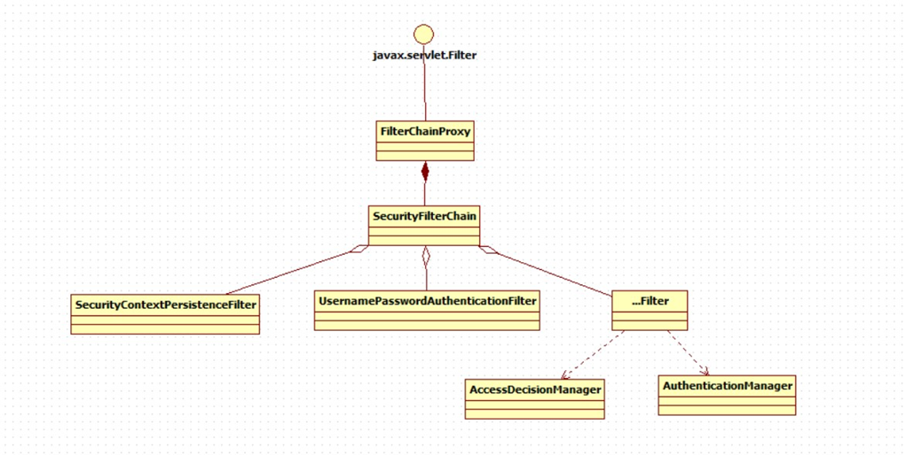
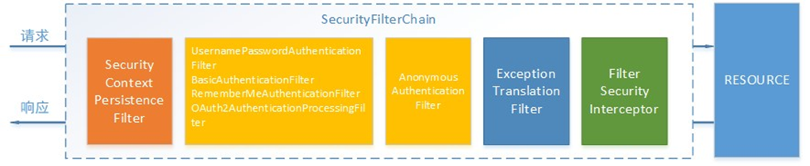
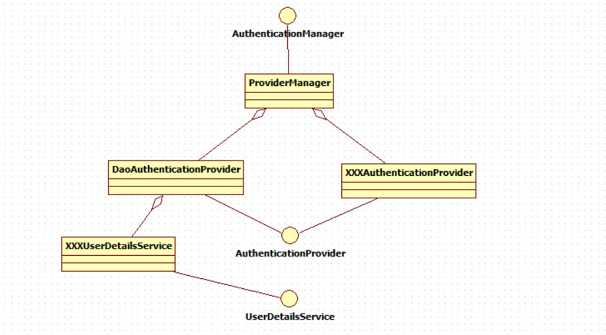
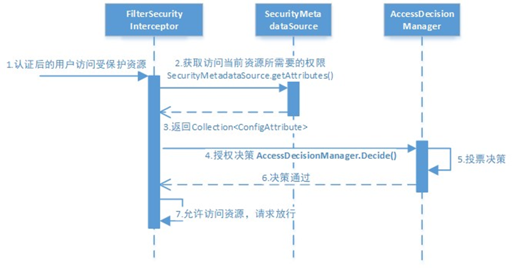
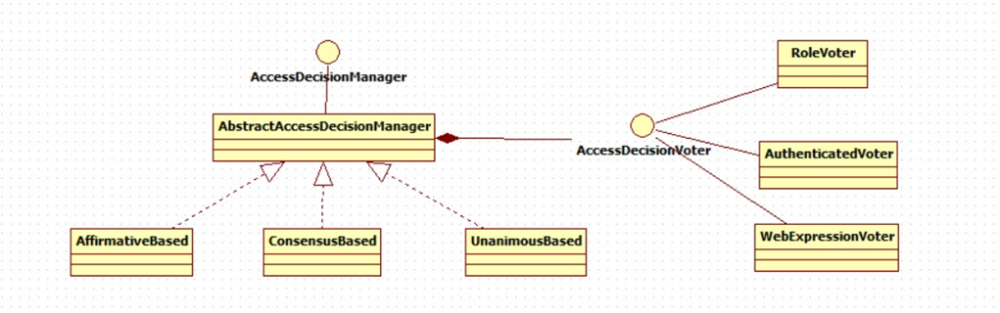

## Spring Security

### 1 结构总览

Spring Security所解决的问题就是**安全访问控制**，而安全访问控制功能其实就是对所有进入系统的请求进行拦截，校验每个请求是否能够访问它所期望的资源。

Spring Security对Web资源的保护是靠Filter实现的，所以从这个Filter来入手，逐步深入Spring Security原理。

当初始化Spring Security时，会创建一个名为 SpringSecurityFilterChain 的Servlet过滤器，类型为org.springframework.security.web.FilterChainProxy，它实现了javax.servlet.Filter，因此外部的请求会经过此类，下图是Spring Security过虑器链结构图：



FilterChainProxy是一个代理，真正起作用的是FilterChainProxy中SecurityFilterChain所包含的各个Filter，同时这些Filter作为Bean被Spring管理，它们是Spring Security核心，各有各的职责，但他们并不直接处理用户的**认证**，也不直接处理用户的**授权**，而是把它们交给了认证管理器（AuthenticationManager）和决策管理器（AccessDecisionManager）进行处理，下图是FilterChainProxy相关类的UML图示



spring Security功能的实现主要是由一系列过滤器链相互配合完成。



下面介绍过滤器链中主要的几个过滤器及其作用：

**SecurityContextPersistenceFilter** 这个Filter是整个拦截过程的入口和出口（也就是第一个和最后一个拦截器），会在请求开始时从配置好的 SecurityContextRepository 中获取 SecurityContext，然后把它设置给SecurityContextHolder。在请求完成后将 SecurityContextHolder 持有的 SecurityContext 再保存到配置好的 SecurityContextRepository，同时清除 securityContextHolder 所持有的 SecurityContext；

**UsernamePasswordAuthenticationFilter** 用于处理来自表单提交的认证。该表单必须提供对应的用户名和密码，其内部还有登录成功或失败后进行处理的 AuthenticationSuccessHandler 和AuthenticationFailureHandler，这些都可以根据需求做相关改变；

**FilterSecurityInterceptor** 是用于保护web资源的，使用AccessDecisionManager对当前用户进行授权访问；

**ExceptionTranslationFilter** 能够捕获来自 FilterChain 所有的异常，并进行处理。但是它只会处理两类异常：AuthenticationException 和 AccessDeniedException，其它的异常它会继续抛出。

### 2 认证流程

#### 2.1 认证流程的时序图如下：


认证过程如下：

1. 用户提交用户名、密码被SecurityFilterChain中的 UsernamePasswordAuthenticationFilter 过滤器获取到，封装为请求Authentication，通常情况下是UsernamePasswordAuthenticationToken这个实现类。

2. 然后过滤器将Authentication提交至认证管理器（AuthenticationManager）进行认证

3. 认证成功后， AuthenticationManager 身份管理器返回一个被填充满了信息的（包括上面提到的权限信息，身份信息，细节信息，但密码通常会被移除） Authentication 实例。

4. SecurityContextHolder 安全上下文容器将第3步填充了信息的 Authentication ，通过 SecurityContextHolder.getContext().setAuthentication(…)方法，设置到其中。

   可以看出AuthenticationManager接口（认证管理器）是认证相关的核心接口，也是发起认证的出发点，它的实现类为ProviderManager。而Spring Security支持多种认证方式，因此ProviderManager维护着一个List<AuthenticationProvider> 列表，存放多种认证方式， 终实际的认证工作是由AuthenticationProvider完成的。

   咱们知道web表单的对应的AuthenticationProvider实现类为 DaoAuthenticationProvider，它的内部又维护着一个UserDetailsService负责UserDetails的获取。 终 AuthenticationProvider将UserDetails填充至Authentication。

认证核心组件的大体关系如下：



#### 2.2 AuthenticationProvider

通过前面的Spring Security认证流程我们得知，认证管理器（AuthenticationManager）委托 AuthenticationProvider完成认证工作。

AuthenticationProvider是一个接口，定义如下：

```java
package org.springframework.security.authentication;

public interface AuthenticationProvider {
	Authentication authenticate(Authentication authentication)
			throws AuthenticationException;
	boolean supports(Class<?> authentication);
}

```

authenticate()方法定义了认证的实现过程，它的参数是一个Authentication，里面包含了登录用户所提交的用户、密码等。而返回值也是一个Authentication，这个Authentication则是在认证成功后，将用户的权限及其他信息重新组装后生成。

 Spring Security中维护着一个 List<AuthenticationProvider> 列表，存放多种认证方式，不同的认证方式使用不同的AuthenticationProvider。如使用用户名密码登录时，使用AuthenticationProvider1，短信登录时使用 AuthenticationProvider2等等。

每个AuthenticationProvider需要实现supports()方法来表明自己支持的认证方式，如我们使用表单方式认证，在提交请求时Spring Security会生成UsernamePasswordAuthenticationToken，它是一个Authentication，里面封装着用户提交的用户名、密码信息。而对应的哪个AuthenticationProvider来处理它？

我们在DaoAuthenticationProvider的基类AbstractUserDetailsAuthenticationProvider发现以下代码：

```java
public boolean supports(Class<?> authentication) {
    // 表单方式认证时候使用AbstractUserDetailsAuthenticationProvider（DaoAuthenticationProvider）类
    return (UsernamePasswordAuthenticationToken.class.isAssignableFrom(authentication));
}
```

也就是说当web表单提交用户名密码时，Spring Security由DaoAuthenticationProvider处理后，Authentication(认证信息)的结构它是一个接口，我们之前提到的UsernamePasswordAuthenticationToken就是它的实现之一。

```java
package org.springframework.security.core;

public interface Authentication extends Principal, Serializable {
    Collection<? extends GrantedAuthority> getAuthorities();
    // 凭证信息，用户输入的密码字符串，在认证过后通常会被移除，用于保障安全
    Object getCredentials();
	// 细节信息，web应用中的实现接口通常为 WebAuthenticationDetails，它记录了访问者的ip地址和sessionId的值
    Object getDetails();
	// 身份信息，大部分情况下返回的是UserDetails接口的实现类，UserDetails代表用户的详细信息，那从Authentication中取出来的UserDetails就是当前登录用户信息，它也是框架中的常用接口之一
    Object getPrincipal();

    boolean isAuthenticated();

    void setAuthenticated(boolean var1) throws IllegalArgumentException;
}
```

#### 2.3 UserDetailsService

UserDetailsService接口用于提供通过用户名查找用户信息。

```java
public interface UserDetailsService {
    UserDetails loadUserByUsername(String var1) throws UsernameNotFoundException;
}
```

DaoAuthenticationProvider中包含了一个UserDetailsService实例，它负责根据用户名提取用户信息UserDetails(包含密码)，而后DaoAuthenticationProvider会去对比UserDetailsService提取的用户密码与用户提交的密码是否匹配作为认证成功的关键依据，因此可以通过将自定义的 UserDetailsService 公开为spring bean来定义自定义身份验证。

很多人把DaoAuthenticationProvider和UserDetailsService的职责搞混淆，其实UserDetailsService只负责从特定的地方（通常是数据库）加载用户信息，仅此而已。而DaoAuthenticationProvider的职责更大，它完成完整的认证流程，同时会把UserDetails填充至Authentication。

UserDetails接口：

```java
public interface UserDetails extends Serializable {
    Collection<? extends GrantedAuthority> getAuthorities();

    String getPassword();
    String getUsername();
    boolean isAccountNonExpired();
    boolean isAccountNonLocked();
    boolean isCredentialsNonExpired();
    boolean isEnabled();
}
```

它和Authentication接口很类似，比如它们都拥有username，authorities。Authentication的getCredentials()与UserDetails中的getPassword()需要被区分对待，前者是用户提交的密码凭证，后者是用户实际存储的密码，认证其实就是对这两者的比对。Authentication中的getAuthorities()实际是由UserDetails的getAuthorities()传递而形成的。还记得Authentication接口中的getDetails()方法吗？其中的UserDetails用户详细信息便是经过了AuthenticationProvider认证之后被填充的。

通过实现UserDetailsService和UserDetails，我们可以完成对用户信息获取方式以及用户信息字段的扩展。

Spring Security提供的InMemoryUserDetailsManager(内存认证)，JdbcUserDetailsManager(jdbc认证)就是UserDetailsService的实现类，主要区别无非就是从内存还是从数据库加载用户。

#### 2.4 PasswordEncoder

PasswordEncoder接口用于实现密码的比对。接口代码如下：

```java
public interface PasswordEncoder {
    String encode(CharSequence var1);
    // 密码比对
    boolean matches(CharSequence var1, String var2);
    default boolean upgradeEncoding(String encodedPassword) {
        return false;
    }
}
```

而Spring Security提供很多内置的PasswordEncoder，能够开箱即用，只需要声明为Bean即可。实际项目中推荐使用BCryptPasswordEncoder, Pbkdf2PasswordEncoder, SCryptPasswordEncoder等。

其中BCrypt实现密码加密和对比的示例如下：

```java
//对原始密码加密
String hashpw = BCrypt.hashpw("123",BCrypt.gensalt());
System.out.println(hashpw);
//校验原始密码和BCrypt密码是否一致
boolean checkpw = BCrypt.checkpw("123", hashpw);
```

### 3 授权流程

Spring Security可以通过 http.authorizeRequests() 对web请求进行授权保护。Spring Security使用标准Filter建立了对web请求的拦截，最终实现对资源的授权访问。

#### 3.1 授权流程

Spring Security的授权流程如下：



分析授权流程：

1. 拦截请求，已认证用户访问受保护的web资源将被SecurityFilterChain中的 FilterSecurityInterceptor 的子类拦截。

2. 获取资源访问策略，FilterSecurityInterceptor会从 SecurityMetadataSource 的子类 DefaultFilterInvocationSecurityMetadataSource 获取要访问当前资源所需要的权限Collection<ConfigAttribute> 。

   SecurityMetadataSource其实就是读取访问策略的抽象，而读取的内容，其实就是我们配置的访问规则， 读取访问策略如：

   ```java
   http.authorizeRequests()
   .antMatchers("/r/r1").hasAuthority("p1")                   
   .antMatchers("/r/r2").hasAuthority("p2")
   ```

3. FilterSecurityInterceptor会调用 AccessDecisionManager 进行授权决策，若决策通过，则允许访问资源，否则将禁止访问。

AccessDecisionManager（访问决策管理器）的核心接口如下:

```java
public interface AccessDecisionManager {
    // 通过传递的参数来决定用户是否有访问对应受保护资源的权限
    // authentication: 要访问资源的访问者的身份 
    // object: 要访问的受保护资源，web请求对应FilterInvocation
    // configAttributes: 是受保护资源的访问策略，通过SecurityMetadataSource获取
    void decide(Authentication authentication, Object object, Collection<ConfigAttribute> configAttributes) throws AccessDeniedException, InsufficientAuthenticationException;

    boolean supports(ConfigAttribute var1);
    boolean supports(Class<?> var1);
}
```

#### 3.2 授权决策

AccessDecisionManager采用投票的方式来确定是否能够访问受保护资源。



通过上图可以看出，AccessDecisionManager中包含的一系列AccessDecisionVoter将会被用来对Authentication 是否有权访问受保护对象进行投票，AccessDecisionManager根据投票结果，做出 终决策。

AccessDecisionVoter是一个接口，其中定义有三个方法，具体结构如下所示。

```java
public interface AccessDecisionVoter<S> {
    // 统同意
    int ACCESS_GRANTED = 1;
    // 弃权
    int ACCESS_ABSTAIN = 0;
    // 拒绝
    int ACCESS_DENIED = -1;

    boolean supports(ConfigAttribute var1);
    boolean supports(Class<?> var1);
    
    // 返回结果会是AccessDecisionVoter中定义的三个常量之一
    int vote(Authentication var1, S var2, Collection<ConfigAttribute> var3);
}
```

Spring Security内置了三个基于投票的AccessDecisionManager实现类如下，它们分别是 AffirmativeBased、ConsensusBased和UnanimousBased。

AffirmativeBased的逻辑是（Spring security默认使用）：

1.  只要有AccessDecisionVoter的投票为ACCESS_GRANTED则同意用户进行访问；

2. 如果全部弃权也表示通过；

3. 如果没有一个人投赞成票，但是有人投反对票，则将抛出AccessDeniedException。

ConsensusBased的逻辑是：

1. 如果赞成票多于反对票则表示通过。

2. 反过来，如果反对票多于赞成票则将抛出AccessDeniedException。

3. 如果赞成票与反对票相同且不等于0，并且属性allowIfEqualGrantedDeniedDecisions的值为true，则表示通过，否则将抛出异常AccessDeniedException。参数allowIfEqualGrantedDeniedDecisions的值默认为true。

4. 如果所有的AccessDecisionVoter都弃权了，则将视参数allowIfAllAbstainDecisions的值而定，如果该值为true则表示通过，否则将抛出异常AccessDeniedException。参数allowIfAllAbstainDecisions的值默认为false。

UnanimousBased的逻辑与另外两种实现有点不一样，另外两种会一次性把受保护对象的配置属性全部传递给AccessDecisionVoter进行投票，而UnanimousBased会一次只传递一个ConfigAttribute给AccessDecisionVoter进行投票。这也就意味着如果我们的AccessDecisionVoter的逻辑是只要传递进来的 ConfigAttribute中有一个能够匹配则投赞成票，但是放到UnanimousBased中其投票结果就不一定是赞成了。 

UnanimousBased的逻辑具体来说是这样的：

1. 如果受保护对象配置的某一个ConfigAttribute被任意的AccessDecisionVoter反对了，则将抛出 AccessDeniedException。

2. 如果没有反对票，但是有赞成票，则表示通过。

3. 如果全部弃权了，则将视参数allowIfAllAbstainDecisions的值而定，true则通过，false则抛出 AccessDeniedException。

Spring Security也内置一些投票者实现类如RoleVoter、AuthenticatedVoter和WebExpressionVoter等，可以自行查阅资料进行学习。

### 4. 集成SpringBoot使用

这里只是简单示例

1. 增加maven依赖

   ```xml
   <dependency>
       <groupId>org.springframework.boot</groupId>
       <artifactId>spring-boot-starter-security</artifactId>
   </dependency>
   ```

2. 实现Security配置类WebSecurityConfigurerAdapter

   ```java
   @Configuration
   public class SecurityConfig extends WebSecurityConfigurerAdapter {
   
       // 安全拦截机制配置
       @Override
       protected void configure(HttpSecurity http) throws Exception {
           // 设置允许跨域等
           http.httpBasic().and().csrf().disable();
           // 设置规则
           http.authorizeRequests()
               	// Web授权相关，严格的规则放在前面
                   .antMatchers("/r/r1").hasAuthority("p1")
               	// 也可以在"/r/r2"控制层接口中使用方法授权@PreAuthorize("hasAuthority('p2')")实现
                   .antMatchers("/r/r2").hasAuthority("p2")
                   .antMatchers("/r/**").authenticated()//所有/r/**的请求必须认证通过
                   .anyRequest().permitAll() //除了/r/**，其它的请求可以访问
               	// 认证相关
                   .and()
                   .formLogin() // 设置允许表单登录，会使用DaoAuthenticationProvider来认证
               	.loginProcessingUrl("/login") // 登录使用的接口
                   .successForwardUrl("/login-success"); //自定义登录成功的页面地址
   		// 可以自定义实现自己的Provider和UserDetailsService等
           http.authenticationProvider(new MyAuthenticationProvider());
       }
   }
   
   ```

3. 提供UserDetailsService和PasswordEncoder 的 Bean；

   ```java
   @Configuration
   public class BeanConfig {
   
       // UserDetailsService用于根据用户名称查找用户信息
       @Bean
       public UserDetailsService userDetailsService(){
           // 简单的内存存储的用户管理器
           InMemoryUserDetailsManager manager = new InMemoryUserDetailsManager();
           manager.createUser(User.withUsername("zhangsan").password("123").authorities("p1").build());
           manager.createUser(User.withUsername("lisi").password("456").authorities("p2").build());
           return manager;
       }
       // 密码编码器
       @Bean
       public PasswordEncoder passwordEncoder(){
           return NoOpPasswordEncoder.getInstance();
       }
   
   }
   ```

   