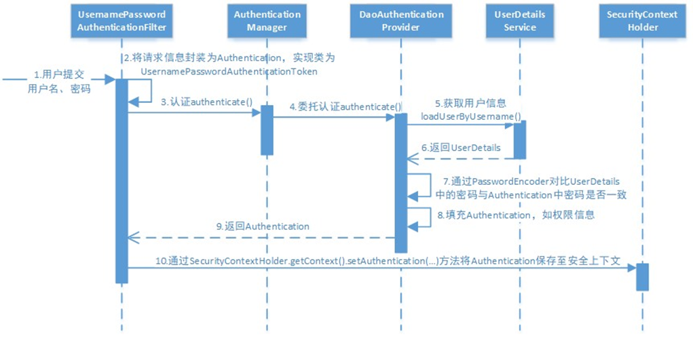

## Spring Security

### 1 结构总览

Spring Security所解决的问题就是**安全访问控制**，而安全访问控制功能其实就是对所有进入系统的请求进行拦截，校验每个请求是否能够访问它所期望的资源。

Spring Security对Web资源的保护是靠Filter实现的，所以从这个Filter来入手，逐步深入Spring Security原理。

当初始化Spring Security时，会创建一个名为 SpringSecurityFilterChain 的Servlet过滤器，类型为org.springframework.security.web.FilterChainProxy，它实现了javax.servlet.Filter，因此外部的请求会经过此类，下图是Spring Security过虑器链结构图：


FilterChainProxy是一个代理，真正起作用的是FilterChainProxy中SecurityFilterChain所包含的各个Filter，同时这些Filter作为Bean被Spring管理，它们是Spring Security核心，各有各的职责，但他们并不直接处理用户的**认证**，也不直接处理用户的**授权**，而是把它们交给了认证管理器（AuthenticationManager）和决策管理器（AccessDecisionManager）进行处理，下图是FilterChainProxy相关类的UML图示


spring Security功能的实现主要是由一系列过滤器链相互配合完成。


下面介绍过滤器链中主要的几个过滤器及其作用：

**SecurityContextPersistenceFilter** 这个Filter是整个拦截过程的入口和出口（也就是第一个和最后一个拦截器），会在请求开始时从配置好的 SecurityContextRepository 中获取 SecurityContext，然后把它设置给SecurityContextHolder。在请求完成后将 SecurityContextHolder 持有的 SecurityContext 再保存到配置好的 SecurityContextRepository，同时清除 securityContextHolder 所持有的 SecurityContext；

**UsernamePasswordAuthenticationFilter** 用于处理来自表单提交的认证。该表单必须提供对应的用户名和密码，其内部还有登录成功或失败后进行处理的 AuthenticationSuccessHandler 和AuthenticationFailureHandler，这些都可以根据需求做相关改变；

**FilterSecurityInterceptor** 是用于保护web资源的，使用AccessDecisionManager对当前用户进行授权访问；

**ExceptionTranslationFilter** 能够捕获来自 FilterChain 所有的异常，并进行处理。但是它只会处理两类异常：AuthenticationException 和 AccessDeniedException，其它的异常它会继续抛出。

### 2 认证流程

#### 2.1 认证流程的时序图如下：



认证过程如下：

1. 用户提交用户名、密码被SecurityFilterChain中的 UsernamePasswordAuthenticationFilter 过滤器获取到，封装为请求Authentication，通常情况下是UsernamePasswordAuthenticationToken这个实现类。

2. 然后过滤器将Authentication提交至认证管理器（AuthenticationManager）进行认证

3. 认证成功后， AuthenticationManager 身份管理器返回一个被填充满了信息的（包括上面提到的权限信息，身份信息，细节信息，但密码通常会被移除） Authentication 实例。

4. SecurityContextHolder 安全上下文容器将第3步填充了信息的 Authentication ，通过 SecurityContextHolder.getContext().setAuthentication(…)方法，设置到其中。

   可以看出AuthenticationManager接口（认证管理器）是认证相关的核心接口，也是发起认证的出发点，它的实现类为ProviderManager。而Spring Security支持多种认证方式，因此ProviderManager维护着一个List<AuthenticationProvider> 列表，存放多种认证方式， 终实际的认证工作是由AuthenticationProvider完成的。

   咱们知道web表单的对应的AuthenticationProvider实现类为 DaoAuthenticationProvider，它的内部又维护着一个UserDetailsService负责UserDetails的获取。 终 AuthenticationProvider将UserDetails填充至Authentication。

认证核心组件的大体关系如下：


#### 2.2 AuthenticationProvider

通过前面的Spring Security认证流程我们得知，认证管理器（AuthenticationManager）委托 AuthenticationProvider完成认证工作。

AuthenticationProvider是一个接口，定义如下：

```java
package org.springframework.security.authentication;

public interface AuthenticationProvider {
	Authentication authenticate(Authentication authentication)
			throws AuthenticationException;
	boolean supports(Class<?> authentication);
}

```

authenticate()方法定义了认证的实现过程，它的参数是一个Authentication，里面包含了登录用户所提交的用户、密码等。而返回值也是一个Authentication，这个Authentication则是在认证成功后，将用户的权限及其他信息重新组装后生成。

 Spring Security中维护着一个 List<AuthenticationProvider> 列表，存放多种认证方式，不同的认证方式使用不同的AuthenticationProvider。如使用用户名密码登录时，使用AuthenticationProvider1，短信登录时使用 AuthenticationProvider2等等。

每个AuthenticationProvider需要实现supports()方法来表明自己支持的认证方式，如我们使用表单方式认证，在提交请求时Spring Security会生成UsernamePasswordAuthenticationToken，它是一个Authentication，里面封装着用户提交的用户名、密码信息。而对应的哪个AuthenticationProvider来处理它？

我们在DaoAuthenticationProvider的基类AbstractUserDetailsAuthenticationProvider发现以下代码：

```java
public boolean supports(Class<?> authentication) {
    // 表单方式认证时候使用AbstractUserDetailsAuthenticationProvider（DaoAuthenticationProvider）类
    return (UsernamePasswordAuthenticationToken.class.isAssignableFrom(authentication));
}
```

也就是说当web表单提交用户名密码时，Spring Security由DaoAuthenticationProvider处理后，Authentication(认证信息)的结构它是一个接口，我们之前提到的UsernamePasswordAuthenticationToken就是它的实现之一。

```java
package org.springframework.security.core;

public interface Authentication extends Principal, Serializable {
    Collection<? extends GrantedAuthority> getAuthorities();
    // 凭证信息，用户输入的密码字符串，在认证过后通常会被移除，用于保障安全
    Object getCredentials();
	// 细节信息，web应用中的实现接口通常为 WebAuthenticationDetails，它记录了访问者的ip地址和sessionId的值
    Object getDetails();
	// 身份信息，大部分情况下返回的是UserDetails接口的实现类，UserDetails代表用户的详细信息，那从Authentication中取出来的UserDetails就是当前登录用户信息，它也是框架中的常用接口之一
    Object getPrincipal();

    boolean isAuthenticated();

    void setAuthenticated(boolean var1) throws IllegalArgumentException;
}
```

#### 2.3 UserDetailsService

UserDetailsService接口用于提供通过用户名查找用户信息。

```java
public interface UserDetailsService {
    UserDetails loadUserByUsername(String var1) throws UsernameNotFoundException;
}
```

DaoAuthenticationProvider中包含了一个UserDetailsService实例，它负责根据用户名提取用户信息UserDetails(包含密码)，而后DaoAuthenticationProvider会去对比UserDetailsService提取的用户密码与用户提交的密码是否匹配作为认证成功的关键依据，因此可以通过将自定义的 UserDetailsService 公开为spring bean来定义自定义身份验证。

很多人把DaoAuthenticationProvider和UserDetailsService的职责搞混淆，其实UserDetailsService只负责从特定的地方（通常是数据库）加载用户信息，仅此而已。而DaoAuthenticationProvider的职责更大，它完成完整的认证流程，同时会把UserDetails填充至Authentication。

UserDetails接口：

```java
public interface UserDetails extends Serializable {
    Collection<? extends GrantedAuthority> getAuthorities();

    String getPassword();
    String getUsername();
    boolean isAccountNonExpired();
    boolean isAccountNonLocked();
    boolean isCredentialsNonExpired();
    boolean isEnabled();
}
```

它和Authentication接口很类似，比如它们都拥有username，authorities。Authentication的getCredentials()与UserDetails中的getPassword()需要被区分对待，前者是用户提交的密码凭证，后者是用户实际存储的密码，认证其实就是对这两者的比对。Authentication中的getAuthorities()实际是由UserDetails的getAuthorities()传递而形成的。还记得Authentication接口中的getDetails()方法吗？其中的UserDetails用户详细信息便是经过了AuthenticationProvider认证之后被填充的。

通过实现UserDetailsService和UserDetails，我们可以完成对用户信息获取方式以及用户信息字段的扩展。

Spring Security提供的InMemoryUserDetailsManager(内存认证)，JdbcUserDetailsManager(jdbc认证)就是UserDetailsService的实现类，主要区别无非就是从内存还是从数据库加载用户。

#### 2.4 PasswordEncoder

PasswordEncoder接口用于实现密码的比对。接口代码如下：

```java
public interface PasswordEncoder {
    String encode(CharSequence var1);
    // 密码比对
    boolean matches(CharSequence var1, String var2);
    default boolean upgradeEncoding(String encodedPassword) {
        return false;
    }
}
```

而Spring Security提供很多内置的PasswordEncoder，能够开箱即用，只需要声明为Bean即可。实际项目中推荐使用BCryptPasswordEncoder, Pbkdf2PasswordEncoder, SCryptPasswordEncoder等。

其中BCrypt实现密码加密和对比的示例如下：

```java
//对原始密码加密
String hashpw = BCrypt.hashpw("123",BCrypt.gensalt());
System.out.println(hashpw);
//校验原始密码和BCrypt密码是否一致
boolean checkpw = BCrypt.checkpw("123", hashpw);
```

### 3 授权流程

Spring Security可以通过 http.authorizeRequests() 对web请求进行授权保护。Spring Security使用标准Filter建立了对web请求的拦截，最终实现对资源的授权访问。

#### 3.1 授权流程

Spring Security的授权流程如下：


分析授权流程：

1. 拦截请求，已认证用户访问受保护的web资源将被SecurityFilterChain中的 FilterSecurityInterceptor 的子类拦截。

2. 获取资源访问策略，FilterSecurityInterceptor会从 SecurityMetadataSource 的子类 DefaultFilterInvocationSecurityMetadataSource 获取要访问当前资源所需要的权限Collection<ConfigAttribute> 。

   SecurityMetadataSource其实就是读取访问策略的抽象，而读取的内容，其实就是我们配置的访问规则， 读取访问策略如：

   ```java
   http.authorizeRequests()
   .antMatchers("/r/r1").hasAuthority("p1")                   
   .antMatchers("/r/r2").hasAuthority("p2")
   ```

3. FilterSecurityInterceptor会调用 AccessDecisionManager 进行授权决策，若决策通过，则允许访问资源，否则将禁止访问。

AccessDecisionManager（访问决策管理器）的核心接口如下:

```java
public interface AccessDecisionManager {
    // 通过传递的参数来决定用户是否有访问对应受保护资源的权限
    // authentication: 要访问资源的访问者的身份 
    // object: 要访问的受保护资源，web请求对应FilterInvocation
    // configAttributes: 是受保护资源的访问策略，通过SecurityMetadataSource获取
    void decide(Authentication authentication, Object object, Collection<ConfigAttribute> configAttributes) throws AccessDeniedException, InsufficientAuthenticationException;

    boolean supports(ConfigAttribute var1);
    boolean supports(Class<?> var1);
}
```

#### 3.2 授权决策

AccessDecisionManager采用投票的方式来确定是否能够访问受保护资源。


通过上图可以看出，AccessDecisionManager中包含的一系列AccessDecisionVoter将会被用来对Authentication 是否有权访问受保护对象进行投票，AccessDecisionManager根据投票结果，做出 终决策。

AccessDecisionVoter是一个接口，其中定义有三个方法，具体结构如下所示。

```java
public interface AccessDecisionVoter<S> {
    // 统同意
    int ACCESS_GRANTED = 1;
    // 弃权
    int ACCESS_ABSTAIN = 0;
    // 拒绝
    int ACCESS_DENIED = -1;

    boolean supports(ConfigAttribute var1);
    boolean supports(Class<?> var1);
    
    // 返回结果会是AccessDecisionVoter中定义的三个常量之一
    int vote(Authentication var1, S var2, Collection<ConfigAttribute> var3);
}
```

Spring Security内置了三个基于投票的AccessDecisionManager实现类如下，它们分别是 AffirmativeBased、ConsensusBased和UnanimousBased。

AffirmativeBased的逻辑是（Spring security默认使用）：

1.  只要有AccessDecisionVoter的投票为ACCESS_GRANTED则同意用户进行访问；

2. 如果全部弃权也表示通过；

3. 如果没有一个人投赞成票，但是有人投反对票，则将抛出AccessDeniedException。

ConsensusBased的逻辑是：

1. 如果赞成票多于反对票则表示通过。

2. 反过来，如果反对票多于赞成票则将抛出AccessDeniedException。

3. 如果赞成票与反对票相同且不等于0，并且属性allowIfEqualGrantedDeniedDecisions的值为true，则表示通过，否则将抛出异常AccessDeniedException。参数allowIfEqualGrantedDeniedDecisions的值默认为true。

4. 如果所有的AccessDecisionVoter都弃权了，则将视参数allowIfAllAbstainDecisions的值而定，如果该值为true则表示通过，否则将抛出异常AccessDeniedException。参数allowIfAllAbstainDecisions的值默认为false。

UnanimousBased的逻辑与另外两种实现有点不一样，另外两种会一次性把受保护对象的配置属性全部传递给AccessDecisionVoter进行投票，而UnanimousBased会一次只传递一个ConfigAttribute给AccessDecisionVoter进行投票。这也就意味着如果我们的AccessDecisionVoter的逻辑是只要传递进来的 ConfigAttribute中有一个能够匹配则投赞成票，但是放到UnanimousBased中其投票结果就不一定是赞成了。 

UnanimousBased的逻辑具体来说是这样的：

1. 如果受保护对象配置的某一个ConfigAttribute被任意的AccessDecisionVoter反对了，则将抛出 AccessDeniedException。

2. 如果没有反对票，但是有赞成票，则表示通过。

3. 如果全部弃权了，则将视参数allowIfAllAbstainDecisions的值而定，true则通过，false则抛出 AccessDeniedException。

Spring Security也内置一些投票者实现类如RoleVoter、AuthenticatedVoter和WebExpressionVoter等，可以自行查阅资料进行学习。

### 4 集成SpringBoot使用

这里只是简单示例

1. 增加maven依赖

   ```xml
   <dependency>
       <groupId>org.springframework.boot</groupId>
       <artifactId>spring-boot-starter-security</artifactId>
   </dependency>
   ```

2. 实现Security配置类WebSecurityConfigurerAdapter

   ```java
   @Configuration
   public class SecurityConfig extends WebSecurityConfigurerAdapter {
   
       // 安全拦截机制配置
       @Override
       protected void configure(HttpSecurity http) throws Exception {
           // 设置允许跨域等
           http.httpBasic().and().csrf().disable();
           // 设置规则
           http.authorizeRequests()
               	// Web授权相关，严格的规则放在前面
                   .antMatchers("/r/r1").hasAuthority("p1")
               	// 也可以在"/r/r2"控制层接口中使用方法授权@PreAuthorize("hasAuthority('p2')")实现
                   .antMatchers("/r/r2").hasAuthority("p2")
                   .antMatchers("/r/**").authenticated()//所有/r/**的请求必须认证通过
                   .anyRequest().permitAll() //除了/r/**，其它的请求可以访问
               	// 认证相关
                   .and()
                   .formLogin() // 设置允许表单登录，会使用DaoAuthenticationProvider来认证
               	.loginProcessingUrl("/login") // 登录使用的接口
                   .successForwardUrl("/login-success"); //自定义登录成功的页面地址
   		// 可以自定义实现自己的Provider和UserDetailsService等
           http.authenticationProvider(new MyAuthenticationProvider());
       }
   }
   
   ```

3. 提供UserDetailsService和PasswordEncoder 的 Bean；

   ```java
   @Configuration
   public class BeanConfig {
   
       // UserDetailsService用于根据用户名称查找用户信息
       @Bean
       public UserDetailsService userDetailsService(){
           // 简单的内存存储的用户管理器
           InMemoryUserDetailsManager manager = new InMemoryUserDetailsManager();
           manager.createUser(User.withUsername("zhangsan").password("123").authorities("p1").build());
           manager.createUser(User.withUsername("lisi").password("456").authorities("p2").build());
           return manager;
       }
       // 密码编码器
       @Bean
       public PasswordEncoder passwordEncoder(){
           return NoOpPasswordEncoder.getInstance();
       }
   
   }
   ```

## OAuth2.0

### 1  OAuth2.0介绍

OAuth（开放授权）是一个开放标准，允许用户授权第三方应用访问他们存储在另外的服务提供者上的信息，而不需要将用户名和密码提供给第三方应用或分享他们数据的所有内容。OAuth2.0是OAuth协议的延续版本，但不向后兼容OAuth 1.0即完全废止了OAuth1.0。很多大公司如Google，Yahoo，Microsoft等都提供了OAUTH认证服务，这些都足以说明OAuth标准逐渐成为开放资源授权的标准。

Oauth协议目前发展到2.0版本，1.0版本过于复杂，2.0版本已得到广泛应用。

### 2  授权服务器配置

maven依赖：

```xml
<!-- oauth2支持 -->
<dependency>
    <groupId>org.springframework.security.oauth</groupId>
    <artifactId>spring-security-oauth2</artifactId>
    <version>2.3.5.RELEASE</version>
</dependency>
```


#### 2.1 EnableAuthorizationServer

可以用 @EnableAuthorizationServer 注解并继承AuthorizationServerConfifigurerAdapter来配置OAuth2.0 授权服务器。

如在config包下创建AuthorizationServer：

```java
@Configuration
@EnableAuthorizationServer
public class AuthorizationServer extends AuthorizationServerConfigurerAdapter {
	// 略...
}
```

AuthorizationServerConfifigurerAdapter要求配置以下几个类，这几个类是由Spring创建的独立的配置对象，它们会被Spring传入AuthorizationServerConfifigurer中进行配置。

```java
public class AuthorizationServerConfigurerAdapter implements AuthorizationServerConfigurer {
	public AuthorizationServerConfigurerAdapter() {}
    // 用来配置令牌端点的安全约束
    public void configure(AuthorizationServerSecurityConfigurer security) throws Exception {}
    // 用来配置客户端详情服务（ClientDetailsService），客户端详情信息在这里进行初始化，你能够把客户端详情信息写死在这里或者是通过数据库来存储调取详情信息
    public void configure(ClientDetailsServiceConfigurer clients) throws Exception {}
    // 用来配置令牌（token）的访问端点和令牌服务(tokenservices)
    public void configure(AuthorizationServerEndpointsConfigurer endpoints) throws Exception {}
}
```

#### 2.2 配置客户端详细信息

ClientDetailsServiceConfigurer 能够使用内存或者JDBC来实现客户端详情服务（ClientDetailsService），ClientDetailsService负责查找ClientDetails，而ClientDetails有几个重要的属性如下列表：

1. clientId：（必须的）用来标识客户的Id。
2. secret：（需要值得信任的客户端）客户端安全码，如果有的话。
3. scope：用来限制客户端的访问范围，如果为空（默认）的话，那么客户端拥有全部的访问范围。
4. authorizedGrantTypes：此客户端可以使用的授权类型，默认为空。
5. authorities：此客户端可以使用的权限（基于Spring Security authorities）。

客户端详情（Client Details）能够在应用程序运行的时候进行更新，可以通过访问底层的存储服务（例如将客户端详情存储在一个关系数据库的表中，就可以使用 JdbcClientDetailsService）或者通过自己实现ClientRegistrationService接口（同时你也可以实现 ClientDetailsService 接口）来进行管理。

```java
// 配置客户端详情服务（ClientDetailsService）
@Override
public void configure(ClientDetailsServiceConfigurer clients) throws Exception {
    // clients.withClientDetails(clientDetailsService);
    clients.inMemory()// 使用in‐memory存储
        .withClient("c1")// client_id
        .secret(new BCryptPasswordEncoder().encode("secret"))
        .resourceIds("res1")
        .authorizedGrantTypes("authorization_code", "password", 
                              "client_credentials", "implicit","refresh_token")// 该client允许的授权类型authorization_code,password,refresh_token,implicit,client_credentials
        .scopes("all")// 允许的授权范围
        .autoApprove(false)
        //加上验证回调地址
        .redirectUris("http://www.baidu.com");
}
```

#### 2.3 管理令牌

AuthorizationServerTokenServices 接口定义了一些操作使得你可以对令牌进行一些必要的管理，令牌可以被用来加载身份信息，里面包含了这个令牌的相关权限。

可以自己创建 AuthorizationServerTokenServices 这个接口的实现，则需要继承 DefaultTokenServices 这个类，里面包含了一些有用实现，你可以使用它来修改令牌的格式和令牌的存储。默认的，当它尝试创建一个令牌的时候，是使用随机值来进行填充的，除了持久化令牌是委托一个 TokenStore 接口来实现以外，这个类几乎帮你做了所有的事情。并且 TokenStore 这个接口有一个默认的实现，它就是 InMemoryTokenStore ，如其命名，所有的令牌是被保存在了内存中。除了使用这个类以外，你还可以使用一些其他的预定义实现，下面有几个版本，它们都实现了TokenStore接口：

**InMemoryTokenStore**：这个版本的实现是被默认采用的，它可以完美的工作在单服务器上（即访问并发量压力不大的情况下，并且它在失败的时候不会进行备份），大多数的项目都可以使用这个版本的实现来进行尝试，你可以在开发的时候使用它来进行管理，因为不会被保存到磁盘中，所以更易于调试。

**JdbcTokenStore**：这是一个基于JDBC的实现版本，令牌会被保存进关系型数据库。使用这个版本的实现时，你可以在不同的服务器之间共享令牌信息，使用这个版本的时候请注意把"spring-jdbc"这个依赖加入到你的classpath当中。

**JwtTokenStore**：这个版本的全称是 JSON Web Token（JWT），它可以把令牌相关的数据进行编码（因此对于后端服务来说，它不需要进行存储，这将是一个重大优势），但是它有一个缺点，那就是撤销一个已经授权令牌将会非常困难，所以它通常用来处理一个生命周期较短的令牌以及撤销刷新令牌（refresh_token）。另外一个缺点就是这个令牌占用的空间会比较大，如果你加入了比较多用户凭证信息。JwtTokenStore 不会保存任何数据，但是它在转换令牌值以及授权信息方面与 DefaultTokenServices 所扮演的角色是一样的。

1. 定义TokenConfig

   在confifig包下定义TokenConfig，我们暂时先使用InMemoryTokenStore，生成一个普通的令牌。

   ```java
   @Configuration
   public class TokenConfig {
       @Bean
       public TokenStore tokenStore() {
       	return new InMemoryTokenStore();
       }
   }
   ```

2. 定义AuthorizationServerTokenServices

   在AuthorizationServer（上面定义过）中定义AuthorizationServerTokenServices

   ```java
   @Autowired
   private TokenStore tokenStore;
   
   @Autowired
   private ClientDetailsService clientDetailsService;
   
   @Bean
   public AuthorizationServerTokenServices tokenService() {
       DefaultTokenServices service = new DefaultTokenServices();
       service.setClientDetailsService(clientDetailsService);
       service.setSupportRefreshToken(true);
       service.setTokenStore(tokenStore);
       service.setAccessTokenValiditySeconds(7200); // 令牌默认有效期2小时
       service.setRefreshTokenValiditySeconds(259200); // 刷新令牌默认有效期3天
       return service;
   }
   ```

#### 2.4 令牌访问端点配置

AuthorizationServerEndpointsConfigurer 这个对象的实例可以完成令牌服务以及令牌endpoint配置。

**配置授权类型（Grant Types）**：

AuthorizationServerEndpointsConfifigurer 通过设定以下属性决定支持的**授权类型（Grant Types）**

- authenticationManager：认证管理器，当你选择了资源所有者密码（password）授权类型的时候，请设置这个属性注入一个 AuthenticationManager 对象。

- userDetailsService：如果你设置了这个属性的话，那说明你有一个自己的 UserDetailsService 接口的实现，或者你可以把这个东西设置到全局域上面去（例如 GlobalAuthenticationManagerConfifigurer 这个配置对象），当你设置了这个之后，那么 "refresh_token" 即刷新令牌授权类型模式的流程中就会包含一个检查，用来确保这个账号是否仍然有效，假如说你禁用了这个账户的话。

- authorizationCodeServices：这个属性是用来设置授权码服务的（即 AuthorizationCodeServices 的实例对象），主要用于"authorization_code" 授权码类型模式。

- implicitGrantService：这个属性用于设置隐式授权模式，用来管理隐式授权模式的状态。

- tokenGranter：当你设置了这个东西（即 TokenGranter 接口实现），那么授权将会交由你来完全掌控，并且会忽略掉上面的这几个属性，这个属性一般是用作拓展用途的，即标准的四种授权模式已经满足不了你的需求的时候，才会考虑使用这个。

**配置授权端点的URL（Endpoint URLs）**：

AuthorizationServerEndpointsConfifigurer 这个配置对象有一个叫做 pathMapping() 的方法用来配置端点URL链接，它有两个参数：

- 第一个参数：String 类型的，这个端点URL的默认链接。

- 第二个参数：String 类型的，你要进行替代的URL链接。

以上的参数都将以 "/" 字符为开始的字符串，框架的默认URL链接如下列表，可以作为这个 pathMapping() 方法的第一个参数：

- /oauth/authorize：授权端点。

- /oauth/token：令牌端点。

- /oauth/confifirm_access：用户确认授权提交端点。

- /oauth/error：授权服务错误信息端点。

- /oauth/check_token：用于资源服务访问的令牌解析端点。

- /oauth/token_key：提供公有密匙的端点，如果你使用JWT令牌的话。

需要注意的是授权端点这个URL应该被Spring Security保护起来只供授权用户访问.

在AuthorizationServer配置令牌访问端点

```java
@Autowired
private AuthorizationCodeServices authorizationCodeServices;

@Autowired
private AuthenticationManager authenticationManager;

// 用来配置令牌端点
@Override
public void configure(AuthorizationServerEndpointsConfigurer endpoints) {
    endpoints
    .authenticationManager(authenticationManager)
    .authorizationCodeServices(authorizationCodeServices)
    .tokenServices(tokenService())
    .allowedTokenEndpointRequestMethods(HttpMethod.POST);
}

@Bean
public AuthorizationCodeServices authorizationCodeServices() {
    // 设置授权码模式的授权码如何存取，暂时采用内存方式
	return new InMemoryAuthorizationCodeServices();
}
```

#### 2.5 令牌端点的安全约束

**AuthorizationServerSecurityConfifigurer**：用来配置令牌端点(Token Endpoint)的安全约束，在AuthorizationServer中配置如下。

```java
@Override
public void configure(AuthorizationServerSecurityConfigurer security){
    security
        .tokenKeyAccess("permitAll()") // tokenKey这个endpoint当使用JwtToken且使用非对称加密时，资源服务用于获取公钥而开放的，这里指这个endpoint完全公开。
    	.checkTokenAccess("permitAll()") // checkToken这个endpoint完全公开
    	.allowFormAuthenticationForClients(); // 允许表单认证
}
```

**授权服务配置总结**：授权服务配置分成三大块，可以关联记忆。

既然要完成认证，它首先得知道客户端信息从哪儿读取，因此要进行客户端详情配置。

既然要颁发token，那必须得定义token的相关endpoint，以及token如何存取，以及客户端支持哪些类型的token。

既然暴露除了一些endpoint，那对这些endpoint可以定义一些安全上的约束等。

#### 2.6 web安全配置

配置Spring Security

```java
@Configuration
@EnableGlobalMethodSecurity(securedEnabled = true,prePostEnabled = true)
public class WebSecurityConfig extends WebSecurityConfigurerAdapter {
    @Bean
    public PasswordEncoder passwordEncoder() {
    	return new BCryptPasswordEncoder();
    }
    @Bean
    public AuthenticationManager authenticationManagerBean() throws Exception {
    	return super.authenticationManagerBean();
    }
    //安全拦截机制（最重要）
    @Override
    protected void configure(HttpSecurity http) throws Exception {
        http.csrf().disable()
        .authorizeRequests()
        .antMatchers("/r/r1").hasAnyAuthority("p1")
        .antMatchers("/login*").permitAll()
        .anyRequest().authenticated()
        .and()
        .formLogin();
    }
}
```

### 3 授权码模式

下图是授权码模式交互图：


微信，QQ等授权登录就是使用这种模式。

### 4 简化模式

下面是简化模式的交互图


一般来说，简化模式用于没有服务器端的第三方单页面应用，因为没有服务器端就无法接收授权码。

### 5 密码模式

下面是密码模式的交互图


1. 资源拥有者将用户名、密码发送给客户端
2. 客户端拿着资源拥有者的用户名、密码向授权服务器请求令牌（access_token），请求如下：

```
/xxx/oauth/token?client_id=c1&client_secret=secret&grant_type=password&username=shangsan&password=123
```

参数列表如下：

- client_id：客户端准入标识。 client_secret：客户端秘钥。

- grant_type：授权类型，填写password表示密码模式 username：资源拥有者用户名。

- password：资源拥有者密码。

3.  授权服务器将令牌（access_token）发送给client

请求示例：


这种模式十分简单，但是却意味着直接将用户敏感信息泄漏给了client，因此这就说明这种模式只能用于client是我们自己开发的情况下。因此密码模式一般用于我们自己开发的，第一方原生App或第一方单页面应用

### 6 客户端模式

客户端模式的交互图如下所示：


这种模式是 方便但 不安全的模式。因此这就要求我们对client完全的信任，而client本身也是安全的。因此这种模式一般用来提供给我们完全信任的服务器端服务。比如，合作方系统对接，拉取一组用户信息。

## JWT

### 1  JWT令牌

当资源服务和授权服务不在一起时资源服务使用 RemoteTokenServices 远程请求授权服务验证token，如果访问量较大将会影响系统的性能 。

解决上边问题：

令牌采用JWT格式即可解决上边的问题，用户认证通过会得到一个JWT令牌，JWT令牌中已经包括了用户相关的信息，客户端只需要携带JWT访问资源服务，资源服务根据事先约定的算法自行完成令牌校验，无需每次都请求认证服务完成授权。

**1，什么是JWT？**

JSON Web Token（JWT）是一个开放的行业标准（RFC 7519），它定义了一种简介的、自包含的协议格式，用于在通信双方传递json对象，传递的信息经过数字签名可以被验证和信任。JWT可以使用HMAC算法或使用RSA的公钥/私钥对来签名，防止被篡改。

官网：https://jwt.io/

标准：https://tools.ietf.org/html/rfc7519

JWT令牌的优点：

1. jwt基于json，非常方便解析。

2. 可以在令牌中自定义丰富的内容，易扩展。

3. 通过非对称加密算法及数字签名技术，JWT防止篡改，安全性高。

4. 资源服务使用JWT可不依赖认证服务即可完成授权。

缺点：

1. JWT令牌较长，占存储空间比较大。

**2、JWT令牌结构**

JWT令牌由三部分组成，每部分中间使用点（.）分隔，比如：xxxxx.yyyyy.zzzzz

- Header

  头部包括令牌的类型（即JWT）及使用的哈希算法（如HMAC SHA256或RSA）一个例子如下：

  ```json
  {
      "alg": "HS256",
      "typ": "JWT"
  }
  ```

  将上边的内容使用Base64Url编码，得到一个字符串就是JWT令牌的第一部分。

- Payload

- 第二部分是负载，内容也是一个json对象，它是存放有效信息的地方，它可以存放jwt提供的现成字段，比如：iss（签发者）,exp（过期时间戳）, sub（面向的用户）等，也可自定义字段。

  此部分不建议存放敏感信息，因为此部分可以解码还原原始内容。

  将第二部分负载使用Base64Url编码，得到一个字符串就是JWT令牌的第二部分。一个例子：

  ```json
  {
      "sub": "1234567890",
      "name": "456",
      "admin": true
  }
  ```

- Signature

  第三部分是签名，此部分用于防止jwt内容被篡改。

  这个部分使用base64url将前两部分进行编码，编码后使用点（.）连接组成字符串，最后使用header中声明签名算法进行签名。

  一个例子：

  ```
  HMACSHA256(
      base64UrlEncode(header) + "." +
      base64UrlEncode(payload),
      secret)
  ```

  base64UrlEncode(header)：jwt令牌的第一部分。 base64UrlEncode(payload)：jwt令牌的第二部分。 secret：签名所使用的密钥。

### 2 配置JWT令牌服务

TokenConfig

```java
@Configuration
public class TokenConfig {
    private String SIGNING_KEY = "uaa123";
    @Bean
    public TokenStore tokenStore() {
    	return new JwtTokenStore(accessTokenConverter());
    }
    @Bean
    public JwtAccessTokenConverter accessTokenConverter() {
        JwtAccessTokenConverter converter = new JwtAccessTokenConverter();
        converter.setSigningKey(SIGNING_KEY); //对称秘钥，资源服务器使用该秘钥来验证
        return converter;
    }
}
```

定义JWT令牌服务

```java
@Autowired
private JwtAccessTokenConverter accessTokenConverter;
@Bean
public AuthorizationServerTokenServices tokenService() {
    DefaultTokenServices service=new DefaultTokenServices();
    service.setClientDetailsService(clientDetailsService);
    service.setSupportRefreshToken(true);
    service.setTokenStore(tokenStore); // 设置jwt存储token
    TokenEnhancerChain tokenEnhancerChain = new TokenEnhancerChain();
    tokenEnhancerChain.setTokenEnhancers(Arrays.asList(accessTokenConverter));
    service.setTokenEnhancer(tokenEnhancerChain);
    service.setAccessTokenValiditySeconds(7200); // 令牌默认有效期2小时
    service.setRefreshTokenValiditySeconds(259200); // 刷新令牌默认有效期3天
    return service;
}
```

