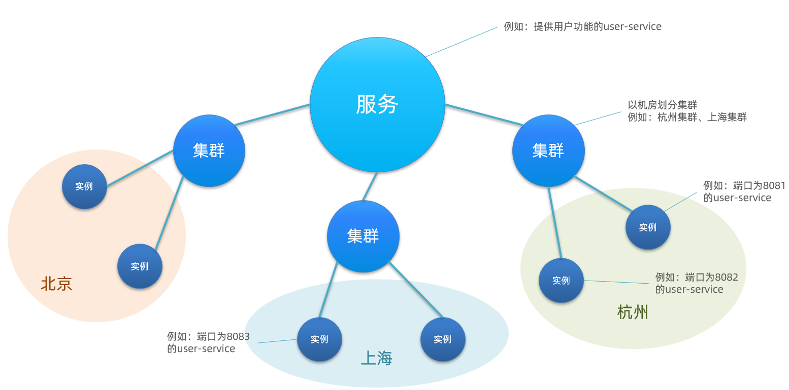
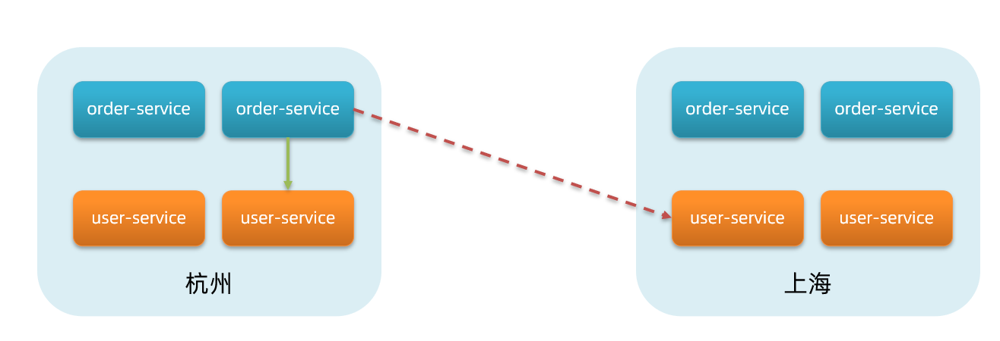

## 注册配置中心Nacos

### 简介

[Nacos](https://nacos.io/zh-cn/) /nɑ:kəʊs/ 是 Dynamic Naming and Configuration Service 的首字母简称，一个更易于构建云原生应用的动态服务发现、配置管理和服务管理平台。

Nacos 致力于帮助您发现、配置和管理微服务。Nacos 提供了一组简单易用的特性集，帮助您快速实现动态服务发现、服务配置、服务元数据及流量管理。

Nacos 帮助您更敏捷和容易地构建、交付和管理微服务平台。Nacos 是构建以“服务”为中心的现代应用架构 (例如微服务范式、云原生范式) 的服务基础设施。

Nacos的注册中心、服务提供者和服务消费者的工作机制如下图：


### 启动Nacos Server

1. 首先下载 [Nacos Server](https://github.com/alibaba/nacos/releases) 到本地并解压。

2. 进入bin目录执行对应系统的脚本，默认是集群模式，如果是单机模式需要增加配置项，如 windows `startup.cmd -m standalone`。

3. 启动完成后，浏览器打开`http://127.0.0.1:8848/nacos`即可进入nacos服务的控制台页面。默认是不需要鉴权的，需要配置鉴权信息。

### Nacos 服务注册与发现

#### 使用

1. 引入依赖 SpringBoot 和 spring-cloud-starter-alibaba-nacos-discovery 依赖

   ```xml
   <parent>
   	<groupId>org.springframework.boot</groupId>
   	<artifactId>spring-boot-starter-parent</artifactId>
   	<version>2.3.12.RELEASE</version>
   </parent>
   
   <dependencies>
   	<dependency>
   		<groupId>org.springframework.boot</groupId>
   		<artifactId>spring-boot-starter-web</artifactId>
   	</dependency>
       <!-- nacos服务注册发现依赖 -->
   	<dependency>
   		<groupId>com.alibaba.cloud</groupId>
   		<artifactId>spring-cloud-starter-alibaba-nacos-discovery</artifactId>
   		<version>2.2.5.RELEASE</version>
   	</dependency>
   </dependencies>
   ```

   当然，也可以在一个父pom中的`<dependencyManagement>`中引入SpringCloudAlibaba的依赖，这样子pom就不需要指定具体的版本号了。

   ```xml
   <dependencyManagement>
       <dependency>
           <groupId>com.alibaba.cloud</groupId>
           <artifactId>spring-cloud-alibaba-dependencies</artifactId>
           <version>2.2.5.RELEASE</version>
           <type>pom</type>
           <scope>import</scope>
       </dependency>
   </dependencyManagement>
   ```

2. 在配置文件中配置Nacos Server 地址

   ```yaml
   spring:
     application:
       # 要配置应用名称作为微服务名，否则会启动报错
       name: user-service
     cloud:
       nacos:
         discovery:
           # 如果需要鉴权请配置鉴权信息
           server-addr: 127.0.0.1:8848
   ```

   

3. 启动类添加 @EnableDiscoveryClient 开启服务注册与发现功能

   ```java
   @EnableDiscoveryClient
   @SpringBootApplication
   public class UserServiceApp {
       public static void main(String[] args) {
           SpringApplication.run(UserServiceApp.class, args);
       }
   }
   ```

   正常启动项目之后就能在Nacos Server中看到了对应的服务了。

#### 服务集群

**集群**

我们一般将同一机房内的服务实例，划分为一个集群。也就是说，user-service是服务，一个服务可以包含多个集群，如杭州、上海，每个集群下可以有多个实例，形成分级模型，如图：



理论上，微服务互相访问时，应该尽可能访问同集群实例，因为本地访问速度更快。当本集群内不可用时，才访问其它集群。例如：



杭州机房内的order-service应该优先访问同机房的user-service。

**给user-service配置集群**

修改user-service的application.yml文件，添加集群配置：

```yaml
spring:
  cloud:
    nacos:
      discovery:
        server-addr: localhost:8848
        cluster-name: HZ # 集群名称
```

启动后我们可以在 Nacos Server 中看到服务的集群信息了。默认的集群是 DEFAULT。

默认的`ZoneAvoidanceRule`并不能实现根据同集群优先来实现负载均衡。因此Nacos中提供了一个`NacosRule`的实现，可以优先从同集群中挑选实例。

#### 命名空间

Nacos提供了命名空间 namespace来实现环境隔离功能。不同namespace之间相互隔离，例如不同namespace的服务互相不可见。比如我们开发环境就可以使用dev命名空间，测试环境使用test命名空间，这样就可以使用同一个Nacos了。默认的命名空间是 public。

命名空间的配置如下：

```yaml
spring:
  cloud:
    nacos:
      server-addr: localhost:8848
      discovery:
        cluster-name: HZ
        namespace: 492a7d5d-237b-46a1-a99a-fa8e98e4b0f9 # 命名空间，填Nacose Server上的ID
```

#### 案例-获取实例列表

```java
// 创建 Properties 对象，配置认证信息
Properties properties = new Properties();
properties.setProperty("serverAddr", "127.0.0.1");
properties.setProperty("username", "nacos");
properties.setProperty("password", "nacos");

// 创建 NamingService 实例，连接到 Nacos 服务器
NamingService namingService = NamingFactory.createNamingService(properties);

// 获取指定服务的实例列表
List<Instance> instances = namingService.getAllInstances("syncplant-system-pf");

// 处理服务实例列表
for (Instance instance : instances) {
	String ip = instance.getIp();
	int port = instance.getPort();
	String name = instance.getServiceName();
	// 可以根据实际需要进行进一步处理
	System.out.println("Instance: " + name + ":" + ip + ":" + port);
}
```

当然了，因为在微服务中，我们已经连接过Nacos Server了，重新获取地址和用户名密码会比较麻烦，不好维护。这时候可以通过注入NacosConfigProperties获取连接信息。代码优化如下：

```java
@Resource
NacosConfigProperties nacosConfigProperties;

// ...

// 通过nacos配置属性转为普通配置
NamingService namingService = NamingFactory.createNamingService(nacosConfigProperties.assembleConfigServiceProperties());
```

### Nacos 配置中心

#### 介绍

当微服务部署的实例越来越多，达到数十、数百时，逐个修改微服务配置就会让人抓狂，而且很容易出错。我们需要一种统一配置管理方案，可以集中管理所有实例的配置。

Nacos除了可以做注册中心，同样可以做配置管理来使用。

因为服务注册到Nacos时需要拉取配置，并与 `application.yml`中的配置进行合并，然后才启动项目。所以Nacos Server的信息肯定不能放在`application.yml`中，而是应该放在`bootstrap.yml`中，因为项目刚开始启动的时候会先加载`bootstrap.yml`中的配置，然后才到`application.yml`。

#### Nacos Server中添加配置

在配置列表中，新增一条配置，填写 Data ID、Group、配置格式、配置内容。

其中 Data ID 为微服务名称\[-profile\]\[\.后缀名\]。如`user-service`、`user-service-dev`、`user-service-dev.yaml`。Nacos Server中的配置文件与SpringBoot中类似，环境为dev的user-service服务会读取`user-service`、`user-service-dev`的配置，但是会优先使用`1user-service-dev`。

Group默认即可。

一个简单的配置内容如下：

```yaml
server:
  port: 8888 # 端口号
```


#### 微服务项目配置

1. 首先应该先引入 nacos-config 的客户端maven依赖

   ```xml
   <!--nacos配置管理依赖-->
   <dependency>
       <groupId>com.alibaba.cloud</groupId>
       <artifactId>spring-cloud-starter-alibaba-nacos-config</artifactId>
   </dependency>
   ```

2. 创建`bootstrap.yaml`配置文件，并填写 Nacos Server 连接的信息和获取配置文件的信息。

   ```yaml
   spring:
     application:
       name: user-service # 服务名称
     profiles:
       active: dev #开发环境，这里是dev 
     cloud:
       nacos:
         server-addr: localhost:8848 # Nacos地址
         config:
           file-extension: yaml # 要拉取的配置文件的后缀
   ```

   这里会根据spring.cloud.nacos.server-addr获取nacos地址，再根据

   `${spring.application.name}-${spring.profiles.active}.${spring.cloud.nacos.config.file-extension}`作为Data ID，来读取Nacos Server中的配置。

   本例中，就是去读取`user-service-dev.yaml`

3. 启动项目之后，发现端口号和 Nacos Server中的配置一样，说明配置生效了。

#### 配置热更新

我们最终的目的，是修改nacos中的配置后，微服务中无需重启即可让配置生效，也就是**配置热更新**。

要实现配置热更新，可以使用两种方式，这里以加载`app.name`配置为例：

1. 在@Value注入的变量所在类上添加注解@RefreshScope：

   ```java
   @RefreshScope
   @RestController
   public class IndexController {
       @Value("${app.name}")
       private String appName;
   }
   ```

2. 使用@ConfigurationProperties注解代替@Value注解。

   ```java
   @Data
   @ConfigurationProperties(prefix = "app")
   public class AppNameProperties {
       private String name;
   }
   ```

#### 配置的使用顺序

优先使用Nacos服务上的配置，带profile的优先。

后使用本地的配置，bootstrap优先，application配置中带profile的优先。

#### 案例-根据DataID获取Nacos Server中的配置

```java
// 创建 Properties 对象，配置认证信息
Properties properties = new Properties();
properties.setProperty("serverAddr", "127.0.0.1");
properties.setProperty("username", "nacos");
properties.setProperty("password", "nacos");


ConfigService configService = NacosFactory.createConfigService(properties);
String content = configService.getConfig("user-service.yaml", "DEFAULT_GROUP", 5000);
System.out.println(content);
```

当然了，因为在微服务中，我们已经连接过Nacos Server了，重新获取地址和用户名密码会比较麻烦，不好维护。这时候可以通过注入NacosConfigProperties获取连接信息。代码优化如下：

```java
@Resource
NacosConfigProperties nacosConfigProperties;

// ...

// 通过nacos配置属性转为普通配置
ConfigService configService = NacosFactory.createConfigService(nacosConfigProperties.assembleConfigServiceProperties());
String content = configService.getConfig("user-service.yaml", "DEFAULT_GROUP", 5000);
```

### 

## OpenFeign

### 概述

Feign是一个声明式的Web服务客户端（Web服务客户端就是Http客户端），让编写Web服务客户端变得非常容易，只需创建一个接口并在接口上添加注解即可。

Java当中常见的Http客户端有很多，除了Feign，类似的还有Apache 的 HttpClient 以及OKHttp3，还有SpringBoot自带的RestTemplate这些都是Java当中常用的HTTP 请求工具。

### OpenFeign和Feign的区别

- Feign

  Feign是Spring Cloud组件中的一个轻量级RESTful的HTTP服务客户端，Feign内置了Ribbon，用来做客户端负载均衡，去调用服务注册中心的服务。Feign的使用方式是：使用Feign的注解定义接口，调用这个接口，就可以调用服务注册中心的服务。

  Feign是在2019就已经不再更新了，通过maven网站可以看出来，随之取代的是OpenFeign，从名字上就可以知道，他是Feign的升级版。

- OpenFeign

  OpenFeign是Spring Cloud 在Feign的基础上支持了SpringMVC的注解，如@RequesMapping等等。OpenFeign的`@FeignClient`可以解析SpringMVC的@RequestMapping注解下的接口，并通过动态代理的方式产生实现类，实现类中做负载均衡并调用其他服务。

### @FeignClient 注解

使用OpenFeign就一定会用到这个注解，@FeignClient属性如下：

- **name/value：** 指定Feign客户端的名称。用于标识客户端，并作为Spring容器中bean名称的一部分
- **serviceId: ** ~~已废弃~~。以前用于在使用Eureka等服务发现机制时指定客户端的服务ID。已被`name()`取代
- **contextId:** 指定Feign客户端的上下文ID。可用于区分同一个Feign客户端的多个实例
- **url:** url一般用于调试，可以手动指定@FeignClient调用的地址
- **decode404:** 指定是否解码HTTP 404响应。如果设置为`true`，Feign将不会为404响应抛出异常，而是通过Encoder解码返回一个正常的响应对象，否则抛出FeignException
- **configuration:** Feign配置类，可以自定义Feign的Encoder、Decoder、LogLevel、Contract
- **fallback:** 定义容错的处理类，当调用远程接口失败或超时时，会调用对应接口的容错逻辑，fallback指定的类必须实现@FeignClient标记的接口
- **fallbackFactory:** 工厂类，用于生成fallback类示例，通过这个属性我们可以实现每个接口通用的容错逻辑，减少重复的代码
- **path:** 定义当前FeignClient的统一前缀，当我们项目中配置了server.context-path,server.servlet-path时使用

### 常规远程调用

1. 添加maven依赖（可以直接在SpringBoot项目中使用）

   ```xml
   <dependency>
       <groupId>org.springframework.cloud</groupId>
       <artifactId>spring-cloud-starter-openfeign</artifactId>
       <version>2.2.2.RELEASE</version>
   </dependency>
   ```

2. 启动类添加`@EnableFeignClients`注解

   ```java
   @EnableFeignClients
   @SpringBootApplication
   public class OpenFeignApp {
       public static void main(String[] args) {
           SpringApplication.run(OpenFeignApp.class, args);
       }
   }
   ```

3. 编写远程调用接口

   ```java
   @FeignClient(name = "remoteService", url = "http://localhost:8088/")
   public interface IRemoteService {
       
       // 这里相当于请求 http://localhost:8088/demo
       @GetMapping("/demo")
       String demo();
   }
   ```

4. 远程调用

   ```java
   @SpringBootTest
   class IRemoteServiceTest {
   
       // 注入OpenFeign接口
       @Autowired
       private IRemoteService remoteService;
   
       @Test
       void demo() {
           // 调用接口方法，通过生成动态代理，调用对应路径的远程接口
           String res = remoteService.demo();
           System.out.println(res);
       }
   }
   ```


### 微服务中调用

微服务之间使用OpenFeign，肯定是要通过注册中心来访问服务的。提供者将自己的ip+端口号注册到注册中心，然后对外提供一个服务名称，消费者根据服务名称去注册中心当中寻找ip和端口。

使用方法和常规远程调用类似，只是`@FeignClient`注解中 value/name 属性配置的是微服务的名称，而不是Bean的名称了。如下

```java
@FeignClient(name = "demo-service")
public interface IRemoteService {
    
    // 这里相当于请求demo-service服务的/demo接口。OpenFeign他本身就集成了ribbon，所以在客户端做请求的负载均衡。
    @GetMapping("/demo")
    String demo();
}
```

消费者要想通过服务名称来调用提供者，那么就一定需要配置注册中心当中的服务发现功能。假如提供者使用的是Eureka，那么消费者就需要配置Eureka的服务发现，假如是consul就需要配置consul的服务发现。假如是nacos就需要配置nacos的服务发现。

### @SpringQueryMap注解

spring cloud项目使用feign的时候都会发现一个问题，就是get方式无法解析对象参数。其实feign是支持对象传递的，但是得是Map形式，而且不能为空，与spring在机制上不兼容，因此无法使用。spring cloud在2.1.x版本中提供了@SpringQueryMap注解，可以传递对象参数，框架自动解析。

加入有这样一个接口：`http://example.com/api/search?term=java&page=1&sort=asc`

这个接口有三个查询参数：`term`、`page`和`sort`，它们的值分别为`java`、`1`和`asc`。如果我们使用OpenFeign来调用这个API，可以将查询参数定义为方法参数，并通过`@RequestParam`注解来指定参数的名称和默认值。例如：

```java
@GetMapping("/api/search")
SearchResult search(@RequestParam("term") String term,
                    @RequestParam(value = "page", defaultValue = "1") int page,
                    @RequestParam(value = "sort", defaultValue = "asc") String sort);
```

但是，如果查询参数较多且比较复杂，手动地定义每个参数可能会很麻烦。这时，可以使用`@SpringQueryMap`注解来简化这个过程。`@SpringQueryMap`注解可以将一个Java对象的属性映射到查询参数中，例如：

```java
@GetMapping("/api/search")
SearchResult search(@SpringQueryMap SearchQuery query);

public class SearchQuery {
    private String term;
    private int page;
    private String sort;
    // constructors, getters and setters
}
```

### OpenFeign 添加Header

主要有下面几种方式

1. 在@RequestMapping中添加，如下：

   ```java
   
   @FeignClient(name="custorm", fallback=Hysitx.class)
   public interface IRemoteCallService {
       @RequestMapping(value="/custorm/getTest",method = RequestMethod.POST,
                       headers = {"Content-Type=application/json;charset=UTF-8"})
       List<String> test(@RequestParam("name") String name);
   }
   ```

2. 在方法参数前面添加@RequestHeader注解，如下：

   ```java
   @FeignClient(name="custorm",fallback=Hysitx.class)
   public interface IRemoteCallService {
       @RequestMapping(value="/custorm/getTest",method = RequestMethod.POST)
       List<String> test(@RequestParam("name") String name, @RequestHeader("Authorization") String name);
   }
   ```

   设置多个属性时，可以使用Map，如下：

   ```java
   @FeignClient(name="custorm",fallback=Hysitx.class)
   public interface IRemoteCallService {
       @RequestMapping(value="/custorm/getTest",method = RequestMethod.POST)
       List<String> test(@RequestParam("name") String name, @RequestHeader Map<String, String> headers);
   }
   ```

   

3. 实现RequestInterceptor接口（拦截器），如下

   ```java
   
   @Configuration
   public class FeignRequestInterceptor implements RequestInterceptor {
       @Override
       public void apply(RequestTemplate temp) {
           temp.header(HttpHeaders.AUTHORIZATION, "XXXXX");
       }
   }
   ```

   > 只要通过FeignClient访问的接口都会走这个地方，所以使用的时候要注意一下。


### OpenFeign 超时控制

当消费方调用提供方接口时候，OpenFeign默认等待1秒钟，超过后报错。

可以在消费者添加如下配置来设置超时时间：

```yaml
#设置feign客户端超时时间(OpenFeign默认支持ribbon)
ribbon:
  #指的是建立连接所用的时间，适用于网络状况正常的情况下,两端连接所用的时间
  ReadTimeout: 5000
  #指的是建立连接后从服务器读取到可用资源所用的时间
  ConnectTimeout: 5000
```

在openFeign高版本当中，我们可以在默认客户端和命名客户端上配置超时。OpenFeign 使用两个超时参数：

- connectTimeout：防止由于服务器处理时间长而阻塞调用者。
- readTimeout：从连接建立时开始应用，在返回响应时间过长时触发。

### 日志级别

### 请求拦截器

在使用 Spring Cloud 中的 OpenFeign 进行服务间通信时，可以通过编写拦截器来对 Feign 请求和响应进行处理。OpenFeign 提供了 `RequestInterceptor` 接口，我们可以实现该接口来定义自己的拦截器。

通过配置类

```java
@Configuration
public class FeignClientInterceptorConfig {

    // 自定义请求拦截器
    @Bean
    public RequestInterceptor customRequestInterceptor() {
        return new RequestInterceptor() {
            @Override
            public void apply(RequestTemplate template) {
                // 在这里可以对请求进行修改或添加头部信息等操作
                template.header("Authorization", "Bearer your_token_here");
            }
        };
    }
}
```

或者直接声明为Bean。

```java
// 自动请求拦截器
@Component
public class CustomRequestInterceptor implements RequestInterceptor {
    
    @Override
    public void apply(RequestTemplate template) {
        // 在这里可以对请求进行修改或添加头部信息等操作
        template.header("Authorization", "Bearer your_token_here");
    }
}
```


## SpringCloudBus

### 概述

SpringCloudBus是微服务总线，可以实现微服务之间的通信，如消息广播。基于SpringBoot的事件发送和监听机制，可以基于RabbitMq或者kafka实现。
如果使用RabbitMQ，连接上RabbitMQ之后，可以在Exchange中看到这一行：springCloudBus topic 。也可以不需要消息队列工作。

可以通过广播消息用来解决多个微服务使用Websocket推送消息的问题（问题：某个需要发送消息的服务可能没有被前端Websocket注册）。

### 使用

1，引入maven依赖

```xml
<dependency>
	<groupId>org.springframework.cloud</groupId>
	<artifactId>spring-cloud-starter-bus-amqp</artifactId>
</dependency>
```

2，监听远程事件
在启动类上增加注解 `@RemoteApplicationEventScan` 开启事件监听，否则无法监听远程事件，只能监听本地事件

3，定义事件

事件需要继承自`RemoteApplicationEvent`，RemoteApplicationEvent是ApplicationEvent的子类。

```java
@Data
public class MyEvent extends RemoteApplicationEvent {
    // 要保留空构造函数，否则无法反序列化
    public MyEvent() {}

    // 需要指定source（事件源，不为空的Object即可）和originService（源微服务）才能发送远程事件（广播）
    // 也可以指定目标微服务destinationService
    public MyEvent(Object source, String originService, String data) {
        super(source, originService);
        this.data = data;
    }

    // 这里是事件的负载
    private String data;
}
```
4，发送事件

```java
/**
 * 当前微服务
 */
@AutoWired
private BusProperties busProperties

public void send() {
	MyEvent event = new MyEvent(this, busProperties.getId(), "sunny");
    eventPublisher.publishEvent(event);
}
```

5，监听事件

```java
@Component
public class MyListener {
    @EventListener
    public void onMyCustomEvent(MyEvent event) {
        // ...
        System.out.println("收到事件" + event);
    }
}
```

如果监听不到远程事件，可以尝试在监听器方法加上`@Async注解`试一试。
