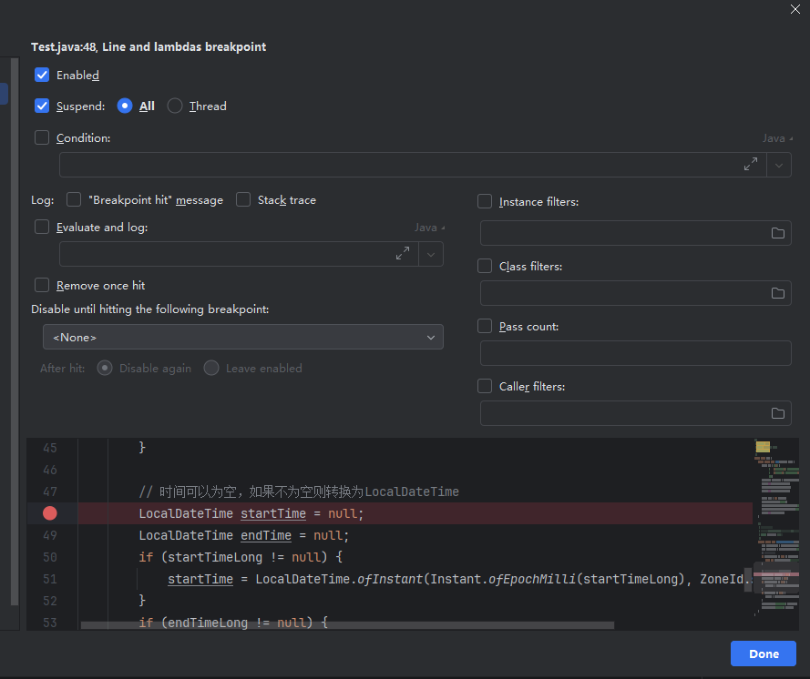

# 开发

### 浏览器修改请求参数并重发

1. 在开发者工具的网络中找到需要重发的请求
2. 右键选择复制 --> 复制为fetch
3. 在浏览器控制台中粘贴fetch请求的内容
4. 这时候可以修改fetch的数据，如请求头，请求参数等
5. 在fetch代码段的后面加入代码`.then(res=>res.json()).then(res=>console.log(res))`。（因为fetch方法返回的是promise，需要在then之后调用结果的 json() 方法将结果转为 json 格式，因为 json() 方法也是返回 promise，因此需要再then后才能打印接口相应的数据）。

不过如果想换一个地址请求，就会受到浏览器跨域的限制。这时候可以复制为`cURL(cmd)`或者`cURL(bash)`，通过命令行就可以直接发送请求了，这比使用`postman`等工具来的更加方便。


### 查看Maven依赖关系

有时候在IDEA中的External Libraries中看到很多的jar包，但是不知道某个jar包是怎么被引用进来的，获取不知道jar包之间的关系，可以使用maven命令进行树形结构整理并输出，然后通过搜索即可查看这些jar包之间的关系。maven命令如下：

```bash
# 树形结构
mvn dependency:tree
# 列表结构
mvn dependency:list
```

当然，如果使用IDEA，安装插件`Maven-helper`，点击`pom.xml`文件就可以通过搜索框搜索依赖了。


### Maven打包跳过测试

```bash
mvn package -DskipTests
```


###  IDEA重新编译单个文件

 有的项目很大，我们运行项目后，修改一点代码，重启项目会花费很多时间，这时候我们可以
 点击左上角Build按钮 选择Recompile 'xxx.java'，即可重新编译项目中的当前打开的单个文件。
 默认快捷键是：ctrl + shift + F9


### 查看校验和

有时候同一个文件，在不同环境的表现不一样，很可能是文件被改动过了，这时候使用校验和来判断文件是否一样就很管用。

windows 系统

```bash
certutil -hashfile filePath MD5
```

linux 系统

```sh
md5sum filePath
```


### 手动修改html页面源码

很多系统对于表单等参数的校验仅限于前端，后端根本不做校验。因此，很多时候我们是可以通过修改表单进行一些取巧的操作的。比如放开某些按钮，取消某些输入框的禁用等。


### IDEA调试技巧

右键断点，点击More ，会展开如下面板：



Suspend：是否到断点处暂停。比如下面的Log打开的时候，其实只是想看看有没有走到断点，并不需要它暂停。

All和Thread：多线程调试的时候，使用Thread，可以选择线程。

Condition：条件断点。满足条件的时候才会暂停。

Log：可以选择打印命中断点的简短信息，也可以输出堆栈。

Evaluate and log：可以直接写代码，可以运用上下文的变量等，可以通过它修改业务逻辑，打印一些日志，功能强大。

Remove once hit：命中一次之后就移除。

Disable until hitting the follwing：在命中哪些断点之后才生效。

xxxFilter：实例、类、调用者过滤。

pass count：放行多少次。在for循环的时候可以用。

