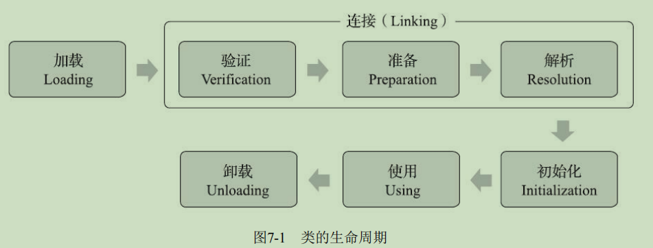
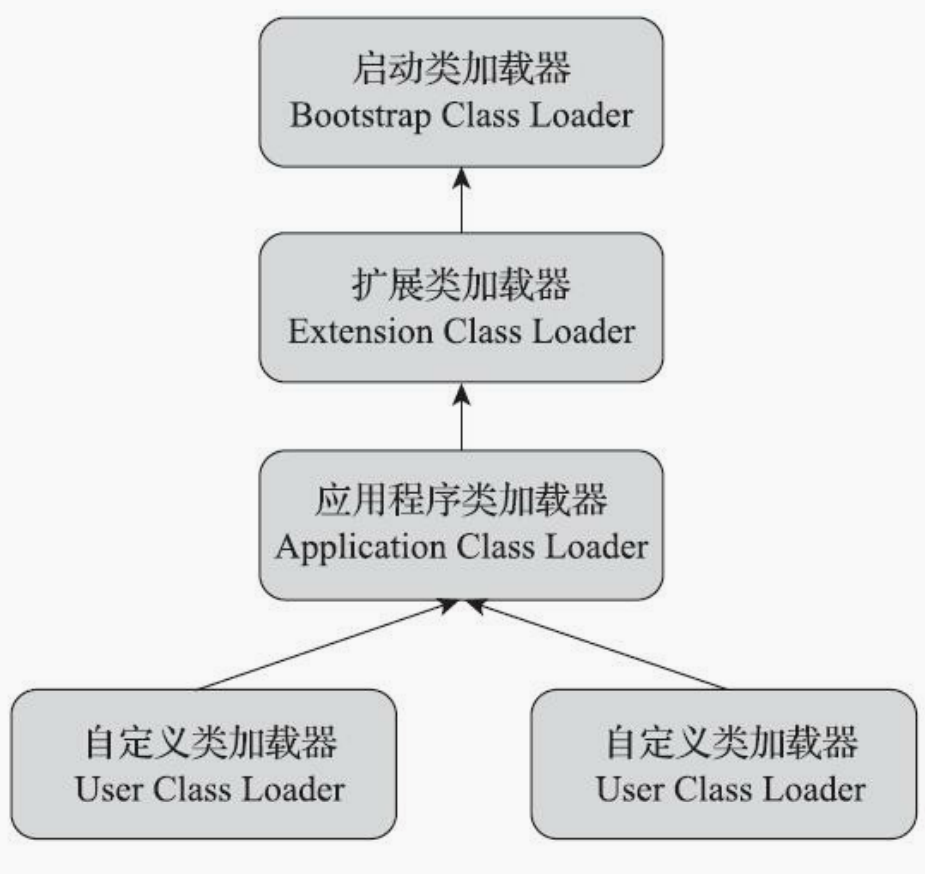
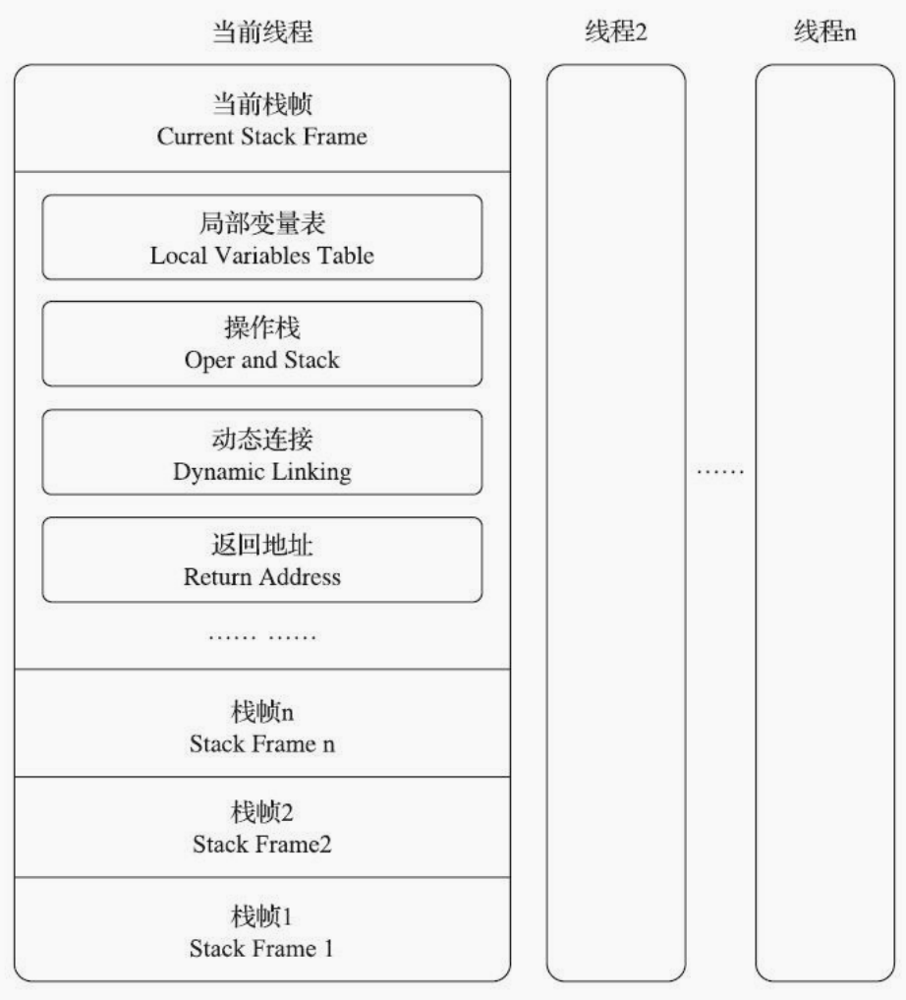
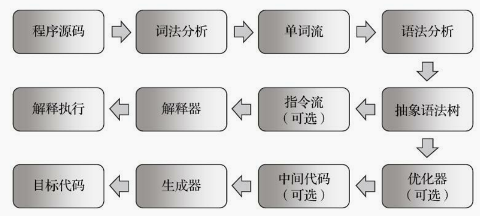
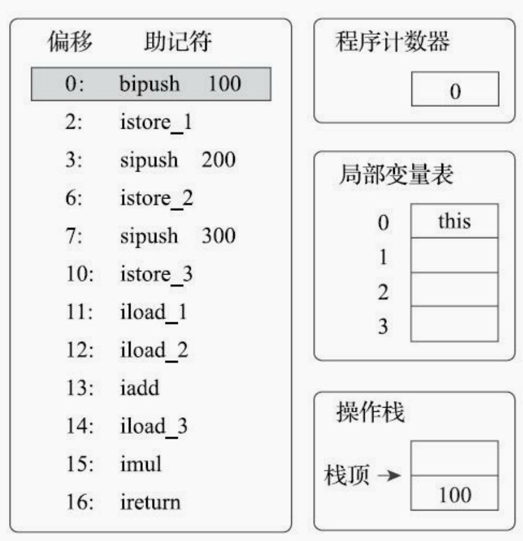
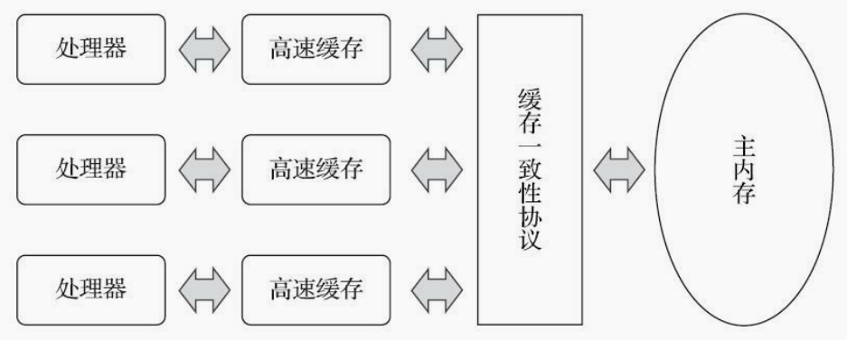
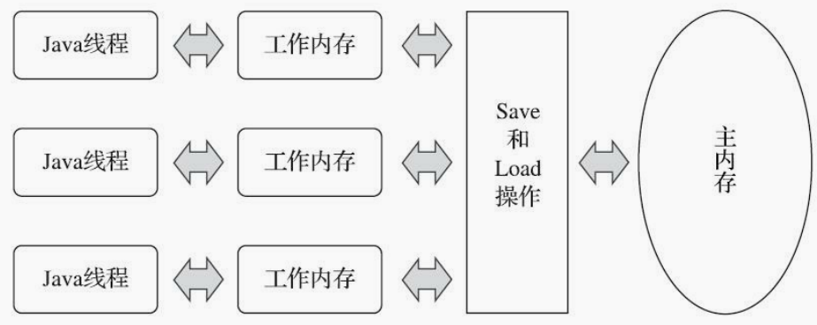

# 深入理解Java虚拟机

## 第三部分 虚拟机执行子系统

### 第7章 虚拟机类加载机制

Java虚拟机把描述类的数据从Class文件加载到内存，对数据进行校验，转换解析，初始化。最终形成可以被虚拟机直接使用的Java类。这个过程就是类加载机制。类型加载、连接和初始化都是在程序运行期间完成的。

1. 类加载的时机

   一个类型从被加载到虚拟机内存开始到载出内存为止，它的生命周期经历加载，验证，准备，解析，初始化，使用，卸载七个阶段。准备，验证，解析三个部分统称为连接。

   

   加载，验证，准备，初始化和卸载这5个阶段的顺序是确定的。但是解析阶段就不一定。某些情况可以在初始化之后再开始解析。为了支持Java语言的运行时绑定的特性。《Java虚拟机规范》则是严格规定了有且只有六种情况必须立即对类进行“初始化”。

   1，遇到new（创建对象）、getstatic（读取静态字段）、putstatic（赋值给静态字段）或invokestatic（调用静态方法）这四条字节码指令时，如果类型没有进行过初始化，则需要先触发其初始化阶段。

   2，使用java.lang.reflect包的方法对类型进行反射调用时，如果类型未初始化需要初始化。

   3，初始化类型时，如果父类没有初始化，则先初始化父类。

   4，虚拟机启动时会先初始化主类（包含main方法）。

   5，当使用JDK7的动态语言支持时，如果方法句柄对应的类没有初始化，则需要初始化。

   6，当接口定义了JDK8的默认方法时，如果有接口实现类要初始化，则先初始化接口。

2. 类的加载过程

   - 加载

     在加载阶段，虚拟机需要完成一下三件事：

     1，通过一个类的权限定类名来获取此类的二进制字节流。

     2，将字节流代表的静态存储结构转化为方法区运行时的数据结构。

     3，在内存中生成一个表达这个类的java.lang.Class对象，作为方法区这个类的各种数据的访问入口。

   - 验证

     1，文件格式验证：

     第一阶段要验证字节流是否符合Class文件格式的规范，并且能被当前版本的虚拟机处理。这一阶段可能包括下面这些验证点：

     魔数是否正确，主次版本号是在当前虚拟机的接受范围，常量池是否有不被支持的常量类型，常量中是否包含不符合UTF-8编码的数据等等。

     2，元数据验证：

     第二阶段是对字节码描述信息进行语义分析，保证信息符合《Java语言规范》的要求：

     这个类是否有的父类（除了Object外），这个类是否继承了不该继承的类（被final修饰），如果此类不是抽象类是否实现了父类或者接口中要求实现的所有方法等。

     3，字节码验证：

     第三阶段是整个验证过程中最复杂的一个阶段，主要目的是通过数据流分析和控制流分析，确定程序语义是合法的、符合逻辑的： 

     保证操作数栈的数据类型与指令代码序列能配合工作（如操作数栈int类型的数据不会被long类型指令加载到本地变量表），保证任何跳转指令都不会跳转到方法之外，保证类型转换是安全的。

     4，符号引用验证：

     发生在解析阶段虚拟机阿静符号引用转化为直接引用的时候。就是验证该类是否缺少或者被禁止访问它依赖的某些外部类、方法、字段等资源。

   - 准备

     准备阶段是正式为类中定义的变量（即静态变量，被static修饰的变量）分配内存并设置类变量初始值（零值和null）的阶段，从概念上讲，这些变量所使用的内存都应当在方法区中进行分配，但必须注意到方法区本身是一个逻辑上的区域，类变量则会随着Class对象一起存放在Java堆中。（JDK8之后HotSpot使用元空间来实现方法区，元空间是分配在堆中的。）

     ```java
     public static int value = 123;
     ```

     以上代码在准备阶段，value的值为0，而把value赋值为123的putstatic指令是程序被编译后，存放于类构造器<clinit>()方法之中，所以把value赋值为123的动作要到类的初始化阶段才会被执行。

     如果把上述代码改为如下代码，则在准备阶段value（字段属性表存在ConstantValue属性）的值被赋为123。

     ```java
     public static final value = 123;
     ```

   - 解析

     解析阶段是Java虚拟机将常量池内的符号引用替换为直接引用的过程。在Class文件中它以CONSTANT_Class_info、 CONSTANT_Fieldref_info、CONSTANT_Methodref_info等类型的常量出现，那解析阶段中所说的直接 引用与符号引用又有什么关联呢？ 

     符号引用：

     符号引用以一组符号来描述所引用的目标，符号可以是任何 形式的字面量，只要使用时能无歧义地定位到目标即可。符号引用与虚拟机实现的内存布局无关，引用的目标并不一定是已经加载到虚拟机内存当中的内容。各种虚拟机实现的内存布局可以各不相同，但是它们能接受的符号引用必须都是一致的，因为符号引用的字面量形式明确定义在《Java虚拟机规 范》的Class文件格式中。 

     直接引用：

     直接引用是可以直接指向目标的指针、相对偏移量或者是一个能间接定位到目标的句柄。直接引用是和虚拟机实现的内存布局直接相关的，同一个符号引用在不同虚拟机实例上翻译出来的直接引用一般不会相同。如果有了直接引用，那引用的目标必定已经在虚拟机的内存中存在。 

   - 初始化

     直到初始化阶段，Java虚拟机才真正开始执行类中编写的Java程序代码，将主导权移交给应用程序。在准备阶段时，变量已经赋过一次系统要求的初始零值，而在初始化阶段，则会根据程序员通过程序编码制定的主观计划去初始化类变量和其他资源。我们也可以从另外一种更直接的形式来表 达：初始化阶段就是执行类构造器<clinit>()方法的过程。<clinit>()并不是程序员在Java代码中直接编写的方法，它是Javac编译器的自动生成物，

3. 类加载器

   - 类与类加载器

     对于任意一个类，都必须由加载它的类加载器和这个类本身一起共同确立其在Java虚拟机中的唯一性，每一个类加载器，都拥有一个独立的类名称空间。如果有两个Integer类，它们的类加载器不是同一个，则说明这两个Integer类不是相等，即不是同一个类。

   - 双亲委派模型

     站在Java虚拟机的角度来看，只存在两种不同的类加载器：一种是启动类加载器（BootstrapClassLoader），这个类加载器使用C++语言实现，是虚拟机自身的一部分；另外一种就是其他所有的类加载器，这些类加载器都由Java语言实现，独立存在于虚拟机外部，并且全都继承自抽象类java.lang.ClassLoader。

     站在Java开发人员的角度来看，类加载器就应当划分得更细致一些。自JDK 1.2以来，Java一直保持着三层类加载器、双亲委派的类加载架构，尽管这套架构在Java模块化系统出现后有了一些调整变动，但依然未改变其主体结构。三层类加载器如下：

     1，启动类加载器：这个类加载器负责加载存放在 <JAVA_HOME>\lib目录，或者被-Xbootclasspath 参数所指定的路径中存放的，而且是Java虚拟机能够识别的（按照文件名识别，如rt.jar、tools.jar，名字不符合的类库即使放在lib目录中也不会被加载）类库加载到虚拟机的内存中。启动类加载器无法被Java程序直接引用，用户在编写自定义类加载器时，如果需要把加载请求委派给引导类加载器去处理，那直接使用null代替即可。

     ```java
     // 可通过以下代码获取启动类加载器加载的类路径
     URL[] urls = sun.misc.Launcher.getBootstrapClassPath().getURLs();
     ```

     2，扩展类加载器：这个类加载器是在类sun.misc.Launcher$ExtClassLoader中以Java代码的形式实现的。它负责加载<JAVA_HOME>\lib\ext目录中，或者被java.ext.dirs系统变量所指定的路径中所有的类库。

     3，应用程序类加载器：这个类加载器由sun.misc.Launcher$AppClassLoader来实现。由于应用程序类加载器是ClassLoader类中的getSystemClassLoader()方法的返回值，所以有些场合中也称它为“系统类加载器”。它负责加载用户类路径（ClassPath）上所有的类库，开发者同样可以直接在代码中使用这个类加载器。如果应用程序中没有自定义过自己的类加载器，一般情况下这个就是程序中默认的类加载器。

     ```java
     // 发现两个类加载器对象相等
     System.out.println(this.getClass.getClassLoader());
     System.out.println(ClassLoader.getSystemClassLoader());
     ```

     双亲委派机制是优先使用父类加载去加载class文件，避免相同的类被不同类加载器加载多次的情况。例如从网络传过来一个java.lang.Integer，子加载器直接加载的话，就会导致方法区中有两个不同的java.lang.Integer类，如果子加载器优先交由父加载器加载，父加载器发现已经包含有该类了，直接返回该类即可，如果没有再让子类加载器去加载。双亲委派模型如下图所示。

     

     自定类加载器：

     自定义类加载器可以继承ClassLoad或者URLClassLoad，继承URLClassLoader不需要实现findClass()方法进行类的查找逻辑。

     ```java
     String jarPath = "";
     File file = new File(jarPath);
     // 先传入空类路径，当前类的类加载器作为自定义类加载器的父类加载器
     MyClassLoader classLoader = new MyClassLoader(new URL[]{}, this.class.getClassLoader());
     List<Class> classList = new ArrayList<>();
     String classSuffix = ".class";
     classLoader.addJar(new File(jarPath).toURI().toURL());
     JarFile jarFile = new JarFile(jarPath);
     Enumeration<JarEntry> enums = jarFile.entries();
     while (enums.hasMoreElements()) {
         JarEntry entry = enums.nextElement();
         String name = entry.getName();
         long size = entry.getSize();
         System.out.println(name + " " + size);
         if (name.endsWith(classSuffix)){
             // 将类路径和后缀名形式替换为包名类名形式
             classList.add(classLoader.loadClass(name.replace(classSuffix, "").replace("/", ".")));
         }
     }
     // 自定类加载器
     static class MyClassLoader extends URLClassLoader {
         MyClassLoader(URL[] urls, ClassLoader parent) {
             super(urls, parent); // 传入加载类路径和父类加载器
         }
         @Override
         void addJar(URL url) {
             this.addURL(url);
         }
     }
     ```

### 第8章 虚拟机字节码执行引擎

1. 运行时栈帧结构

   栈帧的概念结构如下图所示：

   

   - 局部变量表

     局部变量表是一组变量值的存储空间，用于存放方法参数和方法内部定义的局部变量。在Java程序被编译为Class文件时，就在方法的Code属性的max_locals数据项中确定了该方法所需分配的局部变量表的最大容量。

   - 操作数栈

     同局部变量表一样，操作数栈的最大深度也在编译的时候被写入到Code属性的max_stacks数据项 

     之中。操作数栈的每一个元素都可以是包括long和double在内的任意Java数据类型。32位数据类型所占的栈容量为1，64位数据类型所占的栈容量为2。

     当一个方法刚刚开始执行的时候，这个方法的操作数栈是空的，在方法的执行过程中，会有各种字节码指令往操作数栈中写入和提取内容，也就是出栈和入栈操作。譬如在做算术运算的时候是通过将运算涉及的操作数栈压入栈顶后调用运算指令来进行的，又譬如在调用其他方法的时候是通过操作数栈来进行方法参数的传递。

   - 动态连接

     Class文件的常量池中存有大量的符号引用，字节码中的方法调用指令就以常量池里指向方法的符号引用作为参数。这些符号 引用一部分会在类加载阶段或者第一次使用的时候就被转化为直接引用，这种转化被称为静态解析。 

     另外一部分将在每一次运行期间都转化为直接引用，这部分就称为动态连接。

   - 方法返回地址

     当一个方法开始执行后，只有两种方式退出这个方法：

     1，第一种方式是执行引擎遇到任意一个方法返回的字节码指令，这时候可能会有返回值传递给上层的方法调用者。

     2，另外一种退出方式是在方法执行的过程中遇到了异常，并且这个异常没有在方法体内得到妥善处理。

     无论采用何种退出方式，在方法退出之后，都必须返回到最初方法被调用时的位置，程序才能继续执行，方法返回时可能需要在栈帧中保存一些信息，用来帮助恢复它的上层主调方法的执行状态。

   - 附加信息

     《Java虚拟机规范》允许虚拟机实现增加一些规范里没有描述的信息到栈帧之中，例如与调试、性能收集相关的信息，这部分信息完全取决于具体的虚拟机实现。

2. 方法调用

   方法调用并不等同于方法中的代码被执行，方法调用阶段唯一的任务就是确定被调用方法的版本（即调用哪一个方法），暂时还未涉及方法内部的具体运行过程。Class文件的编译过程中不包含传统程序语言编译的连接步骤，一切方法调用在Class文件里面存储的都只是符号引用，而不是方法在实际运行时内存布局中的入口地址（也就是之前说的直接引用）。这个特性给Java带来了更强大的动态扩展能力，但也使得Java方法调用过程变得相对复杂，某些调用需要在类加载期间，甚至到运行期间才能确定目标方法的直接引用。

   - 解析

     所有方法调用的目标方法在Class文件里面都是一个常量池中的符号引用，在类加载的解析阶段，会将其中的一部分符号引用转化为直接引用，这种解析能够成立的前提是：方法在程序真正运行之前就有一个可确定的调用版本，并且这个方法的调用版本在运行期是不可改变的。换句话说，调用目标在程序代码写好、编译器进行编译那一刻就已经确定下来。这类方法的调用被称为解析。 

     不同方法调用的指令。

     - invokestatic：调用静态方法
     - invokespecial：调用实例构造器的< init>方法，私有方法和父类中的方法。
     - invokevirtual：调用虚方法
     - invokeinterface：调用接口方法。
     - invokedynamic：先运行时动态解析出调用点的限定符所引用的方法。然后执行这个方法。前面四条调用指令，分派逻辑都固化在Java虚拟机的内部，而invokedynamic指令的分派逻辑是由用户设定的引导方法决定的。

     只要是能够被invokestatic或者是invokespecial指令调用的方法，都可以在解析阶段中确定唯一的调用版本。Java语言符合这个条件的静态方法，私有方法，实例构造器，父类方法，再加上final修饰的方法。直接可以把方法的符号引用解析为直接引用。这个解析调用是一个静态的过程，编译器就能够完成。

   - 分派

     分派调用揭示了多态特征的最基本表现。

     - 静态分派：

       虚拟机（或者准确地说是编译器）在重载时是通过参数的静态类型而不是实际类型作为判定依据的。

       ```java
       Human man = new Man(); 
       Human woman = new Woman();
       StaticDispatch sr = new StaticDispatch(); 
       // 静态类型决定重载方法
       sr.sayHello(man); // 静态类型为Human
       sr.sayHello(woman); // 静态类型为Human
       sr.sayHello(new Woman); // 静态类型为Woman
       // 输出结果
       ```

       需要注意Javac编译器虽然能确定出方法的重载版本，但在很多情况下这个重载版本并不是“唯一”的，往往只能确定一个“相对更合适的”版本。如下代码，如果没有char类型参数的方法，方法调用将会使用int类型参数的方法，如果再没有int类型参数的方法，将会调用long参数类型的方法。

       ```java
       // 三个重载方法
       public static void sayHello(int arg) { 
           System.out.println("hello int"); 
       }
       public static void sayHello(long arg) {
           System.out.println("hello long"); 
       }
       public static void sayHello(char arg) {
           System.out.println("hello char"); 
       }
       // 方法调用
       sayHello('a')
       // 运行结果
       hello,human
       hello,human
       hello,woman
       ```

     - 动态分派：

       虚拟机在调用被重写的方法时，通过实际参数作为方法调用的判定依据。

       ```java
       static abstract class Human { 
           protected abstract void sayHello(); 
       }
       static class Man extends Human { 
           @Override
           protected void sayHello() { 
               System.out.println("man say hello"); 
           } 
       }
       static class Woman extends Human { 
           @Override
           protected void sayHello() {
               System.out.println("woman say hello");                                      }
       }
       public static void main(String[] args) { 
           Human man = new Man();  // 动态类型为Man
           Human woman = new Woman();  // 动态类型为woman
           man.sayHello(); 
           woman.sayHello(); 
           man = new Woman(); // 动态类型为woman
           man.sayHello(); 
       }
       // 输出结果
       man say hello
       woman say hello 
       woman say hello
       ```

3. 基于栈的字节码解释执行引擎

   - 解释执行

     Java语言经常被人们定位为“解释执行”的语言，在Java初生的JDK 1.0时代，这种定义还算是比较准确的，但当主流的虚拟机中都包含了即时编译器后，Class文件中的代码到底会被解释执行还是编译执行，就成了只有虚拟机自己才能准确判断的事。Java虚拟机代码执行过程大体上都会遵循以下符合现代经典编译原理的思路。

     

   - 基于栈的指令集和基于寄存器的指令集

     Javac编译器输出的字节码指令流，基本上是一种基于栈的指令集架构，字节码指令流里面的指令大部分都是零地址指令，它们依赖操作数栈进行工作。与之相对的另外一套常用的指令集架构是基于寄存器的指令集，最典型的就是x86的二地址指令集，如果说得更通俗一些就是现在我们主流PC机中物理硬件直接支持的指令集架构，这些指令依赖寄存器进行工作。

     计算 1+1：

     ```shell
     # 基于栈的指令
     iconst_1  # 将1入栈
     iconst_1  # 将1入栈
     iadd  # 取出栈顶两个元素然后相加操作
     istore_0  # 将结果放回栈顶
     # 基于汇编的指令
     mov eax, 1  # 设置寄存器的值为1
     add eax, 1  # 在寄存器上加1
     ```

     优缺点总结：

     基于栈的指令集主要优点是可移植，因为寄存器由硬件直接提供，程序直接依赖这些硬件寄存器则不可避免地要受到硬件的约束。栈架构的指令集还有一些其他的优点，如代码相对更加紧凑（字节码中每个字节就对应一条指令，而多地址指令集中还需要存放参数）、编译器实现更加简单（不需要考虑空间分配的问题，所需空间都在栈上操作）等，但是性能会所损耗。

   - 基于栈的解释执行过程

     示意图如下：

     

     

## 第四部分 程序编译与代码优化

在Java技术下谈“编译期”而没有具体上下文语境的话，其实是一句很含糊的表述，因为它可能是 指一个前端编译器（如javac）把java文件转变成class文件的过程；也可能是指Java虚拟机的即时编译器（常称JIT编译器，Just In Time Compiler）运行期把字节码转变成本地机器码的过程；还可能是指使用静态的提前编译器（常称AOT编译器，Ahead Of Time Compiler）直接把程序编译成与目标机器指令集相关的二进制代码的过程。这3类编译过程里一些比较有代表性地编译器产品。

- 前端编译器：JDK的Javac、Eclipse JDT中的增量式编译器（ECJ）。 

- 即时编译器：HotSpot虚拟机的C1、C2编译器，Graal编译器。 

- 提前编译器：JDK的Jaotc、GNU Compiler for the Java（GCJ）、Excelsior JET。

前端编译中优化工作做的少，主要优化工作在后端。

### 第10章 前端编译与优化

1. javac编译器

   Javac编译器不像HotSpot虚拟机那样使用C++语言（包含少量C语言）实现，它本身就是一个由Java语言编写的程序。从Javac代码的总体结构来看，编译过程大致分为以下3个处理过程。

   - 解析与填充符号表

     进行词法分析、语法分析。将源代码的字符流标记集合、构造出抽象语法树。

   - 注解处理器处理

     编译器注解处理的标准API允许程序员访问编译器生成的抽象语法树中的任意元素。因此可以使用插入式注解处理器来实现原本只能在编码阶段由人工完成的事情。譬如著名的效率工具Lombok就通过注解来实现自动生成setter/getter方法。

   - 语义分析与字节码生成

     1，标注检查：标注检查步骤要检查的内容包括诸如变量使用前是否已被声明、变量与赋值之间的数据类型是否能够匹配等，还会顺便进行常量折叠（如int a = 2 + 3编译为int a = 5，String s = "s" + "b"编译为String s = "sb"）的代码优化。

     2，数据及控制流分析：数据流分析和控制流分析是对程序上下文逻辑更进一步的验证，它可以检查出诸如程序局部变量在使用前是否有赋值、方法的每条路径是否都有返回值、是否所有的受查异常都被正确处理了等问题.

     3，解语法糖：糖衣语法能够减少代码量，增加程序的可读性。这里将泛型、变长参数、自动拆箱装箱等语法还原成原始的语法和指令。

     4，字节码生成：是javac编译过程的最后一个阶段，不仅将语法书、符号表等转化成字节码指令写到磁盘中，编译器还进行了少量的代码添加和转换工作（如实例构造器<init>()方法和类构造器<clinit>()方法的添加，实例构造器并等同于默认构造函数）。

2. java语法糖

   - 泛型

     泛型的本质是参数化类型或者参数化多态的应用，即可以将操作的数据类型指定为方法签名中的一种特殊参数，这种参数类型能够用在类、接口和方法的创建中，分别构成泛型类、泛型接口和泛型方法。泛型让程序员能够针对泛化的数据类型编写相同的算法，这极大地增强了编程语言的类型系统及抽象能力。

     在使用泛型的时候，需要传入类型参数，但是在编译之后会将类型擦除。这也是一种语法糖。

   - 自动装箱拆箱与遍历循环

     自动装箱、拆箱在编译之后被转化成了对应的包装和还原方法，如Integer.valueOf()与Integer.intValue()方法，而遍历循环则是把代码还原成了迭代器的实现，这也是为何遍历循环需要被遍历的类实现Iterable接口的原因。最后再看看变长参数，它在调用的时候变成了一个数组类型的参数，在变长参数出现之前，程序员的确也就是使用数组来完成类似功能的。

   - 条件编译

     Java语言中条件编译的实现，也是Java语言的一颗语法糖，根据布尔常量值的真假，编译器将会把分支中不成立的代码块消除掉，这一工作将在编译器解除语法糖阶段类中完成。

     ```java
     public static void main(String[] args) {
         if (true) {
             System.out.println("block 1");
         } else {
             System.out.println("block 2");
         }
     }
     // 会被编译成
     public static void main(String[] args) {
         System.out.println("block 1");
     }
     ```

### 第11章 后端编译与优化

如果我们把字节码看作是程序语言的一种中间表示形式的话， 那编译器无论在何时、在何种状态下把Class文件转换成与本地基础设施（硬件指令集、操作系统）相关的二进制机器码，它都可以视为整个编译过程的后端。无论是提前编译器抑或即时编译器，都不是Java虚拟机必需的组成部分，《Java虚拟机规范》中从来没有规定过虚拟机内部必须要包含这些编译器，更没有限定或指导这些编译器应该如何去实现。

这是因为即便没有后端，虚拟机依旧可以解释执行字节码。只是可能速度并没有那么快。

1. 即时编译器

   目前主流的两款商用Java虚拟机（HotSpot、OpenJ9）里，Java程序最初都是通过解释器进行解释执行的，当虚拟机发现某个方法或代码块的运行特别频繁，就会把这些代码认定为“热点代码”（Hot Spot Code），为了提高热点代码的执行效率，在运行时，虚拟机将会把这些代码编译成本地机器码，并以各种手段尽可能地进行代码优化，运行时完成这个任务的后端编译器被称为即时编译器。

   - 解释器与编译器

     HotSpot、OpenJ9等内部都同时包含解释器与编译器，解释器与编译器两者各有优势：当程序需要迅速启动和执行的时候，解释器可以首先发挥作用，省去编译的时间，立即运行。当程序启动后，随着时间的推移，编译器逐渐发挥作用，把越来越多的代码编译成本地代码，这样可以减少解释器的中间损耗，获得更高的执行效率。

     同时，解释器还可以作为编译器激进优化时后备的“逃生门”，让编译器根据概率选择一些不能保证所有情况都正确，但大多数时候都能提升运行速度的优化手段，当激进优化的假设不成立，如加载了新类以后，类型继承结构出现变化、出现“罕见陷阱”时可以通过逆优化退回到解释状态继续执行

     HotSpot虚拟机中内置了两个（或三个）即时编译器，其中有两个编译器存在已久，分别被称 

     为“客户端编译器”和“服务端编译器”，或者简称为C1编译器和C2编译器（也叫Opto编译器），第三个是在JDK10时才出现的、长期目标是代替C2的Graal编译器（实验状态）。

   - 编译对象与触发条件

     在运行过程中会被即时编译器编译的目标是“热点代码”，热点代码主要有两类： 被多次调用的方法和被多次执行的循环体。 要知道某段代码是不是热点代码，是不是需要触发即时编译，这个行为称为热点探测，主流的热点探测有两种方法：

     1，基于采样的热点探测（J9使用）：采用这种方法的虚拟机会周期性地检查各个线程的调用栈顶，如果发现某个（或某些）方法经常出现在栈顶，那这个方法就是“热点方法”。

     2，基于计数器的热点探测（HotSpot使用）：采用这种方法的虚拟机会为每个方法（甚至是代码块）建立计数器，统计方法的执行次数，如果执行次数超过一定的阈值就认为它是“热点方法”。计数是可通过参数配置。

   - 编译过程

     在默认条件下，无论是方法调用产生的标准编译请求，还是栈上替换编译请求，虚拟机在编译器还未完成编译之前，都仍然将按照解释方式继续执行代码，而编译动作则在后台的编译线程中进行。 用户可以通过参数-XX：-BackgroundCompilation来禁止后台编译，后台编译被禁止后，当达到触发即时编译的条件时，执行线程向虚拟机提交编译请求以后将会一直阻塞等待，直到编译过程完成再开始执行编译器输出的本地代码。 

2. 提前编译器

   现在提前编译产品和对其的研究有着两条明显的分支，一条分支是做与传统C、C++编译器类似 的，在程序运行之前把程序代码编译成机器码的静态翻译工作；另外一条分支是把原本即时编译器在运行时要做的编译工作提前做好并保存下来，下次运行到这些代码（譬如公共库代码在被同一台机器其他Java进程使用）时直接把它加载进来使用。 

   1，即时编译虽然耗时，到那时提前静态编译的优化效果没有即时编译好，因为缺少动态运行监控。

   2，本质是给即时编译器做缓存加速。也叫动态提前编译。为了进程兼容性，很多激进优化都不能肆意运用，所以编译输出的代码质量反而要低于即时编译器。

3. 编译器优化技术

   编译器的目标虽然是做由程序代码翻译为本地机器码的工作，但其实难点并不在于能不能成功翻译出机器码，输出代码优化质量的高低才是决定编译器优秀与否的关键。介绍以下四种编译优化技术。

   - 方法内联（最重要的优化技术之一）

     内联被业内戏称为优化之母，因为除了消除方法调用的成本之外，它更重要的意义是为其他优化手段建立良好的基础。方法内联的优化行为理解起来是没有任何困难的，不过就是把目标方法的代码原封不动地“复制”到发起调用的方法之中，避免发生真实的方法调用而已。

     以下代码如果不做方法内联，根本就不知道代码可以优化，从而避免无用代码。

     ```java
     // 急需编译优化的代码
     public static void foo(Object obj) {
         if (obj != null) {
             System.out.println("do something");
         }
     }
     public static void testInline(String[] args) {
         Object obj = null; 
         foo(obj); 
     }
     ```

   - 逃逸分析（最前沿的优化技术之一）：

     分析对象动态作用域，当一个对象在方法里面被定义后，它可能被外部方法所引用，例如作为调用参数传递到其他方法中，这种称为方法逃逸；甚至还有可能被外部线程访问到，譬如赋值给可以在其他线程中访问的实例变量，这种称为线程逃逸；从不逃逸、方法逃逸到线程逃逸，称为对象由低到高的不同逃逸程度。 

     如果能证明一个对象不会逃逸到方法或线程之外，可以做以下不同程度的优化：

     1，栈上分配：

     在Java虚拟机中，Java堆上分配创建对象的内存空间几乎是Java程序员都知道的常识，虚拟机的垃圾收集子系统会回收堆中不再使用的对象，但回收动作无论是标记筛选出可回收对象还是回收和整理内存，都需要耗费大量资源。如果确定一个对象不会逃逸出线程之外，那让这个对象在栈上分配内存将会是一个很不错的主意，对象所占用的内存空间就可以随栈帧出栈而销毁。

     2，标量替换：

     若一个数据已经无法再分解成更小的数据来表示了，Java虚拟机中的原始数据类型（int、long等数值类型及reference类型等）都不能再进一步分解了，那么这些数据就可以被称为标量。相对的，如果一个数据可以继续分解，那它就被称为聚合量，Java中的对象就是典型的聚合量。如果把一个Java对象拆散，根据程序访问的情况，将其用到的成员变量恢复为原始类型来访问，这个过程就称为标量替换。

     3，同步消除：线程同步本身是一个相对耗时的过程，如果逃逸分析能够确定一个变量不会逃逸出线程，那么这个变量的读写就不会有竞争， 对这个变量实施的同步措施也就可以安全地消除掉。 

     以下为逃逸分析优化的例子，Point是一个包含x，y坐标的POJO类（java代码代替字节码）。

     ```java
     // 完全未优化的代码 
     public int test(int x) {
         int xx = x + 2; 
         Point p = new Point(xx, 42); 
         return p.getX(); 
     }
     // 步骤1：函数内联之后 
     public int test(int x) {
         int xx = x + 2; 
         Point p = point_memory_alloc(); // 在堆中分配P对象的示意方法 
         p.x = xx; // Point构造函数被内联后的样子 
         p.y = 42;
         return p.x;
     }
     // 步骤2：标量替换后 
     public int test(int x) { 
         int xx = x + 2; 
         int px = xx; 
         int py = 42; 
         return px;
     }
     // 步骤3：做无用代码消除后
     public int test(int x) { 
         return x + 2;
     }
     ```

   - 公共子表达式消除（语言无关的经典优化技术之一）

     公共子表达式消除是一项非常经典的、普遍应用于各种编译器的优化技术，它的含义是：如果一 个表达式E之前已经被计算过了，并且从先前的计算到现在E中所有变量的值都没有发生变化，那么E的这次出现就称为公共子表达式。

     ```java
     // 优化前
     int d = (c * b) * 12 + a + (a + b * c);
     // 优化后（E代表b * c）
     int d = E * 13 + a + a;
     ```

   - 数组边界检查消除（语言无关的经典优化技术之一）

     Java语言是一门动态安全的语言，对数组的读写访问也不像C、C++那样实质上就是裸指针操作。如果有一个数组foo[]，在Java语言中访问数组元素foo[i]的时候系统将会自动进行上下界的范围检查，即i必须满足“i>=0&&i<foo.length”的访问条件，否则将抛出一个运行时异常。

     如果在编译时就检查出 i 的值不会超过数组边界，则消除掉数组边界检查的代码。在循环中优化效果更佳。

## 第五部分 高效并发

### 第12章 Java内存模型与线程

1. 硬件的效率与一致性

   基于高速缓存的存储交互很好地解决了处理器与内存速度之间的矛盾，但是也为计算机系统带来更高的复杂度，它引入了一个新的问题：缓存一致性。在多路处理器系统中，每个处理器都有自己的高速缓存，而它们又共享同一主内存，这种系统称为共享内存多核系统。如下图所示：

   

   除了增加高速缓存之外，为了使处理器内部的运算单元能尽量被充分利用，处理器可能会对输入代码进行乱序执行优化，处理器会在计算之后将乱序执行的结果重组，保证该结果与顺序执行的结果是一致的，但并不保证程序中各个语句计算的先后顺序与输入代码中的顺序一致。与处理器的乱序执行优化类似，Java虚拟机的即时编译器中也有指令重排序优化。

2. java内存模型

   - 主内存与工作内存

     Java内存模型规定了所有的变量都存储在主内存中（此处的主内存与介绍物理硬件时提到的主内存名字一样，两者也可以类比，但物理上它仅是虚拟机内存的一部分）。每条线程 还有自己的工作内存（可与前面讲的处理器高速缓存类比），线程的工作内存中保存了被该线程使用的变量的主内存副本，线程对变量的所有操作（读取、赋值等）都必须在工作内存中进行，而不能直接读写主内存中的数据。不同的线程之间也无法直接访问对方工作内存中的变量，线程间变量值的传递均需要通过主内存来完成，线程、主内存、工作内存三者的交互关系如图所示

     

     所讲的主内存、工作内存与之前所讲的Java内存区域中的Java堆、栈、方法区等并不是同一个层次的对内存的划分，这两者基本上是没有任何关系的。如果两者一定要勉强对应起来，那么从变量、主内存、工作内存的定义来看，主内存主要对应于Java堆中的对象实例数据部分，而工作内存则对应于虚拟机栈中的部分区域。

   - 内存间交互操作

     关于主内存与工作内存之间具体的交互协议，即一个变量如何从主内存拷贝到工作内存、如何从工作内存同步回主内存这一类的实现细节，Java内存模型中定义了以下8种操作来完成。

     lock（锁定）：作用于主内存的变量，它把一个变量标识为一条线程独占的状态。 

     unlock（解锁）：作用于主内存的变量，它把一个处于锁定状态的变量释放出来，释放后的变量才可以被其他线程锁定。 

     read（读取）：作用于主内存的变量，它把一个变量的值从主内存传输到线程的工作内存中，给随后的load动作使用。 

     load（载入）：操作工作内存的变量，把read操作从主内存中得到的变量值放入工作内存的变量副本中。 

     use（使用）：作用于工作内存的变量，它把工作内存中一个变量的值传递给执行引擎，每当虚拟机遇到一个需要使用变量的值的字节码指令时将会执行这个操作。 

     assign（赋值）：作用于工作内存的变量，它把一个从执行引擎接收的值赋给工作内存的变量，每当虚拟机遇到一个给变量赋值的字节码指令时执行这个操作。 

     store（存储）：操作工作内存的变量，把工作内存中一个变量的值传送到主内存中，给write操作使用。 

     write（写入）：操作主内存的变量，它把store操作从工作内存中得到的变量的值放入主内存的变量中。

   - 对于volatile型变量的特殊规则

     关键字volatile可以说是java虚拟提供的最轻量级的同步机制，但是它并不容易被正确、完整地理解，导致很多程序员都习惯性地去避免使用它，遇到处理多线程数据竞争问题的时候一律使用synchronized来进行同步。

     volatile变量的可见性经常被开发人员误解，它们会认为以下这句话是对的：“volatile变量在各个线程中是一致的，所以基于volatile变量的运算在并发下是线程安全的”。这句话论据没有错，但是并不能得出上面的结论。

     volatile变量在各个线程的工作内存中是不存在一致性问题的（因为对volatile变量的所有写操作都能立刻反应在其他线程中）。线程不安全的原因就在于，java里面的运算操作符并非原子操作，所以就导致了volatile变量的运算在并发下一样是不安全的。例子如下。

     ```java
     public class VolatileTest {
         private static volatile int race = 0;
         private static void increase() {
             race++;
         }
     
         public static void main(String[] args) {
             Thread[] threads = new Thread[20];
             for (int i = 0; i < threads.length; i++) {
                 threads[i] = new Thread(() -> {
                     for (int j = 0; j < 10000; j++) {
                         increase();
                     }
                 });
                 threads[i].start();
             }
             // 等待所有累加线程都结束，获取当前线程组存活线程数量，idea多开一个其他线程，所以>2
             while (Thread.activeCount() > 2) {
                 Thread.yield(); // 放弃执行
                 System.out.println(race);
             }
         }
     }
     ```

     最终运算结果小于20*2000，这是因为increase方法内部的自增操作不是原子操作。具体如以下字节码（并不严谨，因为一条字节码可能会由好几条机器指令组成，这里只是示意）所示

     ```java
     0: getstatic #13; // 读取主内存的race值时是正确的
     3: iconst_1 
     4: iadd 
     5: putstatic #13; // 执行此操作的时候race很可能已经被修改了
     8: return 
     ```

     使用volatile变量的第二个语义是禁止指令重排序优化，普通的变量仅会保证在该方法的执行过程中所有依赖赋值结果的地方都能获取到正确的结果，而不能保证变量赋值操作的顺序与程序代码中的执行顺序一致。

     指令重排序对单线程不会造成影响，但是多线程协作可能会运行不正确。以下代码展示指令重排序会干扰程序的并发执行。

     ```java
     Map configOptions; 
     char[] configText; 
     // 此变量必须定义为volatile 
     volatile boolean initialized = false; 
     // 假设以下代码在线程A中执行 模拟读取配置信息
     // 当读取完成后,将initialized设置为true,通知其他线程配置可用 
     configOptions = new HashMap(); 
     configText = readConfigFile(fileName);
     processConfigOptions(configText, configOptions); 
     initialized = true; 
     
     // 假设以下代码在线程B中执行
     // 等待initialized为true，代表线程A已经把配置信息初始化完成 
     while (!initialized) { 
         sleep(); 
     }
     // 使用线程A中初始化好的配置信息 
     doSomethingWithConfig();
     ```

     如果定义initialized变量时没有使用volatile修饰，就可能会由于指令重排序的优化，导致位于线程A中最后一条代码“initialized=true”被提前执行（这里虽然使用Java作为伪代码，但所指的重排序优化是机器级的优化操作，提前执行是指这条语句对应的汇编代码被提前执行），这样在线程B中使用配置信息的代码 就可能出现错误，而volatile关键字则可以避免此类情况的发生。

      指令重排序是并发编程中最容易导致开发人员产生疑惑的地方之一。

     从硬件架构上讲，指令重排序是指处理器采用了允许将多条指令不按程序规定的顺序分开发送给各个相应的电路单元进行处理。但并不是说指令任意重排，处理器必须能正确处理指令依赖情况保障程序能得出正确的执行结果。

     volatile的使用场景：一写多读的情况。

     ```java
     volatile boolean shutdownRequested;
     // 一个线程来控制气态线程是否停止工作
     public void shutdown() {
         shutdownRequested = true;
     }
     // 一个或多个线程在工作
     public void doWork() {
         while (!shutdownRequested) { 
             // do something 
         }
     }
     ```

   - 针对long和double变量的特殊规则

     Java内存模型要求lock、unlock、read、load、assign、use、store、write这八种操作都具有原子性，但是对于64位的数据类型（如long和double），如果没有被volatile修饰，允许虚拟机自行选择是否保证64位数据的load、store、read、write这四个操作的原子性。这就是所谓的“long和double的非原子性协定”。

     如果有多个线程共享一个并未声明为volatile的long或double类型的变量，并且同时对它们进行读取和修改操作，那么某些线程可能会读取到一个既不是原值，也不是其他线程修改值的代表了“半个变量”的数值。不过这种读取到“半个变量”的情况是非常罕见的。

     现在的处理器一般都包含专门用于处理单双精度的浮点数据。所以在实际开发中，除非该数据有明确可知的线程竞争，否则我们在编写代码时一般不需要因为这个原因刻意把用到的long和double变量专门声明为volatile。

   - 原子性、可见性、有序性

     原子性：

     我们大致可以认为基本数据类型的访问、读写都是具备原子性的（long和double的非原子协定几乎也不会出现问题）。如果需要有更大范围的原子性保证，java内存模型还是提供了lock和unlock来满足需求，对应到java语言层面就是同步块--synchronized关键字。

     可见性：

     可见性就是指当一个线程修改了共享变量的值时，其他线程能够立即得知这个修改。Java内存模型是通过在变量修改后将新值同步回主内存，在变量读取前从主内存刷新变量值这种依赖主内存作为传递媒介的方式来实现可见性的，无论是普通变量还是volatile变量都是如此。普通变量与volatile变量的区别是，volatile的特殊规则保证了新值能立即同步到主内存，以及每次使用前立即从主内存刷新。

     因此volatile保证了多线程操作时变量的可见性，而普通变量则不能保证这一点。 

     有序性：

     "如果在本线程内观察，所有的操作都是有序的；如果在一个线程中观察另一个线程，所有的操作都是无序的"。前半句是指“线程内似表现为串行的语义”，后半句是指“指令重排序”现象和“工作内存与主内存同步延迟”现象。

     java提供volatile和synchronized两个关键字来保证线程之间操作的有序性。绝大部分并发控制操作都能使用synchronized来完成。synchronized的“万能”也间接造就了它被程序员滥用的局面，越“万能”的并发控制，通常会伴随着越大的性能影响。

   - 原子性、可见性、有序性

   - 先行发生原则

     如果Java内存模型中所有的有序性都仅靠volatile和synchronized来完成，那么有很多操作都将会变得非常啰嗦，但是我们在编写Java并发代码的时候并没有察觉到这一点，这是因为Java语言中有一个“先行发生”的原则。这个原则非常重要，它是判断数据是否存在竞争，线程是否安全的非常有用的手段。依赖这个原则，我们可以通过几条简单规则一揽子解决并发环境下两个操作之间是否可能存在冲突的所有问题，而不需要陷入Java内存模型苦涩难懂的定义之中。 

     以下是Java内存模型下一些“天然的”先行发生关系，这些先行发生关系无须任何同步器协助就已经存在，可以在编码中直接使用。如果两个操作之间的关系不在此列，并且无法从下列规则推导出来，则它们就没有顺序性保障，虚拟机可以对它们随意地进行重排序。 

     - 程序次序规则：在一个线程内，按照控制流顺序，书写在前面的操作先行发生于书写在后面的操作。注意，这里说的是控制流顺序而不是程序代码顺序，因为要考虑分支、循环等结构。（单线程场景） 

     - 管程锁定规则：一个unlock操作先行发生于后面对同一个锁的lock操作。这里必须强调的是“同一个锁”，而“后面”是指时间上的先后。 （同步代码块的场景）

     - volatile变量规则：对一个volatile变量的写操作先行发生于后面对这个变量的读操作，这里的“后面”同样是指时间上的先后。
     - 线程启动规则：Thread对象的start()方法先行发生于此线程的每一个动作。 

     - 线程终止规则：线程中的所有操作都先行发生于对此线程的终止检测，我们可以通过Thread::join()方法是否结束、Thread::isAlive()的返回值等手段检测线程是否已经终止执行。

     - 线程中断规则：对线程interrupt()方法的调用先行发生于被中断线程的代码检测到中断事件的发生，可以通过Thread::interrupted()方法检测到是否有中断发生。 

     - 对象终结规则：一个对象的初始化完成（构造函数执行结束）先行发生于它的finalize()方法的开始。 

     - 传递性：如果操作A先行发生于操作B，操作B先行发生于操作C，那就可以得出操作A先行发生于操作C的结论。 


### 第13章 线程安全与锁优化

1. 线程安全

   什么是线程安全？

   “当多个线程同时访问一个对象时，如果不用考虑这些线程在运行时环境下的调度和交替执行，也不需要进行额外的同步，或者在调用方进行任何其他的协调操作，调用这个对象的行为都可以获得正确的结果，那就称这个对象是线程安全的。” ——《Java并发编程实战》作者Brian Goetz。

   这里我们可以不把线程安全当做一个非黑即白的二元排他选项来看待，可以按照”安全程度“由强至弱分为以下五类：不可变、绝对线程安全、相对线程安全、线程兼容和线程对立。

   - 不可变

     如果共享的数据是不可变的，那么它肯定是线程安全的。基本类型使用final关键字修饰即可，如果想要对象不可变，则对象中的每一个字段使用final修饰即可。

   - 绝对线程安全

     绝对的线程安全满足前面Brain Goetz给的定义。这个定义是很严格的。Java API中标注自己是线程安全的类，大多数都不是绝对的线程安全。如Vector集合类。

     Vector的get、remove、size是同步方法，但是如果在两个线程中对同一个Vector对象分别进行循环多次的get和remove，就可能出现问题。如准备获取某个下标的元素时突然被删除了。解决这个问题还需要在循环处给Vector对象上同步锁。

     ```java
     private static Vector<Integer> vector = new Vector<Integer>();
     public static void main(String[] args) {
         while (true) {
             for (int i = 0; i < 10; i++) {
                 vector.add(i);
             }
             Thread removeThread = new Thread(() -> {
                 for (int i = 0; i < vector.size(); i++) {
                     vector.remove(i);
                 }
             });
             Thread printThread = new Thread(() -> {
                 for (int i = 0; i < vector.size(); i++) {
                     System.out.println((vector.get(i)));
                 }
             });
             removeThread.start();
             printThread.start(); 
             //不要同时产生过多的线程，否则会导致操作系统假死 
             while (Thread.activeCount() > 20);
         }
     }
     ```

     

   - 相对线程安全

     相对线程安全就是我们通常所说的线程安全。它保证对这个对象单次的操作是线程安全的，我们调用的时候不需要额外的保障措施，但是对于一些特定顺序的连续调用，就可能需要额外的同步手段来保证正确性，如上一节的Vector的例子。在java中大部分声称线程安全的类都属于这种类型，如Vector、HashTable、Collections的SynchronizedCollection方法包装的集合等。

   - 线程兼容

     指对象本身不是线程安全的，但是可以通过在调用端正确的使用同步手段来保证对象在并发环境中可以安全地使用。我们平常说一个类不是线程安全的，就是指这种情况。Java API中大部分类都是线程线程兼容的，如与前面Vector和HashTable相对应的集合类ArrayList和HashTable。

   - 线程对立

     线程对立是指不管调用端是否采取了同步措施，都无法在多线程环境中并发使用代码。由于Java语言天生就支持多线程的特性，线程对立这种排斥多线程的代码是很少出现的，而且通常都是有害的，应当尽量避免。 

     一个线程对立的例子是Thread类的suspend()和resume()方法。如果有两个线程同时持有一个线程对象，一个尝试去中断线程，一个尝试去恢复线程，在并发进行的情况下，无论调用时是否进行了同步，目标线程都存在死锁风险——假如suspend()中断的线程就是即将要执行resume()的那个线程，那就肯定要产生死锁了。也正是这个原因，suspend()和resume()方法都已经被声明废弃了。

2. 线程安全的实现方法

   - 同步互斥

     - synchronized：

     最基本的同步互斥手段就是synchronized关键字。synchronized关键字经过Javac编译之后，会在同步块的前后分别形成monitorenter和monitorexit这两个字节码指令。这两个字节码指令都需要一个reference类型的参数来指明要锁定和解锁的对象。

     如果Java源码中的synchronized明确指定了对象参数，那就以这个对象的引用作为reference；如果没有明确指定，那将根据synchronized修饰的方法类型（如实例方法或类方法），来决定是取代码所在的对象实例还是取类型对应的Class对象来作为线程要持有的锁。 

     synchronized修饰的同步块是可重入的，就是一个线程可以多次反复进入同步块。

     synchronized同步块在持有锁的线程释放锁之前，会无条件阻塞后面其他线程的进入。

     synchronized是非公平锁，就是一个线程释放锁之后，所有线程都有机会获得锁，这有点偏袒上一个执行的线程了。

     - ReentrantLock：

       自JDK 5起Java类库中新提供了java.util.concurrent包（下文称J.U.C包），其中的 java.util.concurrent.locks.Lock接口便成了Java的另一种全新的互斥同步手段。基于Lock接口，用户能够以非块结构来实现互斥同步，从而摆脱了语言特性的束缚，改为在类库层面去实现同步，这也为日后扩展出不同调度算法、不同特征、不同性能、不同语义的各种锁提供了广阔的空间。

       重入锁ReentrantLock是Lock接口最常见的一种实现，它与synchronized一样是可重入的。在基本用法上，ReentrantLock与synchronized很相似，只是代码写法上稍有区别而已。不过ReentrantLock与synchronized相比增加了一些高级功能，主要有以下三项：等待可中断、可实现公平锁及锁、可以绑定多个条件。 

       等待可中断：是指当持有锁的线程长期不释放锁的时候，正在等待的线程可以选择放弃等待，改为处理其他事情。可中断特性对处理执行时间非常长的同步块很有帮助。

       实现公平锁：公平锁是指多个线程在等待同一个锁时，按照申请锁的时间顺序来依次获得锁。synchronized中的锁是非公平的，ReentrantLock在默认情况下也是非公平的，但可以通过带布尔值的构造函数要求使用公平锁。不过一旦使用了公平锁，将会导致ReentrantLock的性能急剧下降，会明显影响吞吐量。

       绑定多个条件：是指一个ReentrantLock对象可以同时绑定多个Condition对象。

     - 锁的选择：

       如果需要使用ReentrantLock的特有功能，使用ReentrantLock是一个很好的选择。

       如果是基于性能考虑呢？

       synchronized对性能的影响，尤其在JDK 5之前是很显著的，为此在JDK 6中还专门进行过针对性的优化。当JDK 6中加入了大量针对synchronized锁的优化措施之后，相同的测试中就发synchronized与ReentrantLock的性能基本上能够持平。很多开发者都使用JDK 6或以上版本来部署的，所以性能已经不再是选择synchronized或者ReentrantLock的决定因素。

       推荐在synchronized与ReentrantLock都可满足需要时优先使用synchronized，因为synchronized是在Java语法层面的同步，足够清晰，也足够简单。每个Java程序员都熟悉synchronized。Lock应该确保在finally块中释放锁，否则一旦受同步保护的代码块中抛出异常，则有可能永远不会释放持有的锁。这一点必须由程序员自己来保证，而使用synchronized的话则可以由Java虚拟机来确保即使出现异常，锁也能被自动释放。

   - 非阻塞同步

     互斥同步面临的主要问题是进行线程阻塞和唤醒所带来的性能开销，因此这种同步也被称为阻塞同步。随着硬件指令集的发展，我们已经有了另外一个选择：基于冲突检测的乐观并发策略，就是说就是不管风险，先进行操作，如果没有其他线程争用共享数据，那操作就直接成功了；如果共享的数据的确被争用，产生了冲突，那再进行其他的补偿措施，最常用的补偿措施是不断地重试，直到出现没有竞争的共享数据为止。因为不需要线程挂起，所以是非阻塞的同步。

     CAS（Compare And Swap）指令需要有三个操作数，分别是内存位置（在Java中可以简单地理解为变量的内存地址，用V表示）、旧的预期值（用A表示）和准备设置的新值（用B表示）。CAS指令执行时，当且仅当V符合A时，处理器才会用B更新V的值，否则它就不执行更新。但是，不管是否更新了V的值，都会返回V的旧值，上述的处理过程是一个原子操作，执行期间不会被其他线程中断。 

     如Atomic的原子自增运算 。

     ```java
     public final int incrementAndGet() { 
         for (;;) {
             int current = get(); 
             int next = current + 1; 
             if (compareAndSet(current, next)) return next; 
         } 
     }
     ```

   - 无同步方案

     要保证线程安全，也并非一定要进行阻塞或非阻塞同步，同步与线程安全两者没有必然的联系。同步只是保障存在共享数据争用时正确性的手段，如果能让一个方法本来就不涉及共享数据，那它自然就不需要任何同步措施去保证其正确性，因此会有一些代码天生就是线程安全的。如以下两类：

     - 可重入代码：

       又称纯代码，如递归方法和纯函数。它们不依赖全局变量、存储在堆上的数据和系统资源，用到的状态都由参数传入，不调用非可重入方法等。

     - 线程本地存储：

3. 锁优化

   - 自旋锁与自适应自旋

     互斥同步对性能最大的影响是阻塞的实现，挂起线程和恢复线程的操作都需要转入内核态中完成，这些操作给Java虚拟机的并发性能带来了很大的压力。如果共享数据的锁定状态只会持续很短的一段时间，为了这段时间去挂起和恢复线程并不值得。

     对于这种情况，我们就可以让后面请求锁的那个线程“稍等一会”，但不放弃处理器的执行时间，看看持有锁的线程是否很快就会释放锁。为了让线程等待，我们只须让线程执行一个忙循环（自旋），这项技术就是所谓的自旋锁。自旋锁在JDK6之后默认是开启的，默认自旋10次，支持配置。

     不过无论是默认值还是用户指定的自旋次数，对整个Java虚拟机中所有的锁来说都是相同的。有的锁需要很长时间才能释放，等待的线程一直在自旋，占用CPU时间而不做有意义的事会带来性能浪费。

     所以JDK6引入了自性应自旋，虚拟机会自动收集每一个锁的信息（如释放锁的时间），从而决定是进入自旋还是挂起等待。

   - 锁消除

     锁消除是编译优化中一部分。对于没有线程竞争的数据会去掉锁。没有竞争的数据，开发人员为什么会加锁呢？

     因为有许多同步措施并不是程序员自己加入的，同步的代码在Java程序中出现的频繁程度也许超过了大部分开发者的想象。如以下代码：

     ```java
     public String concatString(String s1, String s2, String s3) { 
         return s1 + s2 + s3;
     }
     ```

     javac编译器会对String连接做优化，在JDK5之前会使用StringBuffer来进行连续的append()操作，可是每一个append方法都是同步的。因此在编译时会去掉这些同步的锁。当然了，这里只是为了说明问题，JDK5之后没有竞争的字符串连接会使用StringBuilder来操作，没有加入锁。

   - 锁粗化

     原则上，我们在编写代码的时候，总是推荐将同步块的作用范围限制得尽量小——只在共享数据的实际作用域中才进行同步，这样是为了使得需要同步的操作数量尽可能变少，即使存在锁竞争，等待锁的线程也能尽可能快地拿到锁。

     但是如果一系列的连续操作都对同一个对象反复加锁和解锁，甚至加锁操作是出现在循环体之中的，那即使没有线程竞争，频繁地进行互斥同步操作也会导致不必要的性能损耗。 

     如果虚拟机探测到有这样一串零碎的操作都对同一个对象加锁，将会把加锁同步的范围扩展（粗化）到整个操作序列的外部，如循环体的外部。

   - 轻量级锁

     轻量级锁是JDK 6时加入的新型锁机制，“轻量级”是相对于使用操作系统互斥量来实现的传统锁而言的，因此传统的锁机制就被称为“重量级”锁。不过，轻量级锁并不是用来代替重量级锁的，它设计的初衷是在没有多线程竞争的前提下，减少传统的重量级锁使用操作系统互斥量产生的性能消耗。

     在代码即将进入同步块的时候，如果此同步对象没有被锁定（锁标志位为“01”状态），虚拟机首先将在当前线程的栈帧中建立一个名为锁记录（Lock Record）的空间，用于存储锁对象目前的Mark Word的拷贝。

     然后，虚拟机将使用CAS操作尝试把对象的Mark Word更新为指向Lock Record的指针。如果这个 

     更新动作成功了，即代表该线程拥有了这个对象的锁，并且对象Mark Word的锁标志位（Mark Word的 

     最后两个比特）将转变为“00”，表示此对象处于轻量级锁定状态。

     如果这个更新操作失败了，那就意味着至少存在一条线程与当前线程竞争获取该对象的锁。虚拟机首先会检查对象的Mark Word是否指向当前线程的栈帧，如果是，说明当前线程已经拥有了这个对象的锁，那直接进入同步块继续执行就可以了，否则就说明这个锁对象已经被其他线程抢占了。如果出现两条以上的线程争用同一个锁的情况，那轻量级锁就不再有效，必须要膨胀为重量级锁，

   - 偏向锁

     偏向锁也是JDK 6中引入的一项锁优化措施，它的目的是消除数据在无竞争情况下的同步原语，进一步提高程序的运行性能。如果说轻量级锁是在无竞争的情况下使用CAS操作去消除同步使用的互斥量，那偏向锁就是在无竞争的情况下把整个同步都消除掉，连CAS操作都不去做了。

     偏向锁中的“偏”，就是偏心的“偏”、偏袒的“偏”。它的意思是这个锁会偏向于第一个获得它的线程，如果在接下来的执行过程中，该锁一直没有被其他的线程获取，则持有偏向锁的线程将永远不需要再进行同步。一旦出现另外一个线程去尝试获取这个锁的情况，偏向模式就马上宣告结束，并且锁会膨胀为重量级锁。

     偏向锁可以提高带有同步但无竞争的程序性能，但它同样是一个带有效益权衡性质的优化，也就是说它并非总是对程序运行有利。如果程序中大多数的锁都总是被多个不同的线程访问，那偏向模式就是多余的。


