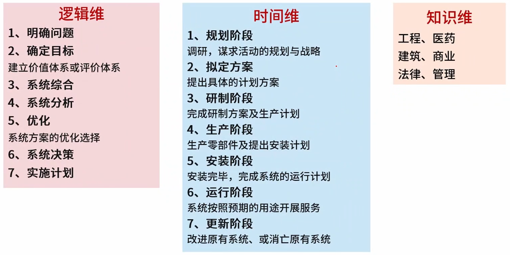
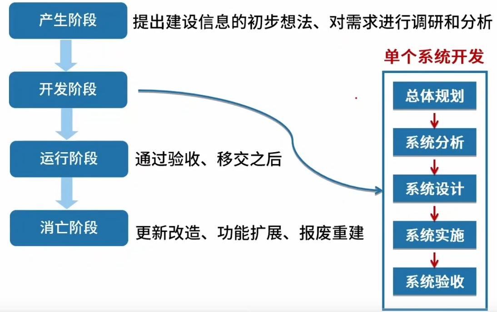
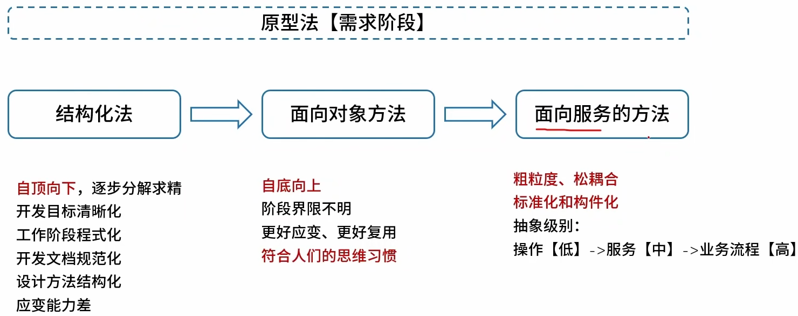
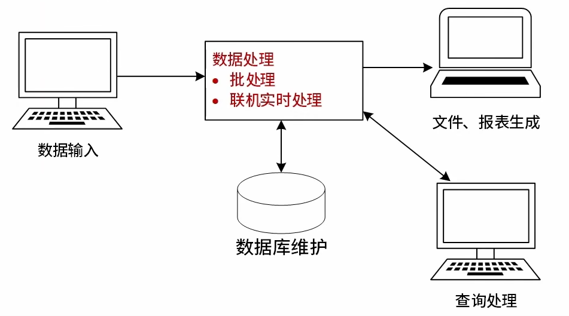
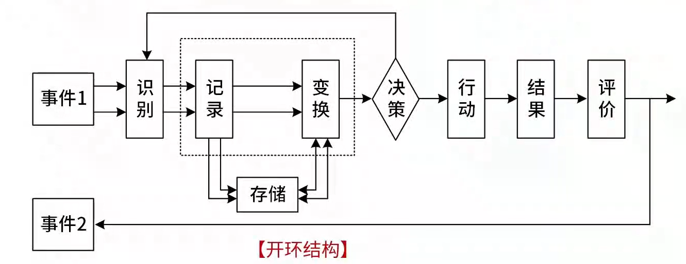
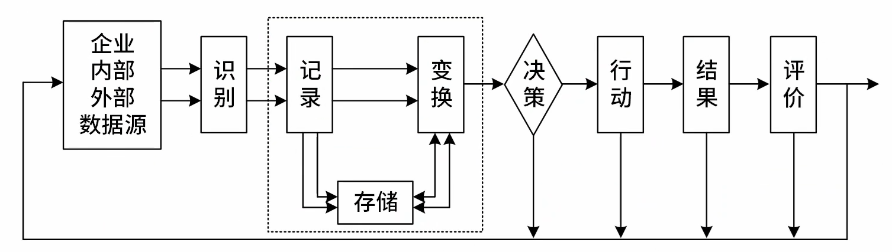
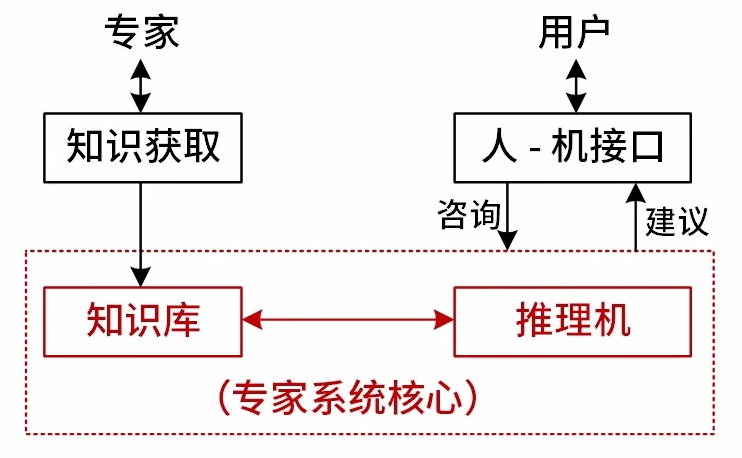
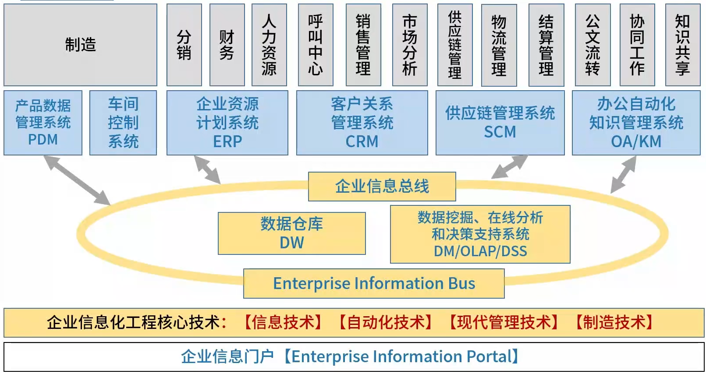
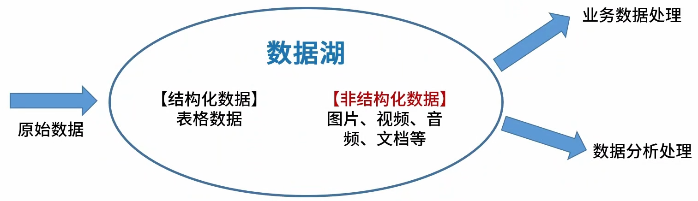

## 考试基本信息

考试场次与科目

上午场总时长240分钟（8:30-12:30）：科目一+科目二

科目一：综合知识【总分：75分】 客观题：75空单选题

科目二：案例分析【总分：75分】 主观题：1道必答+4选2

科目一最短作答时长120分钟，最长作答时长150分钟

下午场总时长120分钟（14:30-16:30）：科目三

科目三：论文写作【总分：75分】 论文题：4选1

**【综合知识知】**

| 章               | 分数 | 考点                                                         | 比例      |
| ---------------- | ---- | ------------------------------------------------------------ | --------- |
| 计算机系统基础   | 0-2  | 计算机组成原理与体系结构：磁盘管理 | 0-2.7%    |
| 计算机系统基础   | 0-2  | 系统配置与性能评价：基准程序测试、计算机性能优化/性能评价、计算机性能指标 | 0-2.7%    |
| 计算机系统基础   | 1-5  | 操作系统：概念、前趋图与PV操作、死锁与银行家算法、段页式存储、页面置换算法、索引文件、位示图 | 1.3%-6.7% |
| 嵌入式系统       | 2-4  | 嵌入式硬件、总线、嵌入式系统、嵌入式操作系统、微内核、多核CPU、嵌入式系统开发设计 | 2.7%-5.3% |
| 计算机网络       | 2-5  | 网络技术、TCP/IP协议簇、网络规划与设计 | 2.7%-6.7% |
| 数据库系统       | 2-4  | 数据库设计、规范化理论、分布式数据库、关系代数、数据仓库、事务处理 | 2.7%-5.3% |
| 法律法规与标准化 | 3    | 著作权保护期限、著作权法、侵权判定、商标法、商业秘密 | 4.00%     |
| 数学与经济管理   | 1    | 数学建模、线性规划、随机模拟函数                             | 1.3%      |
| 专业英语         | 5    | 软件架构风格、软件架构、信息系统设计、DFD                    | 6.7%      |

**【架构核心知识】**

| 章                     | 分数  | 考点                                                         | 比例        |
| ---------------------- | ----- | ------------------------------------------------------------ | ----------- |
| 系统工程与信息系统基础 | 3-7   | 信息工程概念及方法、信息系统分类、信息系统战略规划、电子政务、企业信息化方法、电子商务、企业应用集成 | 4-9.3%      |
| 软件工程               | 17-22 | 软件生命周期、信息系统开发方法、开发模型、逆向工程、需求工程、面向对象基础、UML、软件设计、业务流程设计、软件维护、软件测试、软件过程改进、遗留系统、软件开发环境，范围管理、配置管理、进度管理 | 22.6%-32%   |
| 软件架构设计           | 17-25 | 架构4+1视图、构件技术、MVC模式、架构设计阶段、架构设计基本概念、软件架构需求、ABSD、软件架构文档、软件架构风格选择、架构模式、架构评估方法、架构与质量属性、敏感点与风险点、ADL、中间件 | 22.7%-33.3% |
| 系统可靠性分析与设计   | 0-3   | 可靠性计算、可靠性分析与设计、可靠性模型 | 0-4.00%     |
| 系统安全性与保密性设计 | 5-7   | 安全政策与法律、加密算法、信息摘要与数字签名、数字证书、网络攻击、网络安全协议 | 6.7%-9.3%   |

## 计算机组成原理

## 计算机网络

## 软件架构设计

## 系统工程

### 系统工程概念及方法

从多个维度来看待系统工程

1. 是一种组织管理技术。

2. 是为了最好的实现系统的目的，对系统的组成要素、组织结构、信息流、控制机构进行分析研究的科学方法。

3. 从整体出发、从系统观念出发，以求【整体最优】。

4. 利用计算机作为工具，对系统的结构、元素、信息和反馈等进行分析，以达到最优规划、最优设计、最优管理和最优控制的目的。

5. 是一种现代的科学决策方法。

**系统工程方法论**

(一般考的不会太深，注意知道各个方法论以及相关思想概念)

| 系统工程方法                         | 关键点                                                       |
| ------------------------------------ | ------------------------------------------------------------ |
| **霍尔三维结构** “硬科学”方法论 | 逻辑维：解决问题的逻辑过程； 时间维：工作进程； 知识维：专业科学知识。 应用场景：组织和管理大型工程建设项目。 |
| **切克兰德方法** “软科学”方法论 | 核心不是“最优化”，而在于“比较”和“探寻”。 7个步骤：认识问题、根底定义、建立概念模型、比较及探寻、选择、设计与实施、评估与反馈。 |
| **并行工程方法**                     | “制造过程”与“支持过程”并行。 强调三个方面：产品设计开发期间，最快速度按质完成；各项工作问题协调解决；适当的信息系统工具。 |
| **综合集成法**                       | 由钱学森命名，适用于【简单系统】和【巨系统】。 四原则包括：整体论原则、相互联系原则、有序性原则、动态原则。 |
| **WSR系统方法**                      | 实践准则：【懂物理】- 【明事理】- 【通人理】。 |

**霍尔三维**

### 系统工程生命周期阶段与生命周期方法

系统工程生命周期阶段如下，与后面的系统工程生命周期大同小异。

探索性研究 --> 概念阶段 --> 开发阶段 --> 生产阶段 --> 使用阶段 --> 保障阶段 --> 退役阶段

系统工程生命周期方法：
计划驱动方法(如瀑布模型)：需求 --> 设计 --> 构建 --> 测试 --> 部署
渐进迭代式开发(迭代开发)：提供连续交付以达到期望的系统
精益开发：起源于丰田，是一个动态的、知识驱动的，以客户为中心的过程。有时候归属于敏捷开发的一种。
敏捷开发：是多个开发方法的总称，小步快跑，更好的灵活性。

### 系统工程生命周期

### 系统工程建设原则

高层管理人员介入原则：如ERP建设的时候需要CIO介入 
用户参与开发原则： 用户确定范围、核心用户全程参与、用户深度参与 
自顶向下规划原则： 全局观，以此减少信息不一致的现象 
工程化原则： 引入【软件工程】 
其它原则： 创新性原则、整体性原则、发展性原则、经济性原则

### 信息系统工程开发方法

不管开发阶段使用什么开发方法，需求阶段都可以使用原型法进行需求的确认。原型法有如下分类

按功能分：水平原型（界面）、垂直原型（复杂算法[界面不重要]，如各个短视频平台的推荐算法）

按最终结果分：抛弃式原型（获取需求之后就抛弃了）、演化式原型（不断更新迭代直到和最终系统一样）

### 软件开发方法习题

1、软件方法学是以软件开发方法为研究对象的学科。其中，（ ）是先对最高层次中的问题进行定义、设计、编程和测试，而将其中未解决的问题作为一个子任务放到下一层次中去解决。（ ）是根据系统功能要求，从具体的器件、逻辑部件或者相似系统开始，通过对其进行相互连接、修改和扩大，构成所要求的系统。（ ）是建立在严格数学基础上的软件开发方法。

 A 面向对象开发方法  B 形式化开发方法  C 非形式化开发方法  D 自顶向下开发方法

 A 自底向上开发方法  B 形式化开发方法  C 非形式化开发方法  D 原型开发方法

 A 自底向上开发方法  B 形式化开发方法   C 非形式化开发方法  D 自顶向下开发方法

答案：D、B、C

## 信息系统基础

很多信息系统是过时的，考察可能是想要架构师了解信息系统的演化过程。越往后越先进。

| 信息系统的分类                                | 关键点                                                       |
| --------------------------------------------- | ------------------------------------------------------------ |
| 业务处理系统 【TPS】                          | 早期最初级的信息系统【20世纪50-60年代】 功能:数据输入、数据处理【批处理、OLTP】（管道流架构风格）、数据库维护、文件报表产生 |
| 管理信息系统 【MIS】                          | 高度集成化的人机信息系统 金字塔结构:分多个层级          |
| 决策支持系统 【DSS】                          | 由语言系统、知识系统和问题处理系统组成。 用于辅助决策、支持决策。 |
| 专家系统 【ES】                               | 知识+推理=专家系统。人工智能的一个重要分支。                 |
| 办公自动化系统 【OAS】                        | 由计算机设备、办公设备、数据通信及网络设备、软件系统组成。   |
| 企业资源计划 【ERP】 | 打通供应链，集成，整合                                       |

### 业务处理系统 (TPS)

【业务处理系统（Transaction Processing System,TPS）】又可称为电子数据处理系统(Electronic Data Processing System,EDP)，是计算机在管理方面早期应用的最初级形式的信息系统。

TPS是服务于组织关系层次终最底层、最基础的信息系统。以逐渐退出历史舞台，基本很少单独使用了。

TPS使用了数据流系统架构风格终的批处理架构风格。

### 管理信息系统 (MIS)

【管理信息系统（Manage Information System,MIS）】是由业务处理系统发展而成的，是在TPS基础上引进大量管理方法对企业整体信息进行处理，并利用信息进行预测、控制、计划、辅助企业全面管理的信息系统。

MIS系统四大部件：信息源、信息处理器、信息用户和信息管理者。使用了架构风格中的开环和闭环结构。

**开环结构：**本次的结果只能影响下次结果。

**闭环结构**：不断获取信息和决策，最终导致结果不断受到影响，如空调定温系统。

### 决策支持系统 (DSS)

决策支持系统(Decision Support System,DSS)是一个由语言系统、知识系统和问题处理系统3个互相关联的部分组成的，基于计算机的系统。

**DSS应具有的特征：**

- (1)数据和模型是DSS的主要资源。
- (2)DSS用来支援用户作决策而不是代替用户作决策（ES可以代替）。
- (3)DSS主要用于解决半结构化及非结构化问题。一般是没有最优解问题，需要权衡，结构化问题MIS系统可以处理。
- (4)DSS的作用在于提高决策的有效性（更加正理性）而不是提高决策的效率。

### 专家系统 (ES)

专家系统(Expert System,ES)是一个智能计算机程序系统，其内部含有某个领域具有专家水平的大量知识与经验，能够利用人类专家的知识和解决问题的方法来处理该领域的问题。属于人工智能的一个分支。

| 系统         | 专家系统                            | 一般计算机系统             |
| ------------ | ------------------------------------------------------------ | -------------------------- |
| 功能         | 解决问题、解释结果、进行判断与决策  | 解决问题                   |
| 处理能力     | 处理数字与符号                                               | 处理数字                   |
| 处理问题种类 | 多属准结构性或非结构性，可处理不确定的知识，使用于特定的领域 | 多属结构性，处理确定的知识 |

专家系统的基本结构

知识库：存储求解实际问题的领域知识。 

综合数据库：存储问题的状态描述、中间结果、求解过程的记录等信息。

 推理机：实质是【规则解释器】。 

知识获取：两方面功能：知识的编辑求精及知识自学习。

 解释程序：面向用户服务的。

### 电子政务

电子政务主要有3类角色：政府（Government）、企（事）业单位（Business）及公民（Citizen）。如果有第4类就是公务员（Employee）。

系统分类主要按照谁主动发起来划分的。

| 类型 | 应用                                                         |
| ---- | ------------------------------------------------------------ |
| G2G  | 基础信息的采集、处理和利用，如人口信息 各级政府决策支持 |
| G2E  | 政府内部管理系统                                             |
| G2B  | 政府给企业单位颁发**各种营业执照、许可证、合格证、质量认证**等 |
| B2G  | 企业向政府缴税供应各种商品和服务（含竞/投标）、提建议、申诉等 |
| G2C  | 社区公安和水、火、天灾等与公共安全有关的信息、户口、各种证件和牌照的管理 |
| C2G  | 个人应向政府缴纳的各种税款和费用、反馈民意（征求群众意见） 报警服务（盗贼、医疗、急救、火警等） |

#### 例题

1，人口信息采集处理和利用业务属于（ ），营业执照发放属于（ ），户籍管理属于（ ），参加政府工程交接属于（ ）。

A 政府对企业 (Government to Business, G2B)

B 政府对政府 (Government to Government, G2G)

C 企业对政府 (Business to Government, B2G) 

D 政府对公众 (Government to Citizen, G2C)

答案：B、A、D、C

### 企业信息化

#### 信息化的概念

信息化是指在国家宏观信息政策指导下，通过信息技术开发、信息产业的发展、信息人才的配置，最大限度地利用信息资源以满足全社会的信息需求，从而加速社会各个领域的共同发展以推进信息社会的过程。

信息化的主体是全体社会成员（政府、企业、团体和个人），时域是一个长期过程，空域是经济和社会的一切领域，手段是先进社会生产工具。

#### 企业信息化目的

企业信息化的具体目标是优化企业业务活动使之更加有效，它的根本目的在于提高企业竞争能力，使得企业具有平稳和有效的运作能力，对紧急情况和机会做出快速反应，为企业内外部用户提供有价值的信息。

#### 涉及三类创新

**【技术创新】**在生产工艺设计、产品设计中使用计算机辅助设计系统，并通过互联网及时了解和掌握创新的技术信息，加快技术向生产的转化。还有，生产技术与信息技术相结合，能够大幅度地提高技术水平和产品的竞争力。

**【管理创新】**按照市场发展的要求，要对企业现有的管理流程重新整合，从作为管理核心的财务、资金管理，转向技术、物资、人力资源管理，并延伸到企业技术创新、工艺设计、产品设计、生产制造过程的管理，进而还要扩展到客户关系管理、供应链的管理乃至发展到电子商务。

**【制度创新】**那些不适应企业信息化的管理体制、管理机制和管理制度必须得到创新。

#### 信息化需求的3个层次

**战略需求**： 目标 【提升组织的竞争能力】

**运作需求**：【实现信息化战略目标】的需要，【运作策略】 的需要，【人才培养】 的需要

**技术需求**：信息技术层面上对 【系统的完善、升级、集成】

> 组织（企业）对信息化的需求是 组织信息化的原动力。3个层次的需求自顶向下。

#### 例题

组织信息化需求通常包含三个层次，其中（  ）需求的目标是提升组织的竞争能力，为组织的可持续发展提供支持环境。（  ）需求包含实现信息化战略目标的需求、运营策略的需求和人才培养的需求三个方面。技术需求主要强调在信息层技术层面上对系统的完善、升级、集成和整合提出的需求。

A 战略  B 发展  C 人事  D 财务

A 规划  B 运营  C 营销  D 管理

答案：A、B

#### 企业信息化方法

业务流程重构方法：“彻底的、根本性的”重新设计流程。

核心业务应用方法：围绕核心业务推动信息化。

信息系统建设方法：建设信息系统作为企业信息化的重点和关键。

主题数据库方法：建立面向企业的核心业务的数据库，消除“信息孤岛”。

资源管理方法：切入点是为企业资源管理提供强大的能力。如：ERP、SCM。

人力资本投资方法：人力资本理论【注意不是人力资源管理】把一部分企业的优秀员工看作是一种资本，能够取得投资收益。

#### 信息系统战略规划方法

目标：如何通过信息化实现企业战略目标

**第一阶段**
 以数据处理为核心（围绕职能部门需求）

1. 关键成功因素法（CSF，Critical Success Factors）：找到关键信息集合、成功因素（抓住主要矛盾），决定开发有限次序

2. 战略集合转化法（SST，Strategy Set Transformation）：企业的战略目标、信息集合转换为信息系统的战略目标

3. 企业系统规划法（BSP，Business System Planning）：自顶向下的规划和自底向上的实现。(可以使用UC[use/create]矩阵实现子系统划分)

   > 此外还有：投资回收法、征费法、零线预算法、阶石法

**第二阶段**
以企业内部MIS为核心（围绕企业整体需求）

1. 战略数据规划法（SDP，Strategic Data Planning）：主题数据库(整合各个应用数据库)
2. 信息工程法（IE，Information Engineering）
3. 战略栅格法（SG，Strategic Grid）

**第三阶段**
 综合考虑企业内外环境（以集成为核心(如ERP)，围绕企业战略需求）

1. 价值链分析法（VCA，Value Chain Analysis）
2. 战略一致性模型（SAM，Strategic Alignment Model）

### 企业信息化与电子商务

#### 体系全览

### 企业资源计划(ERP)

演化过程：物料需求计划(Material Requirement Planning，MRP) ==> 制造资源计划(MRPII，Manufacturing Resource Planning II)核心是物流，主线是计划 ==> 企业资源计划 (ERP，Enterprise Resource Planning) 打通了供应链、扩展到了非制造业、重心转移到财务上

### 客户关系管理(CRM)

CRM(Customer Relationship Management)的目的是提高收入。CRM的核心思想就是以客户为中心。

CRM的主要模块：销售自动化、营销自动化、客户服务与支持、商业智能

CRM的价值：提高工作效率，节省开支、提高客户满意度、提高客户的忠诚度

### 供应链管理(SCM)

SCM (Supply Chain Management)理念：强强联合，整合与优化“三流”，打通企业间“信息孤岛”，严格的数据交换标准。

如实现供应商、制造商、分销商和零售商的计划（策略性）、采购、制造、配送、退货等操作。

**SCM信息化的三流**

- 信息流（核心） 

  需求信息流（需求方到供应方）：如客户订单、生产计划、采购合同等 

  供应信息流（供应方到需求方）：如入库单、完工报告单、库存记录、可供销售量、提货发运单等

- 资金流（辅助）

- 物流（辅助）

### 商业智能(BI)

商业智能是指利用数据仓库、数据挖掘、在线分析处理（OLAP）等技术，对企业内部和外部的数据进行收集、转换、存储、分析和展示，从大量的数据中提取有价值的信息。从而为企业的管理决策提供支持的一系列过程和工具。

商业智能和普通应用系统开发的区别

**普通应用系统开发**：应用数据库 <---> OLTP(联机事务处理)。用于支撑业务运作。

**商业智能**：数据仓库 <---> OLAP(联机分析处理)  ---  数据挖掘。主要用于决策分析，分析历史数据预判未来

**数据仓库**

其中数据库和数据仓库的区别如下：

| 数据库                         | 数据仓库【特点】                                             |
| ------------------------------ | ------------------------------------------------------------ |
| 面向应用：按应用组织数据       | 面向主题：按主题组织数据      |
| 零散的：一个应用对应一个数据库 | 集成的：整个企业对应一个数据仓库 |
| CRUD：增删改查是常态           | 相对稳定的（非易失的）：查询为主、基本无修改与删除 |
| 解决当下应用问题               | 反映历史变化（时变的）：各个阶段信息都有，并可做预测未来趋势 |

**数据挖掘**

关联分析：挖掘出隐藏在数据间的相互关系。

序列模式分析：侧重点是分析数据间的前后关系（因果关系）。

分类分析：为每一个记录赋予一个标记再按标记分类。

聚类分析：分类分析法的逆过程。

**例题**

1、商业智能是指利用数据挖掘、知识发现等技术分析和挖掘结构化的、面向特定领域的存储与数据仓库的信息。它可以帮助用户认清发展趋势、获取决策支持并得出结论。以下 ( ) 活动，并不属于商业智能范畴。

A、某大型企业通过对产品销售数据进行挖掘，分析客户购买偏好

B、某大型企业查询数据仓库中某种产品的总体销售数量

C、某大型购物网站通过分析用户的购买历史记录，为客户进行商品推荐

D、某银行通过分析大量股票交易的历史数据，做出投资决策

答案：B

2、商业智能系统的处理过程包括四个主要阶段：数据预处理通过 ( ) 实现企业原始数据的初步整合；建立数据仓库是后续数据处理的基础；数据分析是体现系统智能的关键，主要采用 ( ) 和 ( ) 技术，前者能够实现数据的上卷、下钻和旋转分析，后者利用隐藏的知识，通过建立分析模型预测企业未来发展趋势；数据展现主要完成数据处理结果的可视化。

A、数据映射和关联    B、数据集市和数据立方体    C、数据抽取、转换和装载     D、数据清洗和数据集成

A、知识库    B、数据挖掘    C、联机事务处理    D、联机分析处理

A、知识库    B、数据挖掘    C、联机事务处理    D、联机分析处理

答案：C(ETL)、C(OLAP)、B

### 数据湖

数据湖是一个存储企业的各种各样原始数据的大型仓库，其中的数据可供存取、处理、分析及传输。

数据仓库仅支持数据分析处理。数据湖既支持数据分析处理，也支持事务处理。

数据仓库和数据湖的其他区别

| 维度     | 数据仓库                                                     | 数据湖                                                       |
| -------- | ------------------------------------------------------------ | ------------------------------------------------------------ |
| 数据     | 清洗过的数据结构化的数据                                     | 原始数据结构化，半结构化数据                                 |
| 模式     | 数据存储之前定义数据模式 数据集成之前完成大量工作 数据的价值提前明确 | 数据存储之后定义数据模式提供敏捷 简单的数据集成数据的价值尚未明确 |
| 存取方法 | 标准SQL接口                                                  | 应用程序，类SQL的程序                                        |
| 优势     | 多数据源集成干净，安全的数据转换一次，多次使用               | 无限扩展性并行执行支持编程框架数据经济                       |

如果只用数据湖，数据提取难度较大，可以对数据湖进行分区，分别存储结构化数据和非结构化数据。或者数据库仓库和数据库一起使用，即湖仓一体化。

### BPR和BPM

面对企业的流程优化一般有两种方式：

BRP【业务流程重组】：颠覆原有流程、彻底性的再设计。
BPM【业务流程管理】：使用PDCA（plan、do、check、action）循环，持续改进。
