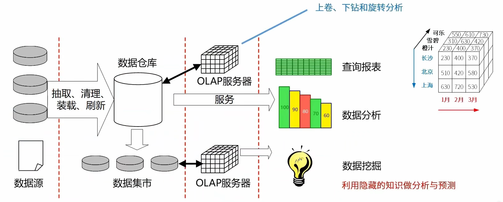

## 考试基本信息

考试场次与科目

上午场总时长240分钟（8:30-12:30）：科目一+科目二

科目一：综合知识【总分：75分】 客观题：75空单选题

科目二：案例分析【总分：75分】 主观题：1道必答+4选2

科目一最短作答时长120分钟，最长作答时长150分钟

下午场总时长120分钟（14:30-16:30）：科目三

科目三：论文写作【总分：75分】 论文题：4选1

**【综合知识知】**

| 章               | 分数 | 考点                                                         | 比例      |
| ---------------- | ---- | ------------------------------------------------------------ | --------- |
| 计算机系统基础   | 0-2  | 计算机组成原理与体系结构：磁盘管理 | 0-2.7%    |
| 计算机系统基础   | 0-2  | 系统配置与性能评价：基准程序测试、计算机性能优化/性能评价、计算机性能指标 | 0-2.7%    |
| 计算机系统基础   | 1-5  | 操作系统：概念、前趋图与PV操作、死锁与银行家算法、段页式存储、页面置换算法、索引文件、位示图 | 1.3%-6.7% |
| 嵌入式系统       | 2-4  | 嵌入式硬件、总线、嵌入式系统、嵌入式操作系统、微内核、多核CPU、嵌入式系统开发设计 | 2.7%-5.3% |
| 计算机网络       | 2-5  | 网络技术、TCP/IP协议簇、网络规划与设计 | 2.7%-6.7% |
| 数据库系统       | 2-4  | 数据库设计、规范化理论、分布式数据库、关系代数、数据仓库、事务处理 | 2.7%-5.3% |
| 法律法规与标准化 | 3    | 著作权保护期限、著作权法、侵权判定、商标法、商业秘密 | 4.00%     |
| 数学与经济管理   | 1    | 数学建模、线性规划、随机模拟函数                             | 1.3%      |
| 专业英语         | 5    | 软件架构风格、软件架构、信息系统设计、DFD                    | 6.7%      |

**【架构核心知识】**

| 章                     | 分数  | 考点                                                         | 比例        |
| ---------------------- | ----- | ------------------------------------------------------------ | ----------- |
| 系统工程与信息系统基础 | 3-7   | 信息工程概念及方法、信息系统分类、信息系统战略规划、电子政务、企业信息化方法、电子商务、企业应用集成 | 4-9.3%      |
| 软件工程               | 17-22 | 软件生命周期、信息系统开发方法、开发模型、逆向工程、需求工程、面向对象基础、UML、软件设计、业务流程设计、软件维护、软件测试、软件过程改进、遗留系统、软件开发环境，范围管理、配置管理、进度管理 | 22.6%-32%   |
| 软件架构设计           | 17-25 | 架构4+1视图、构件技术、MVC模式、架构设计阶段、架构设计基本概念、软件架构需求、ABSD、软件架构文档、软件架构风格选择、架构模式、架构评估方法、架构与质量属性、敏感点与风险点、ADL、中间件 | 22.7%-33.3% |
| 系统可靠性分析与设计   | 0-3   | 可靠性计算、可靠性分析与设计、可靠性模型 | 0-4.00%     |
| 系统安全性与保密性设计 | 5-7   | 安全政策与法律、加密算法、信息摘要与数字签名、数字证书、网络攻击、网络安全协议 | 6.7%-9.3%   |

-----

## 计算机组成原理

------

## 计算机网络

### TCP/IP协议族

**各个常见协议介绍**
POP3：110端口，邮件收取
SMTP：25端口，邮件发送
FTP：20数据端口/21控制端口，文件传输协议
HTTP：80端口，超文本传输协议，网页传输
DHCP：67端口，IP地址自动分配
SNMP：161端口，简单网络管理协议
DNS：53端口，域名解析协议，记录域名与IP的映射关系
TCP：可靠的传输层协议
UDP：不可靠的传输层协议
ICMP：因特网控制协议，PING命令来自该协议
IGMP：组播协议
ARP：地址解析协议，IP地址转换为MAC地址
RARP：反向地址解析协议，MAC地址转IP地址

**TCP和UDP协议的区别**

|          | TCP                                                          | UDP                                                          |
| -------- | ------------------------------------------------------------ | ------------------------------------------------------------ |
| 共同点   | 基于IP协议的传输层协议，可以端口寻址                         | 基于IP协议的传输层协议，可以端口寻址                         |
| 不同点   | 面向连接（连接管理）、三次握手、流量控制、差错校验和重传、IP数据报按序接收（不丢失、不重复）、可靠性强、牺牲通信量、效率低 | 不可靠、无连接、错误检测功能弱，无拥塞控制、无流量控制，有助于提高传输的高速率性。 不对无序IP数据报重新排序、不负责重传、不消除重复IP数据报、不对已收到的数据报进行确认、不负责建立或终止连接，这些由UDP进行通信的应用程序进行处理。 |
| 相关协议 | HTTP、FTP、Telnet、POP3、SMTP                                | DNS、DHCP、TFTP、SNMP                                        |

**例题**

1、以下关于网络控制的叙述，正确的是（ ）。
A、由于TCP的窗口大小是固定的，所以防止拥塞的方法只能是超时重发 
B、在前向纠错系统中，当接收端检测到错误后就要请求发送端重发出错分组 
C、在滑动窗口协议中，窗口的大小以及确认应答使得可以连续发送多个数据 
D、在数据报系统中，所有连续发送的数据都可以沿着预先建立的虚通路传送

答案：C。tcp一般是可变的滑动窗口；前向纠错系统可以在发送之前校验；各个数据包是通过路由转发的。

### 域名系统DNS

**递归查询：**服务器必需回答目标IP与域名的映射关系，如果本机没有会向下不断查询。 
**迭代查询：**服务器收到一次选代查询回复一次结果，这个结果不一定是目标IP与域名的映射关系，也可以是其它DNS服务器的地址。

**不同计算机的玉面查找过程**

浏览器输入域名： HOSTS→本地DNS缓存→本地DNS服务器→根域名服务器→顶级域名服务器→权限域名服务器。 
主域名服务器接收到域名请求：本地缓存记录→区域记录→转发域名服务器→根域名服务器。

**例题**
1、主机PC对某个域名进行查询，最终由该域名的授权域名服务器解析并返回结果，查询过程如下图所示。这种查询方式中不合理的是 ( ) 。

A、根域名服务器采用递归查询，影响了性能
B、根域名服务器采用迭代查询，影响了性能
C、中介域名服务器采用迭代查询，加重了根域名服务器负担
D、中介域名服务器采用递归查询，加重了根域名服务器负担
答案：A（首先要说法正确，其次是设计不合理才是正确答案）

2、Web页面访问过程中，在浏览器发出HTTP请求报文之前不可能执行的操作是 ( ) 。
A、查询本机DNS缓存，获取主机名对应的IP地址
B、发起DNS请求，获取主机名对应的IP地址
C、送请求信息，获取将要访问的Web应用
D、发送ARP协议广播数据包，请求网关的MAC地址

答案：C

### 动态主机配置协议DHCP

电脑获取 ip 地址的方式可以通过手动配置，也可以通过DHCP服务器自动分配获取。手动配置比较麻烦，但是ip固定并且可能更加安全。

**DHCP工作方式介绍**：
1、客户机/服务器模型 
2、租约默认为8天 
3、当租约过半时，客户机需要向DHCP服务器申请续租； 
4、当租约超过87.5%时，如果仍然没有和当初提供IP的DHCP服务器联系上，则开始联系其他的DHCP服务器。 
5、分配方式

- 固定分配（管理员分配静态绑定固定的IP地址）		
- 动态分配（为客户端分配租期为无限长的IP地址）
- 自动分配（为客户端分配具有一定有效期限的IP地址）

6、无效地址：169.254.X.X（windows169开头）和0.0.0.0（linux）

**例题**：

以下关于DHCP服务的说法中，正确的是()。 
A、在一个园区网中可以存在多台DHCP服务器 
B、默认情况下，客户端要使用DHCP服务需指定DHCP服务器地址 
C、默认情况下，DHCP客户端选择本网段内的IP地址作为本地地址 
D、在DHCP服务器上，DHCP服务功能默认开启

答案：A （B客户端不需要指定，DHCP可以选择多个网段的ip，DHCP服务器的功能默认关闭）

### 网络规划与设计

| 阶段         | 内容                                                       | 产物             |
| ------------ | ---------------------------------------------------------- | ---------------- |
| 需求分析     | 确定需求。包括业务、用户、应用、计算机平台和网络通信的需求 | 需求规范         |
| 通信规范分析 | 现有的网络体系分析，估计和测量通信量及设备利用率           | 通信规范         |
| 逻辑网络设计 | 根据需求规范和通信规范选择符合需求的设计，确定网络逻辑结构 | 逻辑设计文档     |
| 物理网络设计 | 将逻辑设计应用到物理空间，确定网络物理结构                 | 物理结构设计文档 |
| 实施阶段     | 实现网络设计，安装和维护                                   |                  |

**逻辑网络设计**

逻辑网络设计是体现网络设计核心思想的关键阶段，在这一阶段根据需求规范和通信规范，选择一种比较适宜的网络逻辑结构，并基于该逻辑结构实施后续的资源分配规划、安全规划等内容。利用需求分析和现有网络体系分析的结果来设计逻辑网络结构，最后得到一份逻辑网络设计文档。
逻辑网络设计工作主要包括以下内容： 
（1）网络结构的设计
（2）物理层技术的选择
（3）局域网技术的选择与应用
（4）广域网技术的选择与应用
（5）地址设计和命名模型
（6）路由选择协议
（7）网络管理
（8）网络安全
（9）逻辑网络设计文档

输出内容有：
1、逻辑网络设计图
2、IP地址方案
3、安全管理方案
4、具体的软/硬件、广域网连接设备和基本的网络服务
5、招聘和培训网络员工的具体说明
6、对软/硬件费用、服务提供费用、员工和培训的费用初步估计

**物理网络设计**

物理网络设计是对逻辑网络设计的物理实现，通过对设备的具体物理分布、运行环境等确定，确保网络的物理连接符合逻辑连接的要求。在这一阶段，网络设计者需要确定具体的软/硬件、连接设备、布线和服务的部署方案，输出如下内容：

- 网络物理结构图和布线方案
- 设备和部件的详细列表清单
- 软硬件和安装费用的估算
- 安装日程表，详细说明服务的时间以及期限
- 安装后的测试计划
- 用户的培训计划

**例题**

1，网络系统生命周期可以划分为5个阶段，实施这5个阶段的合理顺序是 ( ) 。

A、需求规范、通信规范、逻辑网络设计、物理网络设计、实施阶段
B、需求规范、逻辑网络设计、通信规范、物理网络设计、实施阶段
C、通信规范、物理网络设计、需求规范、逻辑网络设计、实施阶段
D、通信规范、需求规范、逻辑网络设计、物理网络设计、实施阶段
答案：A

2，网络开发过程中，物理网络设计阶段的任务是 ( ) 。

A、依据逻辑网络设计的功能要求，确定设备的具体物理分布和运行环境
B、分析现有网络和新网络的各类资源分布，掌握网络所处状态
C、根据需求规范和通信规范，实施资源分配和安全规划
D、理解网络应该具有的功能和性能，最终设计出符合用户需求的网络
答案：A

3，网络设计过程包括逻辑网络设计和物理网络设计两个阶段，下面的选项中， ()应该属于逻辑网络设计阶段的任务。

A、选择路由协议
B、设备选型
C、结构化布线
D、机房设计
答案：A (其他的都是物理设计阶段)

4，网络逻辑结构设计的内容不包括（）。

A、逻辑网络设计图
B、IP地址方案
C、具体的软硬件、广域网连接和基本服务
D、用户培训计划
答案：D

### 层次化网络设计

网络系统为了解耦，做了分层设计

**核心层**：主要是高速数据交换，实现高速数据传输、出口路由，常用冗余机制。
**汇聚层**：网络访问策略控制、数据包处理和过滤、策略路由、广播域定义、寻址。（核心层和接入层之间的抽象，干他俩之外的活）
**接入层**：主要是针对用户端，实现用户接入、计费管理、MAC地址认证、MAC地址过滤、收集用户信息，可以使用集线器代替交换机。

**例题**

1、大型局域网通常划分为核心层、汇聚层和接入层，以下关于各个网络层次的描述中，不正确的是 ( )。

A、核心层进行访问控制列表检查
B、汇聚层定义了网络的访问策略
C、接入层提供局域网络接入功能
D、接入层可以使用集线器代替交换机

答案：A（控制列表检查是汇聚层做的）

2、核心层交换机应该实现多种功能，下面选项中，不属于核心层特性的是 ( )。

A、高速连接
B、冗余设计
C、策略路由
D、较少的设备连接

答案：C（策略路由属于汇聚层）

### 网络存储技术

网络存储有以下分类

**直连式存储**：DAS Direct-Attached Storage
**网络附加存储**：NAS Network-Attached Storage
**存储区域网络**：Storage Area Network
**Internet小型计算机系统接口**：iSCSI internet Small Computer System Interface

| 分类          | 特点                                                         |
| ------------- | ------------------------------------------------------------ |
| DAS/SAS       | 通过SCSI连接到服务器，本身是硬件的堆叠，不带有任何操作系统。存储器必须被直接连接到应用服务器上，不能跨平台共享文件，各系统平台下文件分别存储。 |
| NAS           | 通过网络接口与网络直接连接，由用户通过网络访问（支持多种 TCP/IP协议）。NAS设备有自己的OS,类似于一个专用的文件服务器，一般存储信息采用RAID进行管理。即插即用。 |
| SAN           | 通过专用高速网络将一个或多个网络存储设备和服务器连接起来的专用存储系统，采用数据块的方式进行数据和信息的存储。目前主要使用以太网(IP SAN)和光纤通道(FC SAN)两类环境。 |
| IP -SAN/iSCSI | 基于IP网络实现，设备成本低，配置技术简单，可共享和使用大容量的存储空间。 |

**例题**

1、以下关于网络存储的叙述，正确的是()。

A、DAS支持完全跨平台文件共享，支持所有的操作系统
B、NAS通过SCSI连接至服务器，通过服务器网卡在网络上传输数据
C、FC SAN的网络介质为光纤通道，而IP SAN使用标准的以太网
D、SAN设备有自己的文件管理系统，NAS中的存储设备没有文件管理系统

答案：C

### 磁盘阵列-RAID

磁盘阵列技术-RAID英文是：Redundant Arrays of Independent Disk。主要有以下分类：

**Raid0(条块化)**：性能最高，多个磁盘并行处理，无冗余，损坏无法恢复
**Raid1(镜像结构)**：每个磁盘有一个备份盘，可用性，可修复性好，仅有50%利用率
**Raid0+1(Raid10)**：Raid0与Raid1长处的结合，高效也可靠
**Raid3(奇偶校验并行传送)**：N+1模式，有一个固定的校验盘，坏一个盘可恢复，利用率为n/n+1，以最小的容量做计算。固定盘容易坏
**Raid5(分布式奇偶校验的独立磁盘)**：N+1模式，无固定的校验盘，坏一个盘可恢复，利用率为n/n+1，比Raid3好一点
**Raid6(两种存储的奇偶校验)**：N+2模式，无固定的校验盘，坏两个盘可恢复

> 软考主要考阵列3和阵列5的容量计算。

几种磁盘阵列的图示：

**例题**
1、假如有3块容量是80G的硬盘做RAID 5阵列，则这个RAID 5的容量是（）；而如果有2块80G的盘和1块40G的盘，此时RAID 5的容量是（)。

A、240G	B、160G	C、80G	D、40G
A、40G	B、80G	C、160G	D、200G

答案：B、B

### IPv6

### 网络接入技术

#### 有线接入

共用交换电话网络（PSTN）：早期，需要安装调制解调器通过电话线通信，联网不能通话，通话不能联网
数字数据网（DDN）：电话线和网络线单独使用，没有冲突
综合业务数字网（ISDN）：也叫一键通，可以传输图片、视频等
非对称数字用户线路（ADSL）：上行和下行速率，因为上行用的少，速率快有点浪费
同轴光纤技术（HFC）：光纤已经实现光纤到楼、到户

#### 无线接入

IEEE 802.11（Wifi）：几十米上百米通信范围
IEEE 802.11（蓝牙Bluetooth）：十几米左右通信范围
红外（IrDA）：一般遥控器使用
WAPI

### 综合布线

**工作区子系统**：由信息插座、插座盒、连接跳线和适配器组成。 
**水平子系统**：由一个工作区的信息插座开始，经水平布置到管理区的内侧配线架的线缆所组成。 
**管理间子系统**：由交连、互连配线架组成。管理子系统为连接其它子系统提供连接手段。
**垂直干线子系统**：由建筑物内所有的垂直干线多对数电缆及相关支撑硬件组成，以提供设备间总配线架与干线接线间楼层配线架之间的干线路由。 
**设备间子系统**：是由设备间的电缆、连接器和有关的支撑硬件组成，作用是将计算机、PBX、摄像头、监视器等弱电设备互连起来并连接到主配线架上。 
**建筑群子系统**：将一个建筑物的电缆延伸到建筑群的另外一些建筑物中的通信设备和装置上，是结构化布线系统的一部分，支持提供楼群之间通信所需的硬件。它由电缆、光缆和入楼处的过流过压电气保护设备等相关硬件组成，常用介质是光缆。

**例题**

1、建筑物综合布线系统中的垂直子系统是指（ ）。
A、由终端到信息插座之间的连线系统 
B、楼层接线间的配线架和线缆系统 
C、各楼层设备之间的互连系统 
D、连接各个建筑物的通信系统
答案：C

### 物联网

**物联网**（The Internet of Things）是实现物物相连的互联网络，其内涵包含两个方面：第一，物联网的核心和基础仍然是互联网，是在互联网基础上延伸和扩展的网络；第二，其用户端延伸和扩展到了任何物体与物体之间，使其进行信息交换和通信

物联网的分层
感知层：负责识别物体和采集信息，包括使用二维码、RFID、摄像头和各种传感器（如温度、湿度传感器）。 
网络层：主要功能是传递和处理信息，涉及通信网与互联网的融合网络、网络管理中心、信息中心和智能处理中心等。 
应用层：解决信息处理和人机交互的问题，使人们能够利用收集到的数据进行决策或控制。

**射频识别技术**（Radio Frequency Identification，RFID），又称电子标签，是一种通信技术，可通过无线电讯号识别特定目标并读写相关数据，而无需识别系统与特定目标之间建立机械或光学接触。该技术是物联网的一项核心技术，很多物联网应用都离不开它
RFID的基本组成部分通常包括：标签、阅读器、天线。

**二维码**是用某种特定的几何图形按一定规律在平面（二维方向上）分布的黑白相间的图形记录数据符号信息的。在代码编制上巧妙地利用构成计算机内部逻辑基础的“0”、“1”比特流的概念，使用若干个与二进制相对应的几何形体来表示文字数值信息，通过图像输入设备或光电扫描设备自动识读以实现信息自动处理

**例题**
1，在有关物体中安装信息传感设备，使其与互联网相连接，进行信息交换和通信，以实现对物体的智能化识别、定位、跟踪、监控和管理，这样的一种网络称为 ( )。

A、移动互联网
B、全球定位系统
C、智联网
D、物联网

答案：D

### 云计算

------

## 软件架构设计

### 软件架构的基本概念

软件架构也叫做软件体系结构。

**架构的本质**

1、软件架构为软件系统提供了一个结构、行为和属性的高级抽象。

2、软件架构风格是特定应用领域的惯用模式，架构定义一个词汇表和一组约束。

**架构的作用**

1、软件架构是项目干系人进行交流的手段。

2、软件架构是可传递和可复用的模型，通过研究软件架构可能预测软件的质量。

3、软件架构使推理和控制的更改更加简单，有助于循序渐进的原型设计，可以作为培训的基础。

软件架构填补了需求分析和软件设计之间的鸿沟。架构设计就是需求分配，即将满足需求的职责分配到组件上。

**例题：**

1、以下叙述，( ) 不是软件架构的主要作用。

A、在设计变更相对容易的阶段，考虑系统结构的可选方案
B、便于技术人员与非技术人员就软件设计进行交互
C、展现软件的结构、属性与内部交互关系
D、表达系统是否满足用户的功能性需求

答案：D

### 软件架构风格

架构风格反映了领域中众多系统所共有的结构和语义特性，并指导如何将各个构件有效地组织成一个完整的系统。
架构风格定义了用于描述系统的术语表和一组指导构建系统的规则。

| 五大架构风格  | 子风格                                                    |
| ------------- | --------------------------------------------------------- |
| 数据流风格    | 批处理、管道-过滤器。如传统编译器、网络传输报文处理       |
| 调用/返回风格 | 主程序/子程序、面向对象、层次结构。如微服务调用、方法调用 |
| 独立构件风格  | 进程通信、事件驱动系统（隐式调用）。如事件监听器          |
| 虚拟机风格    | 解释器、规则系统。如规则引擎、游戏引擎等                  |
| 仓库风格      | 数据库系统、黑板系统、超文本系统。                        |

一个系统中，大概率不会只使用了一种架构风格，可能是多个一起使用的。

### 数据流风格

数据流风格基本示意图

| 优点                                                         | 缺点                                                         | 典型实例                     |
| ------------------------------------------------------------ | ------------------------------------------------------------ | ---------------------------- |
| 1、松耦合【高内聚-低耦合】；  2、良好的重用性/可维护性；  3、可扩展性【标准接口适配】；  *4、良好的隐蔽性；*  5、支持并行。 | 1、交互性较差； 2、复杂性较高； 3、性能较差（每个过滤器都需要解析与合成数据）。 | 传统编译器 网络报文处理 |

### 数据流风格的子风格

批处理序列：大量整体数据、无需用户交互。所有数据处理完成，才能到下一步

管道-过滤器：流式数据、弱用户交互。如视频流媒体，一步数据到了就可以播放了

### 独立构件风格与调用/返回风格

独立构件风格与调用返回风格的结构图与区别

独立构件风格的优缺点

| 优点                                                         | 缺点                                                         | 特点                                                         |
| ------------------------------------------------------------ | ------------------------------------------------------------ | ------------------------------------------------------------ |
| 1、松耦合  2、良好的重用性/可修改性/可扩展性 | 1、构件放弃了对系统计算的控制。一个构件触发一个事件时，不能确定其他构件是否会响应它。而且即使它知道事件注册了哪些构件的过程，它也不能保证这些过程被调用的顺序。  2、数据交换的问题（需要互相发送事件）。  3、既然过程的语义必须依赖于被触发事件的上下文约束，关于正确性的推理就存在问题。 | 1,、系统由若干子系统构成且成为一个整体；系统有统一的目标； 2、子系统有主从之分； 3、每一子系统有自己的事件收集和处理机制 |

### 虚拟机风格

虚拟机风格，其实就是根据一套规则或者语法，去执行业务逻辑。比如java虚拟机执行java代码，游戏引擎执行游戏设计。

### 仓库风格

仓库风格也叫数据为中心的风格。特点是多个构件对仓库中的数据进行操作。例如数据库、注册表、剪切板等。

仓库风格的子风格

黑板风格如字面意思，多个角色可以对黑板进行操作，并且可以读取黑板的内容

数据库系统与黑板系统的区别

### 闭环控制架构

不属于5大架构风格，但是是架构风格一种补充，有时候也会考到。

不断反馈和调整结果。如保温壶的保温系统、空调的恒温系统以及定速巡航系统等等。

### C2风格

不属于5大架构风格，但是是架构风格一种补充。了解它的特定和定义即可。

C2架构的基本规则：

- 构件和连接件都有一个顶部和一个底部。

- 构件的顶部要连接到连接件的底部，构件的底部要连接到连接件的顶部，不件之间不允许直连。

- 一个连接件可以和任意数目的其他构件和连接件连接。
- 当两个连接件进行直接连接时，必须由其中一个的底部到另一个的顶部。

### 例题

1、Java程序可以做到“一次编写，到处运行”，从架构风格上看符合 ( ) 风格的特点。

2、在网络通信中，进行包的解析，一般先进行包头的分离，然后进行报文解析及后续处理，根据这一特点，选用 ( ) 风格最合适。

3、某公司欲开发一个基于图形用户界面的集成调试器。该调试器的编辑器和变量监视器可以设置调试断点。当调试器在断点处暂停运行时，编辑程序可以自动卷屏到断点，变量监视器刷新变量数值。针对这样的功能描述，采用()的架构风格最为合适。

4、某游戏公司欲开发一个大型多人即时战略游戏，游戏设计的目标之一是能够支持玩家自行创建战役地图，定义游戏对象的行为和之间的关系。针对该目标，公司应该采用 ( )  架构风格最为合适。（四选一：管道-过滤器、隐式调用、主程序-子程序、解释器）

5、某公司承接了一个开发家用空调自动调温器的任务，调温器测量外部空气温度，根据设定的期望温度控制空调的开关。根据该需求，公司应采用 ( ) 架构风格最为合适。（四选一：解释器、过程控制、分层、管道-过滤器）

6、某公司欲开发一个语音识别系统，语音识别的主要过程包括分割原始语音信号、识别音素、产生候选词、判定语法片断、提供语义解释等。每个过程都需要进行基于先验知识的条件判断并进行相应的识别动作。针对该系统的特点，采用()架构风格最为合适。（四选一：解释器、面向对象、黑板、隐式调用）

7、某公司欲开发一个漫步者机器人，用来完成火星探测任务。机器人的控制者首先定义探测任务和任务之间的时序依赖性，机器人接受任务后，需要根据自身状态和外界环境进行动态调整，最终自动完成任务。针对这些需求，该机器人应该采用 ( ) 架构风格最为合适。（四选一：解释器、主程序-子程序、隐式调用、管道-过滤器）

8、Windows操作系统在图形用户界面处理方面采用的核心架构风格是 ( ) 风格。
**答案：**1、数据流风格  2、数据流风格  3、隐式调用/事件驱动  4、解释器  5、过程控制  6、黑板  7、解释器  8、事件驱动**

9、（真题）
	编译器”是一种非常重要的基础软件，其核心功能是对源代码形态的单个或一组源程序依次进行预处理、词法分析、语法分析、语义分析、代码生成、代码优化等处理，最终生成目标机器的可执行代码。考虑以下与编译器相关的软件架构设计场景：
	传统的编译器设计中，上述处理过程都以独立功能模块的形式存在，程序源代码作为一个整体，依次在不同模块中进行传递，最终完成编译过程。针对这种设计思路，传统的编译器采用 (1)架构风格比较合适。
	随着编译、链接、调试、执行等开发过程的一体化趋势发展，集成开发环境（IDE）随之出现。IDE集成了编译器、连接器、调试器等多种工具，支持代码的增量修改与处理，能够实现不同工具之间的信息交互，覆盖整个软件开发生命周期。针对这种需求，IDE采用（2）架构风格比较合适。IDE强调交互式编程，用户在修改程序代码后，会同时触发语法高亮显示、语法错误提示、程序结构更新等多种功能的调用与结果呈现，针对这种需求，通常采用（3）架构风格比较合适。 
	某公司已经开发了一款针对某种嵌入式操作系统专用编程语言的IDE，随着一种新的嵌入式操作系统上市并迅速占领市场，公司决定对IDE进行适应性改造，支持采用现有编程语言进行编程，生成符合新操作系统要求的运行代码，并能够在现有操作系统上模拟出新操作系统的运行环境，以支持代码调试工作。针对上述要求，为了使IDE能够生成符合新操作系统要求的运行代码，采用基于（4）的架构设计策略比较合适；为了模拟新操作系统的运行环境，通常采用（5）架构风格比较合适。 
(1) A.管道-过滤器 B. 顺序批处理 C. 过程控制 D. 独立进程 
(2) A. 规则引擎 B. 解释器 C. 数据共享 D. 独立构件 
(3) A.隐式调用 B. 显式调用 C. 主程序-子程序 D. 层次结构 
(4) A. 代理 B. 适配 C. 包装 D. 模拟 
(5) A. 隐式调用 B. 仓库结构 C. 基于规则 D. 虚拟机

**答案：**(1)B(代码作为一个整体编译)  (2)C  (3) A  (4)B  (5)D  

------

## 系统工程

### 系统工程概念及方法

从多个维度来看待系统工程

1. 是一种组织管理技术。

2. 是为了最好的实现系统的目的，对系统的组成要素、组织结构、信息流、控制机构进行分析研究的科学方法。

3. 从整体出发、从系统观念出发，以求【整体最优】。

4. 利用计算机作为工具，对系统的结构、元素、信息和反馈等进行分析，以达到最优规划、最优设计、最优管理和最优控制的目的。

5. 是一种现代的科学决策方法。

**系统工程方法论**

(一般考的不会太深，注意知道各个方法论以及相关思想概念)

| 系统工程方法                         | 关键点                                                       |
| ------------------------------------ | ------------------------------------------------------------ |
| **霍尔三维结构** “硬科学”方法论 | 逻辑维：解决问题的逻辑过程； 时间维：工作进程； 知识维：专业科学知识。 应用场景：组织和管理大型工程建设项目。 |
| **切克兰德方法** “软科学”方法论 | 核心不是“最优化”，而在于“比较”和“探寻”。 7个步骤：认识问题、根底定义、建立概念模型、比较及探寻、选择、设计与实施、评估与反馈。 |
| **并行工程方法**                     | “制造过程”与“支持过程”并行。 强调三个方面：产品设计开发期间，最快速度按质完成；各项工作问题协调解决；适当的信息系统工具。 |
| **综合集成法**                       | 由钱学森命名，适用于【简单系统】和【巨系统】。 四原则包括：整体论原则、相互联系原则、有序性原则、动态原则。 |
| **WSR系统方法**                      | 实践准则：【懂物理】- 【明事理】- 【通人理】。 |

**霍尔三维**

### 系统工程生命周期阶段与生命周期方法

系统工程生命周期阶段如下，与后面的系统工程生命周期大同小异。

探索性研究 --> 概念阶段 --> 开发阶段 --> 生产阶段 --> 使用阶段 --> 保障阶段 --> 退役阶段

系统工程生命周期方法：
计划驱动方法(如瀑布模型)：需求 --> 设计 --> 构建 --> 测试 --> 部署
渐进迭代式开发(迭代开发)：提供连续交付以达到期望的系统
精益开发：起源于丰田，是一个动态的、知识驱动的，以客户为中心的过程。有时候归属于敏捷开发的一种。
敏捷开发：是多个开发方法的总称，小步快跑，更好的灵活性。

### 系统工程生命周期

### 系统工程建设原则

高层管理人员介入原则：如ERP建设的时候需要CIO介入 
用户参与开发原则： 用户确定范围、核心用户全程参与、用户深度参与 
自顶向下规划原则： 全局观，以此减少信息不一致的现象 
工程化原则： 引入【软件工程】 
其它原则： 创新性原则、整体性原则、发展性原则、经济性原则

### 信息系统工程开发方法

不管开发阶段使用什么开发方法，需求阶段都可以使用原型法进行需求的确认。原型法有如下分类

按功能分：水平原型（界面）、垂直原型（复杂算法[界面不重要]，如各个短视频平台的推荐算法）

按最终结果分：抛弃式原型（获取需求之后就抛弃了）、演化式原型（不断更新迭代直到和最终系统一样）

### 软件开发方法习题

1、软件方法学是以软件开发方法为研究对象的学科。其中，（ ）是先对最高层次中的问题进行定义、设计、编程和测试，而将其中未解决的问题作为一个子任务放到下一层次中去解决。（ ）是根据系统功能要求，从具体的器件、逻辑部件或者相似系统开始，通过对其进行相互连接、修改和扩大，构成所要求的系统。（ ）是建立在严格数学基础上的软件开发方法。

 A 面向对象开发方法  B 形式化开发方法  C 非形式化开发方法  D 自顶向下开发方法

 A 自底向上开发方法  B 形式化开发方法  C 非形式化开发方法  D 原型开发方法

 A 自底向上开发方法  B 形式化开发方法   C 非形式化开发方法  D 自顶向下开发方法

答案：D、A、B

------

## 信息系统基础

很多信息系统是过时的，考察可能是想要架构师了解信息系统的演化过程。越往后越先进。

| 信息系统的分类                                | 关键点                                                       |
| --------------------------------------------- | ------------------------------------------------------------ |
| 业务处理系统 【TPS】                          | 早期最初级的信息系统【20世纪50-60年代】 功能:数据输入、数据处理【批处理、OLTP】（管道流架构风格）、数据库维护、文件报表产生 |
| 管理信息系统 【MIS】                          | 高度集成化的人机信息系统 金字塔结构:分多个层级          |
| 决策支持系统 【DSS】                          | 由语言系统、知识系统和问题处理系统组成。 用于辅助决策、支持决策。 |
| 专家系统 【ES】                               | 知识+推理=专家系统。人工智能的一个重要分支。                 |
| 办公自动化系统 【OAS】                        | 由计算机设备、办公设备、数据通信及网络设备、软件系统组成。   |
| 企业资源计划 【ERP】 | 打通供应链，集成，整合                                       |

### 业务处理系统 (TPS)

【业务处理系统（Transaction Processing System,TPS）】又可称为电子数据处理系统(Electronic Data Processing System,EDP)，是计算机在管理方面早期应用的最初级形式的信息系统。

TPS是服务于组织关系层次终最底层、最基础的信息系统。以逐渐退出历史舞台，基本很少单独使用了。

TPS使用了数据流系统架构风格终的批处理架构风格。

### 管理信息系统 (MIS)

【管理信息系统（Manage Information System,MIS）】是由业务处理系统发展而成的，是在TPS基础上引进大量管理方法对企业整体信息进行处理，并利用信息进行预测、控制、计划、辅助企业全面管理的信息系统。

MIS系统四大部件：信息源、信息处理器、信息用户和信息管理者。使用了架构风格中的开环和闭环结构。

**开环结构：**本次的结果只能影响下次结果。

**闭环结构**：不断获取信息和决策，最终导致结果不断受到影响，如空调定温系统。

### 决策支持系统 (DSS)

决策支持系统(Decision Support System,DSS)是一个由语言系统、知识系统和问题处理系统3个互相关联的部分组成的，基于计算机的系统。

**DSS应具有的特征：**

- (1)数据和模型是DSS的主要资源。
- (2)DSS用来支援用户作决策而不是代替用户作决策（ES可以代替）。
- (3)DSS主要用于解决半结构化及非结构化问题。一般是没有最优解问题，需要权衡，结构化问题MIS系统可以处理。
- (4)DSS的作用在于提高决策的有效性（更加正理性）而不是提高决策的效率。

### 专家系统 (ES)

专家系统(Expert System,ES)是一个智能计算机程序系统，其内部含有某个领域具有专家水平的大量知识与经验，能够利用人类专家的知识和解决问题的方法来处理该领域的问题。属于人工智能的一个分支。

| 系统         | 专家系统                            | 一般计算机系统             |
| ------------ | ------------------------------------------------------------ | -------------------------- |
| 功能         | 解决问题、解释结果、进行判断与决策  | 解决问题                   |
| 处理能力     | 处理数字与符号                                               | 处理数字                   |
| 处理问题种类 | 多属准结构性或非结构性，可处理不确定的知识，使用于特定的领域 | 多属结构性，处理确定的知识 |

专家系统的基本结构

知识库：存储求解实际问题的领域知识。 

综合数据库：存储问题的状态描述、中间结果、求解过程的记录等信息。

 推理机：实质是【规则解释器】。 

知识获取：两方面功能：知识的编辑求精及知识自学习。

 解释程序：面向用户服务的。

### 电子政务

电子政务主要有3类角色：政府（Government）、企（事）业单位（Business）及公民（Citizen）。如果有第4类就是公务员（Employee）。

系统分类主要按照谁主动发起来划分的。

| 类型 | 应用                                                         |
| ---- | ------------------------------------------------------------ |
| G2G  | 基础信息的采集、处理和利用，如人口信息 各级政府决策支持 |
| G2E  | 政府内部管理系统                                             |
| G2B  | 政府给企业单位颁发**各种营业执照、许可证、合格证、质量认证**等 |
| B2G  | 企业向政府缴税供应各种商品和服务（含竞/投标）、提建议、申诉等 |
| G2C  | 社区公安和水、火、天灾等与公共安全有关的信息、户口、各种证件和牌照的管理 |
| C2G  | 个人应向政府缴纳的各种税款和费用、反馈民意（征求群众意见） 报警服务（盗贼、医疗、急救、火警等） |

#### 例题

1，人口信息采集处理和利用业务属于（ ），营业执照发放属于（ ），户籍管理属于（ ），参加政府工程交接属于（ ）。

A 政府对企业 (Government to Business, G2B)

B 政府对政府 (Government to Government, G2G)

C 企业对政府 (Business to Government, B2G) 

D 政府对公众 (Government to Citizen, G2C)

答案：B、A、D、C

### 企业信息化

#### 信息化的概念

信息化是指在国家宏观信息政策指导下，通过信息技术开发、信息产业的发展、信息人才的配置，最大限度地利用信息资源以满足全社会的信息需求，从而加速社会各个领域的共同发展以推进信息社会的过程。

信息化的主体是全体社会成员（政府、企业、团体和个人），时域是一个长期过程，空域是经济和社会的一切领域，手段是先进社会生产工具。

#### 企业信息化目的

企业信息化的具体目标是优化企业业务活动使之更加有效，它的根本目的在于提高企业竞争能力，使得企业具有平稳和有效的运作能力，对紧急情况和机会做出快速反应，为企业内外部用户提供有价值的信息。

#### 涉及三类创新

**【技术创新】**在生产工艺设计、产品设计中使用计算机辅助设计系统，并通过互联网及时了解和掌握创新的技术信息，加快技术向生产的转化。还有，生产技术与信息技术相结合，能够大幅度地提高技术水平和产品的竞争力。

**【管理创新】**按照市场发展的要求，要对企业现有的管理流程重新整合，从作为管理核心的财务、资金管理，转向技术、物资、人力资源管理，并延伸到企业技术创新、工艺设计、产品设计、生产制造过程的管理，进而还要扩展到客户关系管理、供应链的管理乃至发展到电子商务。

**【制度创新】**那些不适应企业信息化的管理体制、管理机制和管理制度必须得到创新。

#### 信息化需求的3个层次

**战略需求**： 目标 【提升组织的竞争能力】

**运作需求**：【实现信息化战略目标】的需要，【运作策略】 的需要，【人才培养】 的需要

**技术需求**：信息技术层面上对 【系统的完善、升级、集成】

> 组织（企业）对信息化的需求是 组织信息化的原动力。3个层次的需求自顶向下。

#### 例题

组织信息化需求通常包含三个层次，其中（  ）需求的目标是提升组织的竞争能力，为组织的可持续发展提供支持环境。（  ）需求包含实现信息化战略目标的需求、运营策略的需求和人才培养的需求三个方面。技术需求主要强调在信息层技术层面上对系统的完善、升级、集成和整合提出的需求。

A 战略  B 发展  C 人事  D 财务

A 规划  B 运营  C 营销  D 管理

答案：A、B

#### 企业信息化方法

业务流程重构方法：“彻底的、根本性的”重新设计流程。

核心业务应用方法：围绕核心业务推动信息化。

信息系统建设方法：建设信息系统作为企业信息化的重点和关键。

主题数据库方法：建立面向企业的核心业务的数据库，消除“信息孤岛”。

资源管理方法：切入点是为企业资源管理提供强大的能力。如：ERP、SCM。

人力资本投资方法：人力资本理论【注意不是人力资源管理】把一部分企业的优秀员工看作是一种资本，能够取得投资收益。

#### 信息系统战略规划方法

目标：如何通过信息化实现企业战略目标

**第一阶段**
 以数据处理为核心（围绕职能部门需求）

1. 关键成功因素法（CSF，Critical Success Factors）：找到关键信息集合、成功因素（抓住主要矛盾），决定开发有限次序

2. 战略集合转化法（SST，Strategy Set Transformation）：企业的战略目标、信息集合转换为信息系统的战略目标

3. 企业系统规划法（BSP，Business System Planning）：自顶向下的规划和自底向上的实现。(可以使用UC[use/create]矩阵实现子系统划分)

   > 此外还有：投资回收法、征费法、零线预算法、阶石法

**第二阶段**
以企业内部MIS为核心（围绕企业整体需求）

1. 战略数据规划法（SDP，Strategic Data Planning）：主题数据库(整合各个应用数据库)
2. 信息工程法（IE，Information Engineering）
3. 战略栅格法（SG，Strategic Grid）

**第三阶段**
 综合考虑企业内外环境（以集成为核心(如ERP)，围绕企业战略需求）

1. 价值链分析法（VCA，Value Chain Analysis）
2. 战略一致性模型（SAM，Strategic Alignment Model）

### 企业信息化与电子商务

#### 体系全览

### 企业资源计划(ERP)

演化过程：物料需求计划(Material Requirement Planning，MRP) ==> 制造资源计划(MRPII，Manufacturing Resource Planning II)核心是物流，主线是计划 ==> 企业资源计划 (ERP，Enterprise Resource Planning) 打通了供应链、扩展到了非制造业、重心转移到财务上

### 客户关系管理(CRM)

CRM(Customer Relationship Management)的目的是提高收入。CRM的核心思想就是以客户为中心。

CRM的主要模块：销售自动化、营销自动化、客户服务与支持、商业智能

CRM的价值：提高工作效率，节省开支、提高客户满意度、提高客户的忠诚度

### 供应链管理(SCM)

SCM (Supply Chain Management)理念：强强联合，整合与优化“三流”，打通企业间“信息孤岛”，严格的数据交换标准。

如实现供应商、制造商、分销商和零售商的计划（策略性）、采购、制造、配送、退货等操作。

**SCM信息化的三流**

- 信息流（核心） 

  需求信息流（需求方到供应方）：如客户订单、生产计划、采购合同等 

  供应信息流（供应方到需求方）：如入库单、完工报告单、库存记录、可供销售量、提货发运单等

- 资金流（辅助）

- 物流（辅助）

### 商业智能(BI)

商业智能是指利用数据仓库、数据挖掘、在线分析处理（OLAP）等技术，对企业内部和外部的数据进行收集、转换、存储、分析和展示，从大量的数据中提取有价值的信息。从而为企业的管理决策提供支持的一系列过程和工具。

商业智能和普通应用系统开发的区别

**普通应用系统开发**：应用数据库 <---> OLTP(联机事务处理)。用于支撑业务运作。

**商业智能**：数据仓库 <---> OLAP(联机分析处理)  ---  数据挖掘。主要用于决策分析，分析历史数据预判未来

**数据仓库**

其中数据库和数据仓库的区别如下：

| 数据库                         | 数据仓库【特点】                                             |
| ------------------------------ | ------------------------------------------------------------ |
| 面向应用：按应用组织数据       | 面向主题：按主题组织数据      |
| 零散的：一个应用对应一个数据库 | 集成的：整个企业对应一个数据仓库 |
| CRUD：增删改查是常态           | 相对稳定的（非易失的）：查询为主、基本无修改与删除 |
| 解决当下应用问题               | 反映历史变化（时变的）：各个阶段信息都有，并可做预测未来趋势 |

**数据挖掘**

关联分析：挖掘出隐藏在数据间的相互关系。

序列模式分析：侧重点是分析数据间的前后关系（因果关系）。

分类分析：为每一个记录赋予一个标记再按标记分类。

聚类分析：分类分析法的逆过程。

**例题**

1、商业智能是指利用数据挖掘、知识发现等技术分析和挖掘结构化的、面向特定领域的存储与数据仓库的信息。它可以帮助用户认清发展趋势、获取决策支持并得出结论。以下 ( ) 活动，并不属于商业智能范畴。

A、某大型企业通过对产品销售数据进行挖掘，分析客户购买偏好

B、某大型企业查询数据仓库中某种产品的总体销售数量

C、某大型购物网站通过分析用户的购买历史记录，为客户进行商品推荐

D、某银行通过分析大量股票交易的历史数据，做出投资决策

答案：B

2、商业智能系统的处理过程包括四个主要阶段：数据预处理通过 ( ) 实现企业原始数据的初步整合；建立数据仓库是后续数据处理的基础；数据分析是体现系统智能的关键，主要采用 ( ) 和 ( ) 技术，前者能够实现数据的上卷、下钻和旋转分析，后者利用隐藏的知识，通过建立分析模型预测企业未来发展趋势；数据展现主要完成数据处理结果的可视化。

A、数据映射和关联    B、数据集市和数据立方体    C、数据抽取、转换和装载     D、数据清洗和数据集成

A、知识库    B、数据挖掘    C、联机事务处理    D、联机分析处理

A、知识库    B、数据挖掘    C、联机事务处理    D、联机分析处理

答案：C(ETL)、C(OLAP)、B

### 数据湖

数据湖是一个存储企业的各种各样原始数据的大型仓库，其中的数据可供存取、处理、分析及传输。

数据仓库仅支持数据分析处理。数据湖既支持数据分析处理，也支持事务处理。

数据仓库和数据湖的其他区别

| 维度     | 数据仓库                                                     | 数据湖                                                       |
| -------- | ------------------------------------------------------------ | ------------------------------------------------------------ |
| 数据     | 清洗过的数据结构化的数据                                     | 原始数据结构化，半结构化数据                                 |
| 模式     | 数据存储之前定义数据模式 数据集成之前完成大量工作 数据的价值提前明确 | 数据存储之后定义数据模式提供敏捷 简单的数据集成数据的价值尚未明确 |
| 存取方法 | 标准SQL接口                                                  | 应用程序，类SQL的程序                                        |
| 优势     | 多数据源集成干净，安全的数据转换一次，多次使用               | 无限扩展性并行执行支持编程框架数据经济                       |

如果只用数据湖，数据提取难度较大，可以对数据湖进行分区，分别存储结构化数据和非结构化数据。或者数据库仓库和数据库一起使用，即湖仓一体化。

### BPR和BPM

面对企业的流程优化一般有两种方式：

BRP【业务流程重组】：颠覆原有流程、彻底性的再设计。
BPM【业务流程管理】：使用PDCA（plan、do、check、action）循环，持续改进。
